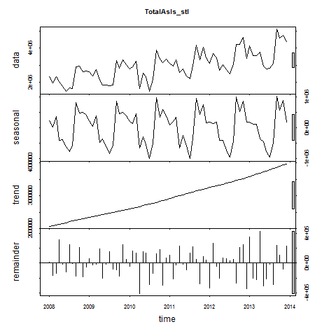
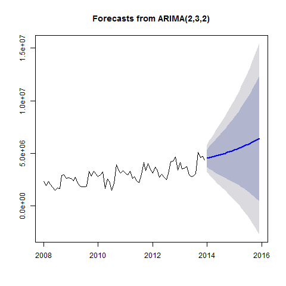

# Doing Data Science: Case Study 2 - Forecasting Chulwalar Total Etel Exports
###Claire Chu & Joseph Stoffa  
###July 19, 2016  

<br>

##Introduction

Chulwalar is part of the island group Urbano in the northern hemisphere. They are famous for their plants which flower in winter. There are three main plants that Chulwalar exports: Efak is a leafy bush with white flowers, Wuge is a grass like plant with tiny pink flowers and Etel is a flowering tree. Etel comes in two varieties: red flowers and blue flowers. Due to the nature of the products, exports generally are higher towards the end of the year. Chulwalar celebrates its independence on the 1st of December each year. On this day it is custom to give presents to family and friends. Chulwalar also celebrates the March Equinox as a time of rebirth in the northern hemisphere. 

The Prime Minister of Chulwalar has asked us to help him in forecasting the exports. In order to do this we have been given as is data and plan data as well as a list of indicators which may affect exports. Our job is to find out the best way to forecast Chulwalar's exports in 2014 based on data collected before this year 
<br>

```{r setup, include=FALSE}
knitr::opts_chunk$set(echo = TRUE)
library(fpp)
```
## Background
This case study builds on the data analysis and modeling of plant exports from Chulwalar performed by .


##Table of Contents
####1.0 [Importing Data](#id-section1)
####2.0 [Cleaning Modifying Data](#id-section2)
####3.0 [Exploring Data](#id-section3)
####---3.1 [Preliminary Analysis](#id-section3.1)
####---3.2 [Preliminary Time Series Analysis](#id-section3.2)
####4.0 [Correlation of Different External Indicators](#id-section4)
####---4.1 [4.1 Definition of the Indicators and Their Correlation with the Basic Data](#id-section4.1)
####---4.2 [4.2 Correlation of the Indicators with a Time Offset](#id-section4.2)
####---4.3 [Correlation of the Indicators with Each Other](#id-section4.3)
####5.0 [Development of Forecasting Models](#id-section5)
####---5.1 [ModelWithAlllIndicators and with Each Indicator Individually](#id-section5.1)
####---5.2 [Models](#id-section5.2)
####6.0 [Forecasts with the models](#id-section6)
####---6.1 [Shorten the Time Series in Order to Test the Forecasts](#id-section6.1)
####---6.2 [Forecasting and Testing the Models](#id-section6.2)
####7.0 [Forecast for 2014](#id-section7)
####8.0 [Developing Forecasting Models with Alternative Model Approaches](#id-section8)
####---8.1 [Exponential Smoothing](#id-section8.1)
####---8.2 [ARIMA](#id-section8.2)
####---8.3 [Dynamic Regression Models](#id-section8.3)
<br>

****************************
<div id='id-section1'/>
## 1.0  Importing Data

The script _loadData.r_ loads the the data for this case study into dataframes _ImportedAsISData_, _ImportedIndicators_, and _ImportedPlanData_ from the files _ImportedAsIsDataChulwalar.csv_, _ImportedIndicatorshulwalar.csv_, and _ImportedPlanDataChulwalar.csv_ respectively.

```{r pressure, echo=FALSE}
source("Scripts/loadData.r")
```

****************************
<div id='id-section2'/>
## 2.0  Cleaning/Modifying Data
In order to conduct our analysis the data needs to be subsetted into vectors and time series.  For this case study we are only interested in the Total Etel exports.  Data on other individual plants will be ignored.  The script _cleanData.r_ takes the data frames for As Is, Planned, and Indicator data and splits them into vectors which are then converted into time series.  Below are the resultant time series outputted by the script.

``` {r cleaning data}
source("Scripts/cleanData.r")
```

****************************
<div id='id-section3'/>
## 3.0 Exploring Data
<div id='id-section3.1'/>
### 3.1 Preliminary Analysis

For the preliminary Analysis, the time series have been plotted and the correlation between the As Is and Plan data has been tested in order to ascertain how exact the planning is.  These results show a very high planning accuracy and are therefore suitable for modeling. (Wheeler et al.)

``` {r preliminary analysis}
source("Scripts/preliminaryAnalysis.r")
```


<div id='id-section3.2'/>
### 3.2 Preliminary Time Series Analysis

The time series can be analyzed using the _stl_ function in order to seperate the trend, seasonality, and remainder (remaining) coincidental) components from one another.  Thus the individual time series can be shown graphically and tabularly.  The trend of the total exports is almost linear.  A relatively uniform seasonality can be seen in Figure 5. (Wheeler et al).



```{r Total As Is STL}
print(TotalAsIs_stl)
```

It is interesting to note that the almost linear trend is not seen in the individual segment for Total Etel (Figure 6).  The individual trends for all flower exports run in partially opposite directions in the middle of the time scale, which causes the total As Is data trend to be linear. (Wheeler et al).


```{r Total Etel As Is STL}
print(TotalEtelAsIs_stl)
```


The modification of the seasonality component can also be changed into a montly view.  It only makes sense to do this if the seasonality component as the trend looks almost identical and the remainder is then randomly spread. (Wheeler et al.)


****************************
<div id='id-section4'/>
## 4.0 Correlation of Different External Indicators
<div id='id-section4.1'/>
###  4.1 Definition of the Indicators and Their Correlation with the Basic Data

The following indicators are to be tested:

1.  Monthly Change in Export Price Index (CEPI)
2. Monthly Satisfaction Index (SI) government based data
3. Average monthly temperatures in Chulwalar
4. Monthly births in Chulwalar
5. Monthly Satisfaction Index (SI) external index 
6. Yearly Exports from Urbano
7. Yearly number of Globalisation Party members in Chulwalar
8. Monthly Average Export Price Index for Chulwalar
9. Monthly Producer Price Index (PPI) for Etel in Chulwalar
10. National Holidays
11. Chulwalar Index (Total value of all companies in Chulwalar)
12. Monthly Inflation rate in Chulwalar
13. Proposed spending for National Holidays
14. Influence of National Holiday

The indicators will be converted into individual vectors and subsequently converted into time series. The correlation of the indicators will then be tested against the As Is exports for Chulwalar. 

``` {r correlate indicators}
source("Scripts/correlateIndicators.r")
```

#### Monthly Changine in Export Price (CEPI):


``` {r CEPI}
#check correlation of CEPI 
print(cor(TotalAsIs, CEPI))
print(cor(TotalEtelAsIs, CEPI))
```

The CEPI correlates very well with the efak exports.

#### Monthly Satisfaction Index (SI) Government Based Data:


``` {r SIGov}
#check correlation of SIGov
print(cor(TotalAsIs, SIGov))
print(cor(TotalEtelAsIs, SIGov))
```

The Satisfaction Index does not show any particular correlation with any of the exports data.

#### Average Monthly Temperatures in Chulwalar:


``` {r Temperatures}
#check correlation of Temperature
print(cor(TotalAsIs, Temperature))
print(cor(TotalEtelAsIs, Temperature))
```

The temperatures have a negative correlation, exports increase in the colder months. However, the relationship is only stronger with blue Etels.

#### Monthly Births in Chulwalar:


``` {r Births}
#check correlation of Births
print(cor(TotalAsIs, Births))
print(cor(TotalEtelAsIs, Births))
```

The consideration by Chulwalar's experts was that expecting new parents to try to export more products to pay for the cost of a new child. However, this could not be confirmed.

#### Monthly Satisfaction Index (SI) External Index:


``` {r SIExtern}
#check correlation of SIExtern
print(cor(TotalAsIs, SIExtern))
print(cor(TotalEtelAsIs, SIExtern))
```

This indicator also has a high correlation with Efak exports.

#### Yearly Exports from Urbano:


``` {r UrbanoExports}
#check correlation of SIExtern
print(cor(TotalAsIs, UrbanoExports))
print(cor(TotalEtelAsIs, UrbanoExports))
```

This indicator also has a high correlation with Efak exports. The Wuge exports also show a correlation. Unfortunatly it was not possible to find other useful indicators based on exports from Urbano, due to possible informers being very restrictive with information.

#### Yearly Number of Globalisation Party Members in Chulwalar:


``` {r GlobalisationPartyMembers}
#check correlation of GlobalisationPartyMembers
print(cor(TotalAsIs, GlobalisationPartyMembers))
print(cor(TotalEtelAsIs, GlobalisationPartyMembers))
```

There is a similar picture here to that of Urbano Exports.It should however be noted that there is a continuos growth here and that the yearly view could lead to the data appearing to correlate, although this could just be due to an increase in trend. Although this could also be true for the Urbano Exports, the trend seems logical due to the Chulwalar's exports growing in accordance with the Urbano's Exports.

#### Monthly Average Export Price Index for Chulwalar:


``` {r AEPI}
#check correlation of AEPI
print(cor(TotalAsIs, AEPI))
print(cor(TotalEtelAsIs, AEPI))
```

The continuous growth leads to a good correlation here too. See Above.

#### Monthly Producer Price Index (PPI) for Etel in Chulwalar:


``` {r PPIEtel}
#check correlation of PPIEtel
print(cor(TotalAsIs, PPIEtel))
print(cor(TotalEtelAsIs, PPIEtel))
```

This indicator does not give the expected results. It does not show any correlation worth mentioning, not even with the Etel segment. 

#### National Holidays: 


``` {r NationalHolidays}
#check correlation of NationalHolidays
print(cor(TotalAsIs, NationalHolidays))
print(cor(TotalEtelAsIs, NationalHolidays))
```

The months April and December do not correlate well with the exports data. However later tests will show that these are worth considering. The missing correlation is just due to the sparse structure of the NationalHolidays time series.

#### Chulwalar Index (Total Value of all Companies in Chulwalar):


``` {r ChulwalarIndex}
#check correlation of ChulwalarIndex
print(cor(TotalAsIs, ChulwalarIndex))
print(cor(TotalEtelAsIs, ChulwalarIndex))
```

No particular findings.

#### Monthly Inflation Rate in Chulwalar:


``` {r Inflation}
#check correlation of Inflation
print(cor(TotalAsIs, Inflation))
print(cor(TotalEtelAsIs, Inflation))
```

No particular findings.

#### Proposed Spending for Independence Day Presents:


``` {r IndependenceDayPresents}
#check correlation of IndependenceDayPresents
cor(TotalAsIs, IndependenceDayPresents)
cor(TotalEtelAsIs, IndependenceDayPresents)
```

No particular findings.

#### Influence of National Holidays:
This indicator is an experiment where the influence of National Holidays is extended into the months leading up to the holiday. However later tests show that this indicator is no better for forecasting than the orignial National Holidays indicator. 


``` {r InfluenceNationalHolidays}
#check correlation of InfluenceNationalHolidays
print(cor(TotalAsIs, InfluenceNationalHolidays))
print(cor(TotalEtelAsIs, InfluenceNationalHolidays))

#check that the data import has worked
head(CEPIVector) 
head(SIGovVector)  
head(TemperatureVector)
head(BirthsVector)
head(SIExternVector) 
head(UrbanoExportsVector)
head(GlobalisationPartyMembersVector)
head(AEPIVector)
head(PPIEtelVector)
head(NationalHolidaysVector)
head(ChulwalarIndexVector)
head(InflationVector)
head(IndependenceDayPresentsVector)
```

<div id='id-section4.2'/>
###  4.2 Correlation of the Indicators with a Time Offset

The External Satisfaction Index indicator is to be offset by one month, to see if the index change makes itself first noticeable on exports in the following months.


####Here December 2013 has been deleted from the time series:

```{r correlate As Is no Dec 2013}
print(cor(TotalAsIsWithoutDec12013, SIExternOffsetByOneMonth))
print(cor(TotalEtelAsIsWithoutDec12013, SIExternOffsetByOneMonth))
print(summary(TotalAsIsWithoutDec2013_lm))
```

####Offsett SIGov Indicator by two months:


####Delete November and December 2013 from the time series:

```{r correlate As Is no Nov or Dec 2013}
print(cor(TotalAsIsWithoutNovDec2013, SIGovShifted2Months))
print(cor(TotalEtelAsIsWithoutNovDec2013, SIGovShifted2Months))
print(summary(TotalAsIsWithoutNovDec2013))
```

The correlation of the indicators has not really been improved by the offsets, so we will not continue with this approach.

<div id='id-section4.3'/>
### 4.3 Correlation of the Indicators with Each Other   

In order to test which indicators could be used in a model with eachother, we need to look at the correlation of the indicators with eachother. All thirteen indicators will be compared with eachother in a correlation coefficient matrix. First of all it is necessary to summarise all indicators in a matrix.
<br>
####Establish the standardised data matrix:

``` {r establish the standardised data matrix}
print(head(IndicatorsmatrixStandardised))
```

#### The dimensions of the matrix are determined by the number of indicators:

``` {r determine matrix indicators}
print(NumberOfIndicators)
```

#### Produce the IndicatorsCorrelationCoefficientMatrix.

``` {r produce IndicatorsCorrelationCoefficientMatrix}
print(IndicatorsCorrelationCoefficientMatrix)
```

The Correlation Coefficient Matrix shows that CEPI has a high correlation with SIExtern, UrbanoExports, GlobalisationPartyMembers and AEPI. These will become the set of indicators used later, although we are aware of the dangers of multicollinearity.However it is interesting to note that NationalHolidays, UrbanoExports, GlobalisationPartyMembers have a very low correlation with one another. Therefore these will also  become a set of indicators used later.

****************************
<div id='id-section5'/>
## 5.0 Development of Forecasting Models

With help of the tslm function, we will produce a model based on the time series. Possible inputs could be Trend and Seasonality as well as the time series of the indicators. 

<div id='id-section5.1'/>
### 5.1 ModelWithAlllIndicators and with Each Indicator Individually

``` {r develop forecasting models}
source("Scripts/developModels.r")
```

#### All Indiators in one model:

``` {r all indicators in one model}
print(summary(ModelWithAlllIndicators))
# Adjusted R²: 0.9106
```

#### CEPI:

The CEPI Indicator correlated best with total exports. Indeed the multiple R² improved the model slighltly compared to the simple ModelWithTrendAndSeasonalityOnly; however, the adjusted R² remains the same.

``` {r CEPI Indicator}
summary(ModelWithCEPI)    
# Adjusted R²: 0.9004
```


##### SIGov:
The Satisfaction Index (gov)  hardly changes the function of the model.

``` {r SIGov Indicator}
summary(ModelWithSIGov)    
# Adjusted R²: 0.8994
```

#### Temperature:

``` {r Temperature Indicator}
summary(ModelWithTemperature)
# Adjusted R²: 0.8993 
```

#### Births:

``` {r Births Indicator}
summary(ModelWithBirths) 
# Adjusted R²: 0.9088 
```

#### SIExtern:

``` {r SIExtern Indicator}
summary(ModelWithSIExtern) 
# Adjusted R²: 0.8998 
```

#### UrbanoExports:

Indicator with adjusted R² shows a better result than the reference model (ModelWithTrendAndSeasonalityOnly). The individual months are also very significant.

``` {r  UrbanoExports Indicator}
summary(ModelWithTotalUrbanoExports) 
# Adjusted R²: 0.9005 
```

#### GlobalisationPartyMembers:

``` {r ModelWithGlobalisationPartyMembers Indicator}
summary(ModelWithGlobalisationPartyMembers) 
# Adjusted R²: 0.8991  
```

#### AEPI:

``` {r AEPI Indicator}
summary(ModelWithAEPI) 
# Adjusted R²: 0.8999
```

#### PPIEtel:

``` {r NationalHolidays Indicator}
summary(ModelWithPPIEtel)
# Adjusted R²: 0.9003 
```

#### NationalHolidays:

Indicator with the best adjusted R². The months remain very significant and the indicator itself has a p-value of 0,00636**

``` {r ModelWithNationalHolidays Indicator}
summary(ModelWithNationalHolidays)
# Adjusted R²: 0.9110 
```

#### ChulwalarIndex:

``` {r ChulwalarIndex Indicator}
summary(ModelWithChulwalarIndex) 
# Adjusted R²: 0.9001
```

#### Inflation:

``` {r Inflation Indicator}
summary(ModelWithInflation)
# Adjusted R²: 0.8989
```

#### IndependenceDayPresents:

``` {r IndependenceDayPresents Indicator}
summary(ModelWithIndependenceDayPresents)
# Adjusted R²: 0.8993
```

#### InfluenceNationalHolidays:

Indicator with the best adjusted R². The months remain very significant and the indicator itself has a p-value of 0,00636**

``` {r  InfluenceNationalHolidays Indicator}
summary(ModelWithInfluenceNationalHolidays)
# Adjusted R²: 0.9110 
```

<div id='id-section5.1'/>
###  5.2 Models

#### ModelWithHighCorrelatingIndicators:

In this model only the indicators that correlate well with eachother have been used.

``` {r high correlating indicators}
summary(ModelWithHighCorrelatingIndicators) 
# Adjusted R²: 0.8941
```

It can be seen that the addition of these indicators causes the seasonality to be weakened. The individual indicators are not very significant either. Is this a multicollinearity effect? Or is it just because we have chose irrelevant indicators? An experimental idea comes from the next section:

#### ModelWithLowCorrelatingIndicators:

In this model only the indicators that hardly correlate at all with eachother have been used.  

``` {r low correlating indicators}
summary(ModelWithLowCorrelatingIndicators) 
# Adjusted R²: 0.9097
```

It can be seen that the addition of these indicators causes the seasonality to be weakened. The individual indicators are not very significant either. Thus we should continue with trend and *seasonality*; the comparison of 4.3 and 4.4 confirms this:

#### ModelWithTrendAndSeasonalityOnly:

``` {r ModelWithTrendAndSeasonalityOnly}
summary(ModelWithTrendAndSeasonalityOnly)
# Adjusted R²: 0.9004
```

This model remains one of the best when looking at total exports.

#### ModelWithoutTrendAndSeasonality:

``` {r ModelWithoutTrendAndSeasonality}
summary(ModelWithoutTrendAndSeasonality)
# Adjusted R²: 0.415
```


####ModelTotalEtel

The model for the etel segment, including both subcategories, work best with trend and seasonality. An attempt to improve the model by adding Temperature showed no improvement worth mentioning.  

``` {r ModelTotalEtel}
summary(ModelTotalEtel)
# Adjusted R²: 0,8683
```

****************************
<div id='id-section6'/>
## 6.0 Forecast with Models
<div id='id-section6.1'/>
### 6.1 Shorten the Time Series in Order to Test the Forecasts

Shorten the exports data in the Time Series in order to be able to compare the produced forecasts with the As Is data.

``` {r forecasting models}
source("Scripts/forecastModels.r")
```

The first part of the _forecastModels.r_ script:

* Shortens the indicators by the same amount

* Seperates the As Is and Plan data for 2013 in order to be able to compare the forecast to this date

* Seperate the indicator data for 2013 and 2014 in order to use these in the forecasts. First as a vector and then as a time series.

<div id='id-section6.2'/>
### 6.2 Forecasting and Testing the Models  

#### Forecast ModelWithHighCorrelatingIndicators:

Shorten ModelWithHighCorrelatingIndicators by one year in order to be able to produce a forecast for 2013. 
``` {r ModelWithHighCorrelatingIndicators_2012}
summary(ModelWithHighCorrelatingIndicators_2012)
```

Add "newdata" to the 2013 indicator values for the forecast


``` {r ModelWithHighCorrelatingIndicators_Forecast}
print(head(ModelWithHighCorrelatingIndicators_Forecast))
```
In order to be able to correlate the Forecast with the As Is Data, it is necessary to convert the Point 
Estimator into a time series. Correlation of the forecasts and As Is Data. As a comparison, the correlation of the As Is Data for 2013 with the Plan Data.

``` {r}
print(cor(ModelWithHighCorrelatingIndicators_PointForecast, TotalAsIs_2013))
print(cor(TotalAsIs_2013, TotalPlan_2013))
```

A Comparison with linear regression also supports the result.

``` {r ModelWithHighCorrelatingIndicators_forecast_lm}
print(summary(ModelWithHighCorrelatingIndicators_forecast_lm))
print(summary(TotalAsIs_2013_lm))
```

Forecast ModelWithLowCorrelatingIndicators
<br>
Shorten ModelWithLowCorrelatingIndicators by one year in order to be able to produce a forecast for 2013. 

``` {r ModelWithLowCorrelatingIndicators_2012}
print(summary(ModelWithLowCorrelatingIndicators_2012))
```

Add "newdata" to the 2013 indicator values for the forecast

``` {r ModelWithLowCorrelatingIndicators_Forecast}
print(head(ModelWithLowCorrelatingIndicators_Forecast))
```


In order to be ableCorrelation of the forecasts and As Is Data. As a comparison, the correlation of the As Is Data for 2013 with the Plan Data.  to correlate the Forecast with the As Is Data, it is necessary to convert the Point Estimator into a time series. 

``` {r ModelWithLowCorrelatingIndicators_Forecast_df}
print(cor(ModelWithLowCorrelatingIndicators_PointForecast, TotalAsIs_2013))
print(cor(TotalAsIs_2013, TotalPlan_2013))
```

A Comparison with linear regression also supports the result.

``` {r ModelWithLowCorrelatingIndicators_forecast_lm}
print(summary(ModelWithLowCorrelatingIndicators_forecast_lm))
print(summary(TotalAsIs_2013_lm))
```


#### Forecast ModelWithTrendAndSeasonalityOnly:

Shorten ModelWithTrendAndSeasonalityOnly by one year in order to be able to produce a forecast for 2013.

``` {r ModelWithTrendAndSeasonalityOnly_2012}
print(summary(ModelWithTrendAndSeasonalityOnly_2012)) 
```

Add "newdata" to the 2013 indicator values for the forecast.

``` {r ModelWithTrendAndSeasonalityOnly_Forecas}
print(head(ModelWithTrendAndSeasonalityOnly_Forecast))
```


In order to be able to correlate the Forecast with the As Is Data, it is necessary to convert the Point Estimator into a time series. Correlation of the forecasts and As Is Data. As a comparison, the correlation of the As Is Data for 2013 with the Plan Data.

``` {r}
print(cor(ModelWithTrendAndSeasonalityOnly_PointForecast, TotalAsIs_2013) )
print(cor(TotalAsIs_2013, TotalPlan_2013))
```

A Comparison with linear regression also supports the result

``` {r} ModelWithTrendAndSeasonalityOnly_Forecast_lm}
print(summary(ModelWithTrendAndSeasonalityOnly_Forecast_lm))
print(summary(TotalAsIs_2013_lm))
```

#### Forecast ModelTotalEtel

Shorten the variables in ModelTotalEtel by one year in order to be able to produce a forecast for 2013.

``` {r ModelTotalEtel_2012}
print(summary(ModelTotalEtel_2012))
```

#### Forecast:


``` {r ModelTotalEtel_Forecast}
print(head(ModelTotalEtel_Forecast))
```

In order to be able to correlate the Forecast with the As Is Data, it is necessary to convert the Point Estimator into a time series.
<br>
Correlation of the forecasts and As Is Data. As a comparison, the correlation of the As Is Data for 2013 with the Plan Data.

``` {r}
print(cor(ModelTotalEtel_PointForecast, TotalEtelAsIs_2013))
print(cor(TotalEtelPlan_2013, TotalEtelAsIs_2013))
```

#### Forecast ModelWithTotalUrbanoExports

Shorten the variables in ModelWithTotalUrbanoExports by one year in order to be able to produce a forecast for 2013.
```{r ModelWithTotalUrbanoExports_2012}
print(summary(ModelWithTotalUrbanoExports_2012)) 
```

Add "newdata" to the 2013 indicator values for the forecast.


```{r}
print(head(ModelWithTotalUrbanoExports_Forecast))
```

In order to be able to correlate the Forecast with the As Is data, it is necessary to convert the Point Estimator into a time series. Correlation of the forecasts and As Is Data. As a comparison, the correlation of the As Is Data for 2013 with the Plan Data.

```{r}
print(cor(ModelWithTotalUrbanoExports_PointForecast, TotalAsIs_2013) )
print(cor(TotalAsIs_2013, TotalPlan_2013))
```

#### Forecast ModelWithNationalHolidays

Shorten the variables in ModelWithNationalHolidays by one year in order to be able to produce a forecast for 2013.
``` {r ModelWithNationalHolidays_2012}
print(summary(ModelWithNationalHolidays_2012)) 
```

Add "newdata" to the 2013 indicator values for the forecast.


``` {r}
print(head(ModelWithNationalHolidays_Forecast))
```


In order to be able to correlate the Forecast with the As Is data, it is necessary to convert the Point Estimator into a time series. Correlation of the forecasts and As Is Data. As a comparison, the correlation of the As Is data for 2013 with the Plan Data.
``` {r}
print(cor(ModelWithNationalHolidays_PointForecast, TotalAsIs_2013) )
```

#### Forecast ModelWithInfluenceNationalHolidays

Shorten the variables in ModelWithInfluenceNationalHolidays by one year in order to be able to produce a forecast for 2013.
```{ r ModelWithInfluenceNationalHolidays_2012}
print(summary(ModelWithInfluenceNationalHolidays_2012)) 
```

Add "newdata" to the 2013 indicator values for the forecast.


``` {r}
print(head(ModelWithInfluenceNationalHolidays_Forecast, 10))
```

In order to be able to correlate the Forecast with the As Is Data, it is necessary to convert the Point Estimator into a time series. Correlation of the forecasts and As Is Data. As a comparison, the correlation of the As Is Data for 2013 with the Plan Data.

``` {r}
print(cor(ModelWithInfluenceNationalHolidays_PointForecast, TotalAsIs_2013))
print(cor(TotalAsIs_2013, TotalPlan_2013))
print(cor(TotalAsIs_2013, TotalPlan_2013))
```


****************************
<div id='id-section7'/>
## 7.0 Forecast for 2014

The script _forecast2014.r_ procuces a 2014 export forecast and alternate forecast.  It also outputs both forecasts as CSV files.
<br>
As ModelWithLowCorrelatingIndicators was the one of best fitting model for a forecast, the exports data for 2014 will be forecast based on trend and seasonality and NationalHolidays, UrbanoExports and GlobalisationPartyMembers. 
```{r}
source("Scripts/forecast2014.r")
```

```{r summary ModelWithLowCorrelatingIndicators}
print(summary(ModelWithLowCorrelatingIndicators))
```


``` {r PointForecast_ModelWithLowCorrelatingIndicators_2014}
print(PointForecast_ModelWithLowCorrelatingIndicators_2014)
print(cor(TotalAsIs_2014,TotalPlan_2014))
print(cor(TotalAsIs_2014,PointForecast_ModelWithLowCorrelatingIndicators_2014))
```

As ModelWithTrendAndSeasonalityOnly also gave a well fitting model for a forecast, the exports data for 2014 will be forecast
based on trend and seasonality.

``` {r summary ModelWithTrendAndSeasonalityOnly}
print(summary(ModelWithTrendAndSeasonalityOnly) )
```


``` {r correlate 2014}
cor(TotalAsIs_2014,TotalPlan_2014)
cor(TotalAsIs_2014,PointForecast_TrendAndSeasonality_2014)
```

#### Alternative

As the indiators NationalHolidays delievered a good result, but could not convince in the 2013 forecast,it could be possible that the data for 2013 was to blame. Therefore there is another Forecast using the
ModelWithNationalHolidays

``` {r alt summary}
print(summary(ModelWithNationalHolidays))
```


``` {r alt forecast}
print(head(PointForecast_2014_alternative))
```

****************************
<div id='id-section8'/>
## 8.0 Developing Forecasting Models with Alternative Model Approaches
<div id='id-section8.1'/>
### 8.1 Exponential Smoothing

```{r}
source("Scripts/alternativeForecastModels.r")
```

Exponential Smoothing uses past values to calculate a forecast. The strength with which each value influences the forecast is weakened with help of a smoothing parameter. Thus we are dealing with a weighted average, whose values fade out the longer ago they were in the past.

####Simple expontential smoothing

Formula: ses(). It must be decided if alpha (the smoothing parameter should be automatically calculated. If initial=simple, the alpha value canbe set to any chosen value, if initial=optimal (or nothing, as this is the default), alpha will be set to the optimal value based on ets(). h=12 gives the number of cycles for the forecast.

```{r summary Model_ses}
print(summary(Model_ses))
```


The Akaike's Information Criterion(AIC/AICc) or the Bayesian Information Criterion (BIC) should be at minimum.


#####Holt's linear trend method:

# Holt added to the model in order to forecast using trends as well.
# For this it is necessary to add a beta, which determines the trend.
# If neither alpha nor beta is stated, both parameters will be optimised
# using ets(). 

``` {r Model_holt_1}
print(summary(Model_holt_1))
```


The trend is exponential if the intercepts(level) and the gradient (slope) are multiplied with eachother. The values are worse. As the Beta was very low in the optimisation, the forecast is very similar to the ses() model. 


``` {r Model_holt_2}
print(summary(Model_holt_2))
```


As such simple trends tend to forecast the future to positively, we have added a dampener. Similar values to that of Model_holt_1 

``` {r Model_holt_3}
summary(Model_holt_3)
```


This also 
works for exponential trends. The values remain worse. 

``` {r Model_holt_4}
print(summary(Model_holt_4))
```


As these forecasts are not very convincing at the moment, there is no need to export the data.

####Holt-Winter's Seasonal Method

Holt and Winters have expanded Holt's model further to include the seasonality aspect. The parameter gamma, which is for smoothing the seasonality, was added to achieve this. The values are better than the models without seasonality. This logical matches our results from the regression approaches, the data is strongly influenced by seasonality. In the following model, none of the parameters are given so that they will be optimised automatically. There are two models: one using an additive error model method and one using a multiplicative error model.


``` {r Model_hw_1}
print(summary(Model_hw_1))
```


```{r}
#     AIC     AICc      BIC 
#2127.984 2137.875 2164.411 
```

```{r Model_hw_2}
print(summary(Model_hw_2))
```


``` {r}
#     AIC     AICc      BIC 
#2137.673 2147.564 2174.100 
```


The additive model gives slightly better results than the multiplicative model.


In order to use the results later, they need to be converted into point forcasts.

```{r}

print(head(Model_hw_1_PointForecast))
print(head(Model_hw_2_PointForecast))
```

####Innovations state space models for exponential smoothing

The funktion ets() produces a model with the same values as Model_hw_1. The reason for this is that all of the parameters in this model were optimised using the ets() function. The results are a ets(A,A,A) model which is anadditive method for trend, seasonality and errors. The previous models also showed the type of ets() model in their summary. In this case the user parameters were either accepted or rejected. As the model has been set to "ZZZ", the best model will be automatically chosen. 

```{r}
print(summary(Model_ets))
```


```{r}
#     AIC     AICc      BIC 
#2127.984 2137.875 2164.411 
```

In order to use the results later, they need to be converted into point forcasts.

```{r}
head(Model_ets_PointForecast)
```

<div id='id-section8.2'/>
###8.2 ARIMA


####AR = Autoregression
<br>
A Regression of a variable with itself. The autoregressive model specifies that the output variable depends linearly on its own previous values.

#### MA = Moving Average
The rolling average of past forecast errors.  This model should not be confused with moving average smoothing, which is used for establishing trends and is based on past values. 

#### ARIMA = AutoRegressive Integrated Moving Average model A combination of Differencing, Autoregression and Moving Average.  Integration is the opposite of differencing.

#### Differencing
In order to make the time series stationary, it is necessary to difference. Firstly, we need to check if the data are already stationary. This can be done with help of the Augmented Dickey-Fuller Test

```{r}
print(adf.test(TotalAsIs, alternative = "stationary"))
```

The p-value is less than 0,05. This means that the data is stationary, as the 0-Hypothesis of the test is "The data are not stationary".  Another possibility is the Kwiatkowski-Phillips-Schmidt-Shin Test
```{r}
print(kpss.test(TotalAsIs))
```

This test swaps the hypothesis so that a low p-value means that it is necessary to difference. The p-value here is under 0,01 and a warning is shown.
<br>
As the test failed to deliver a clear result, the data will be differencedand then retested. 

```{r}
print(adf.test(ChulwalarDiff, alternative = "stationary"))
print(kpss.test(ChulwalarDiff))
```

The kpss.test now has a p-value of more than 0,1, which hints that the data is stationary. 

```{r}
print(tsdisplay(ChulwalarDiff))
```

However this plot shows that the months correlate stongly with the values from the previous year. This plot shows a  ACF (autocorrelation function) and a PACF (partial autocorrelation function).
<br>
The folling is a test method to distinguish the number of "normal" differencing rounds and seasonal differencing rounds. Seasonal differencing is used for data which is dominated by seasonality. The time series has been assigned a lag.

```{r}
nd # Number of normal differencing rounds
ns # Number of seasonal differencing rounds
xstar # The output "xstar" has been differenced correctly. 
print(tsdisplay(xstar))
```

If "lag" is set to 12, this is equivalent to 1* seasonal differencing

```{r}
print(adf.test(ChulwalarDiff_lag, alternative = "stationary"))
print(kpss.test(ChulwalarDiff_lag))

print(tsdisplay(ChulwalarDiff))
print(tsdisplay(ChulwalarDiff_lag))
```


The time series appears much more "stationary".

####ARIMA modelling

# The values for AIC, AICc and BIC should be minimised.
# We wil try a range of combinations.

# R uses the maximum likelihood estimation (MLE) in order to decide how good
# a certain model is. The parameters, which give the most likely model based on the given data, are chosen. Furthermore, R gives the log-likelihood, which should be maximised. 

```{r Model_ARIMA_1}
print(summary(Model_ARIMA_1))
```


```{r}
#AIC=2101.93   AICc=2101.99   BIC=2104.19
```

``` {r Model_ARIMA_2}
print(summary(Model_ARIMA_2))
```


```{r}
#AIC=2099.2   AICc=2099.38   BIC=2103.72
```

```{r Model_ARIMA_3}
print(summary(Model_ARIMA_3))
```


```{r}
#AIC=2093.09   AICc=2093.45   BIC=2099.88
```

```{Model_ARIMA_4}
print(summary(Model_ARIMA_4))
```


```{r}
#AIC=2095.08   AICc=2095.68   BIC=2104.13
```

```{Model_ARIMA_5}
print(summary(Model_ARIMA_5))
```


```{r}
#AIC=2091.07   AICc=2092   BIC=2102.39
```

```{r Model_ARIMA_6}
print(summary(Model_ARIMA_6))
```


```{r}
#AIC=2092.3   AICc=2093.61   BIC=2105.87
```

```{r Model_ARIMA_7}
print(summary(Model_ARIMA_7))
```


```{r}
#AIC=2094.03   AICc=2095.81   BIC=2109.87
```

```{r Model_ARIMA_8}
print(summary(Model_ARIMA_8))
```


```{r}
#AIC=2096.57   AICc=2097.5   BIC=2107.89
```

``` {r Model_ARIMA_9}
print(summary(Model_ARIMA_9))
```


```{r}
#AIC=2092.3   AICc=2093.61   BIC=2105.87
```

```{r Model_ARIMA_10}
print(summary(Model_ARIMA_10))
```


```{r}
#AIC=2096.69   AICc=2097.61   BIC=2108
```

```{r Model_ARIMA_11}
print(summary(Model_ARIMA_11))
```


```{r}
#AIC=2085.22   AICc=2086.53   BIC=2098.8
```

```{r Model_ARIMA_12}
print(summary(Model_ARIMA_12))
```


```{r}
#AIC=2065.39   AICc=2066.72   BIC=2078.88
```

```{r Model_ARIMA_13}
print(summary(Model_ARIMA_13))
```



```{r}
#AIC=2061.27   AICc=2062.22   BIC=2072.44
```

```{r}
print(Acf(residuals(Model_ARIMA_13)))
print(Box.test(residuals(Model_ARIMA_13), lag=12, fitdf=4, type="Ljung"))
```

The Ljung-Box Test has H0: The data are independently distributed und Ha: The data are not independently distributed. 
<br>
Just like the remainder showed before, there is a definite coherence.

#### Seasonal ARIMA modelling

This model integrates the seasonal aspect into the ARIMA model. As the previous models all had a peak in lag 12, it seems viable that the data are seasonal. 

```{r Model_Seasonal_ARIMA_0}
summary(Model_Seasonal_ARIMA_0)
```

```{r}
#AIC=2105.79   AICc=2106.14   BIC=2112.62
```

```{r Model_Seasonal_ARIMA_1}
print(summary(Model_Seasonal_ARIMA_1))
```


```{r}
#AIC=1672.88   AICc=1673.31   BIC=1679.11
```

Insert the values from the previous chapter for the non-seasonal values. 

```{r Model_Seasonal_ARIMA_2}
print(summary(Model_Seasonal_ARIMA_2))
```


```{r}
# AIC=1630.23   AICc=1632.51   BIC=1644.53
```

Good results when using drift.

```{r Model_Seasonal_ARIMA_3}
print(summary(Model_Seasonal_ARIMA_3))
```


```{r}
# AIC=1355.99   AICc=1357.58   BIC=1368.56
```


```{r Model_Seasonal_ARIMA_4}
print(summary(Model_Seasonal_ARIMA_4))
```


```{r}
# AIC=1630.23   AICc=1632.51   BIC=1644.53
```

The stronger the seasonality is differenced, the better the results are. However the plot shows that the data are being increasingly changed. 

```{r Model_Seasonal_ARIMA_5}
print(summary(Model_Seasonal_ARIMA_5))
```


```{}
# AIC=765   AICc=777   BIC=773.36
```

The more the seasonal aspect is changed, the better the results based on AIC, AICc and BIC. Theoretically the models should more and more suitable for the forecast.  However, a look at the plot of the forecasts shows that the changes are making the data less and less convincing and thus unuseable. 


#####Auto-ARIMA modelling

The automatic establishment of an ARIMA model shows that (2,0,1)(0,1,1) with drift delivers the best results. 

```{r}
# AIC=1344.04   AICc=1345.62   BIC=1356.6 
```

For comparison, here are the results of ModelWithTrendAndSeasonalityOnly with tslm():

```{r}
#          CV          AIC         AICc          BIC        AdjR2 
# 8.472378e+10    1810.912      1818.281    1842.786    0.9004392 
```

```{r Model_auto.arima}
summary(Model_auto.arima)
CV(ModelWithTrendAndSeasonalityOnly)
Box.test(residuals(Model_auto.arima), lag=12, fitdf=4, type="Ljung")
```

The Ljung-Box Test has H0: The data are independently distributed and Ha: The data are not independently distributed. The results show: White noise


```{r}
print(Model_auto.arima_PointForecast)
```

<div id='id-section8.3'/>
###8.3 Dynamic Regression Models

Regression models are combined with ARIMA models on order to make sure that external factors are included and that the time series are not only forecasted based on past values. A regression of the ARIMA errors should be aspired for. 
<br>
We have to diffentiate, as the time series and the SIGov Indicator are not stationary. So that a forecast can be produced, the indicator has to be lagged so that we have values for 2014. 


```{r Model_dynreg}
print(summary(Model_dynreg))
```

```{r Model_dynreg_auto.arima}
print(summary(Model_dynreg_auto.arima))
```

ARIMA(2,0,1)(0,1,1)[12] with drift 

```{r}
# AIC=1343.61   AICc=1345.76   BIC=1358.27
```


The Ljung-Box Test has H0: The data are independently distributed and Ha: The data are not independently distributed. The results show: White noise.

```{r Model_dynreg_auto.arima_forecast}
print(summary(Model_dynreg_auto.arima))
Box.test(residuals(Model_dynreg_auto.arima), lag=12, fitdf=4, type="Ljung")
```
 


if(!checkPlot("./Model_dynreg_auto_arima_forecast_plot")) { #checks to see if plot exists and is up to date
  source("Plots/Model_dynreg_auto_arima_forecast_plot.r")
}

```{r}
print(Model_dynreg_auto.arima_forecast)
print(Model_dynreg_auto.arima_PointForecast)
```

