# Doing Data Science: Case Study 2
Claire Chu & Joseph Stoffa  
July 19, 2016  

#Case Study 2: Forecasting Chulwalar Exports
#Group Members: Claire Chu & Joseph Stoffa

<br>

####Introduction

Chulwalar is part of the island group Urbano in the northern hemisphere. They are famous for their plants which flower in winter. There are three main plants that Chulwalar exports: Efak is a leafy bush with white flowers, Wuge is a grass like plant with tiny pink flowers and Etel is a flowering tree. Etel comes in two varieties: red flowers and blue flowers. Due to the nature of the products, exports generally are higher towards the end of the year. Chulwalar celebrates its independence on the 1st of December each year. On this day it is custom to give presents to family and friends. Chulwalar also celebrates the March Equinox as a time of rebirth in the northern hemisphere. 

The Prime Minister of Chulwalar has asked us to help him in forecasting the exports. In order to do this we have been given as is data and plan data as well as a list of indicators which may affect exports. Our job is to find out the best way to forecast Chulwalar's exports in 2014 based on data collected before this year 
<br>

####Assignment

Choose one of the flowers from the data provided and complete the following analysis:

- Section the code into modules for importing data, cleaning/modifying data, exploring data, analyzing data

- Add interpretation

- Determine which model is best

- Give a conclusion of your analysis as far as forecasting exports for Chulwalar

For this project, we will be forecasting the "total etel" flower exports for Chulwalar.

#Table of Contents

#####[Please note: you will need to set your environment prior to running any of this code](#id-section1)

1.0 [Preperation, import and convert data for Chulwalar Exports](#id-section1.0)

---1.1 [Import the exports data and the indicators](#id-section1.1)

---1.2 [Transforming the data into vectors and time series](#id-section1.2)

2.0 [Analysis of the basic data](#id-section2.0)

---2.1 [Development of the business portfolio](#id-section2.1)

---2.2 [Correlation between As Is and Plan data](#id-section2.2)

---2.3 [Time series analysis](#id-section2.3)

-------2.3.1 ["stl" function](#id-section2.3.1)

-------2.3.2 [Modification of the seasonal componant to a monthly base](#id-section2.3.2)

3.0 [Correlation of different external indicators](#id-section3.0) 

---3.1 [Definition of the indicators and their correlation with the basic data](#id-section3.1)

---3.2 [Correlation of the indicators with a time offset](#id-section3.2)

---3.3 [Correlation of the indicators with each another ](#id-section3.3)

4.0 [Development of forecasting models](#id-section4.0) 

---4.1 [Model With All Indicators and with each indicator individually](#id-section4.1)

-------4.2.1 [Model With High Correlating Indicators](#id-section4.2.1)

-------4.2.2 [Model With Low Correlating Indicators](#id-section4.2.2)

---4.3 [Model With Trend And Seasonality Only](#id-section4.3)

---4.4 [Model Without Trend And Seasonality ](#id-section4.4)

---4.5 [Model Total Etel](#id-section4.5)

5.0 [Forecasts with the models](#id-section5.0)

---5.1 [Shorten the time series in order to test the forecasts](#id-section5.1)

---5.2 [Forecasting and testing with the models](#id-section5.2)

----------5.2.1.1 [Forecast Models with High Correlating Indicators](#id-section5.2.1.1)

----------5.2.1.2 [Forecast Models with Low Correlating Indicators](#id-section5.2.1.2)

-------5.2.2 [Forecast Model with Trend and Seasonality](#id-section5.2.2)

-------5.2.3 [Forecast Model Totel Etel](#id-section5.2.3)

-------5.2.4 [Forecast with Total Urbano Exports](#id-section5.2.4)

-------5.2.5 [Forecast Model with National Holidays](#id-section5.2.5)

-------5.2.6 [Forecast Model with Influential National Holidays](#id-section5.2.6)

6.0 [Forecast for 2014 ](#id-section6.0)

7.0 [Forecasting models with smoothing and related approaches](#id-section7.0)

---7.1 [Forecasting Models with Smoothing and related approaches (TotalAsIs)](#id-section7.1)

---7.2 [Forecasting Models with Smoothing and related approaches (TotalEtelAsIs)](#id-section7.2)

8.0 [Conclusion](#id-section8.0)

9.0 [Acknowledgements](#id-section9.0)


<br>

****************************
<div id='id-section1'/>
###PRELIMINARY STEPS
######Please set up the environment before going through the analysis

```r
setwd("/Users/macnificent/Desktop")

library(fpp)
library(tcltk)

source('mywait.r')
```

######We will use the 'fpp' library for forecasting functions and the 'tcltk' library to generate the "mywait" function
****************************
<div id='id-section1.0'/>
###1.0 Preperation, import and convert data for Chulwalar Exports

****************************
<div id='id-section1.1'/>
####1.1 Import the exports data and the indicators


```r
ImportedAsIsData <- read.csv("ImportedAsIsDataChulwalar.csv", header = F, sep=";", fill = T)

ImportedPlanData <- read.csv("ImportedPlanDataChulwalar.csv", header = F, sep=";", fill = T)

ImportedIndicators <- read.csv("ImportedIndicatorsChulwalar.csv", header = F, sep=";", fill = T)

head(ImportedAsIsData)
```

```
##            V1      V2      V3      V4      V5      V6      V7      V8
## 1 Total As Is    2008    2009    2010    2011    2012    2013    2014
## 2         Jan 2313221 2610573 2760688 3112861 3093088 4119526 4308161
## 3         Feb 1950131 2371327 2918333 2926663 3679308 3535744 4155378
## 4         Mar 2346635 2743786 3227041 3294784 3433364 3560974 3924332
## 5         Apr 2039787 2125308 1613888 2577079 2714899 3760065 3659121
## 6         May 1756964 1850073 2550157 2774068 3011767 2959933 3898758
```

```r
head(ImportedPlanData)
```

```
##           V1      V2      V3      V4      V5      V6      V7      V8
## 1 Total Plan    2008    2009    2010    2011    2012    2013    2014
## 2        Jan 2243103 2547980 2965885 3113110 3895396 3580325 4474000
## 3        Feb 2162705 2247049 2751170 2883766 3588151 3863212 4185565
## 4        Mar 2720911 2731156 2906493 2957893 3787240 3606083 4278119
## 5        Apr 2011182 2020158 2383358 2601648 3036434 3213575 3985542
## 6        May 1877757 2098038 2246893 2370949 2907891 3139128 3605973
```

```r
head(ImportedIndicators)
```

```
##                        V1     V2     V3     V4     V5     V6     V7   V8
## 1 Change in export prices 2008.0 2009.0 2010.0 2011.0 2012.0 2013.0 2014
## 2                     Jan   97.4   98.3   99.0  100.7  102.8  104.5   NA
## 3                     Feb   97.8   98.9   99.4  101.3  103.5  105.1   NA
## 4                     Mar   98.3   98.7   99.9  101.9  104.1  105.6   NA
## 5                     Apr   98.1   98.8  100.0  101.9  103.9  105.1   NA
## 6                     Mai   98.7   98.7   99.9  101.9  103.9  105.5   NA
```

######The data provided comprises of the following partial data sets:
####IMPORTED AS IS DATA
-Monthly As Is exports<br>
-Monthly As Is exports of Efak<br>
-Monthly As Is exports of Wuge<br>
-Monthly As Is exports of Etel (Total)<br>
-Monthly As Is exports of blue Etel<br>
-Monthly As Is exports of red Etel<br>
-Yearly As Is exports<br>

####IMPORTED PLAN DATA
-Monthly Plan exports <br>
-Monthly Plan exports of Efak<br>
-Monthly Plan exports of Wuge<br>
-Monthly Plan exports of Etel (Total)<br>
-Monthly Plan exports of blue Etel<br>
-Monthly Plan exports of red Etel<br>
-Yearly Plan exports<br>

####IMPORTED INDICATORS
-Change in Exports prices<br>
-Satisfaction index<br>
-Average Temperature<br>
-Birth Index<br>
-Satisfaction index (Independent)<br>
-Total Exports from Urbano<br>
-Globalization Party Members<br>
-Average Export Price<br>
-Etel Production Price index<br>
-Chulwalar Index<br>
-Inflation<br>
-Spending for Chulwalar holidays<br>
-Chulwalar holidays<br>
-Influence of Chulwalar holidays<br>

****************************
<div id='id-section1.2'/>
####1.2 Transforming the data into vectors and time series 
#####We need to separate the data so that we can do partial dataset analysis on each time series
#####Seperating the Imported As Is Data

```r
TotalAsIsVector <- c(ImportedAsIsData [2:13,2],ImportedAsIsData [2:13,3],ImportedAsIsData [2:13,4],ImportedAsIsData [2:13,5],ImportedAsIsData [2:13,6],ImportedAsIsData [2:13,7])

TotalEtelAsIsVector <- c(ImportedAsIsData [44:55,2],ImportedAsIsData [44:55,3],ImportedAsIsData [44:55,4],ImportedAsIsData [44:55,5],ImportedAsIsData [44:55,6],ImportedAsIsData [44:55,7])

YearAsIsVector <- c(ImportedAsIsData [86,2],ImportedAsIsData [86,3],ImportedAsIsData [86,4],ImportedAsIsData [86,5],ImportedAsIsData [86,6],ImportedAsIsData [86,7])
TotalAsIsVector_2014 <- c(ImportedAsIsData[2:13,8])
```
#####Converting the Imported As Is vectors into a time series

```r
TotalAsIs<- ts(TotalAsIsVector , start=c(2008,1), end=c(2013,12), frequency=12)

TotalEtelAsIs<- ts(TotalEtelAsIsVector, start=c(2008,1), end=c(2013,12), frequency=12)

YearAsIs <- ts(YearAsIsVector, start=c(2008,1), end=c(2013,12), frequency=12)
TotalAsIs_2014 <- ts(TotalAsIsVector_2014, start=c(2014,1), end=c(2014,12), frequency=12)
```

#####Separating the Imported Plan Data

```r
PlanVector <- c(ImportedPlanData[2:13,2],ImportedPlanData[2:13,3],ImportedPlanData[2:13,4],ImportedPlanData[2:13,5],ImportedPlanData[2:13,6],ImportedPlanData[2:13,7])

TotalEtelPlanVector <- c(ImportedPlanData[44:55,2],ImportedPlanData[44:55,3],ImportedPlanData[44:55,4],ImportedPlanData[44:55,5],ImportedPlanData[44:55,6],ImportedPlanData[44:55,7])

YearPlanVector <- c(ImportedPlanData[86,2],ImportedPlanData[86,3],ImportedPlanData[86,4],ImportedPlanData[86,5],ImportedPlanData[86,6],ImportedPlanData[86,7])
PlanVector_2014 <- c(ImportedPlanData[2:13,8])
```
#####Converting the Imported Plan Vectors into a time series

```r
TotalPlan <- ts(PlanVector , start=c(2008,1), end=c(2013,12), frequency=12)

TotalEtelPlan <- ts(TotalEtelPlanVector, start=c(2008,1), end=c(2013,12), frequency=12)

YearPlan <- ts(YearPlanVector, start=c(2008,1), end=c(2013,12), frequency=12)
TotalPlan_2014 <- ts(PlanVector_2014, start=c(2014,1), end=c(2014,12), frequency=12)
```

##### Call up the As Is time series to check everything has worked.

```r
TotalAsIs
```

```
##          Jan     Feb     Mar     Apr     May     Jun     Jul     Aug
## 2008 2313221 1950131 2346635 2039787 1756964 1458302 1679637 1639670
## 2009 2610573 2371327 2743786 2125308 1850073 1836222 1797311 1851968
## 2010 2760688 2918333 3227041 1613888 2550157 2317645 1474144 2148521
## 2011 3112861 2926663 3294784 2577079 2774068 2378227 2222900 2991787
## 2012 3093088 3679308 3433364 2714899 3011767 2726028 2483834 3055655
## 2013 4119526 3535744 3560974 3760065 2959933 2787898 2828744 3084113
##          Sep     Oct     Nov     Dec
## 2008 2882886 2959716 2596494 2656568
## 2009 3271171 2818888 3310776 3022513
## 2010 3898571 3348953 3135945 3332886
## 2011 4151531 3318684 4037076 3429843
## 2012 4200796 4228724 4618540 3383673
## 2013 5107775 4562144 4729313 4372181
```

```r
TotalEtelAsIs
```

```
##          Jan     Feb     Mar     Apr     May     Jun     Jul     Aug
## 2008 1279668 1053325 1367520 1090725  873568  644479  772658  806741
## 2009 1583216 1407388 1420801 1141100  919860  858876  910134  843050
## 2010 1637464 1676161 1549560  813469 1198401 1140024  551268 1012542
## 2011 1595267 1473528 1469728 1034650  952553  819303  802076 1222812
## 2012 1519748 1812897 1607280 1008022 1291983  940158  945929 1235146
## 2013 2109497 1738197 1633944 1745092 1039449 1054201 1003166 1154675
##          Sep     Oct     Nov     Dec
## 2008 1715265 1795751 1518288 1601324
## 2009 1981563 1647934 1857836 1615091
## 2010 2335488 1856264 1678123 1699063
## 2011 2303271 1591584 1960675 1713991
## 2012 2330334 2177895 2306324 1618147
## 2013 3000929 2305605 2284672 2062160
```

```r
YearAsIs
```

```
##           Jan      Feb      Mar      Apr      May      Jun      Jul
## 2008 26280011 29609916 32726772 37215503 40629676 45408410 26280011
## 2009 26280011 29609916 32726772 37215503 40629676 45408410 26280011
## 2010 26280011 29609916 32726772 37215503 40629676 45408410 26280011
## 2011 26280011 29609916 32726772 37215503 40629676 45408410 26280011
## 2012 26280011 29609916 32726772 37215503 40629676 45408410 26280011
## 2013 26280011 29609916 32726772 37215503 40629676 45408410 26280011
##           Aug      Sep      Oct      Nov      Dec
## 2008 29609916 32726772 37215503 40629676 45408410
## 2009 29609916 32726772 37215503 40629676 45408410
## 2010 29609916 32726772 37215503 40629676 45408410
## 2011 29609916 32726772 37215503 40629676 45408410
## 2012 29609916 32726772 37215503 40629676 45408410
## 2013 29609916 32726772 37215503 40629676 45408410
```

```r
TotalAsIs_2014
```

```
##          Jan     Feb     Mar     Apr     May     Jun     Jul     Aug
## 2014 4308161 4155378 3924332 3659121 3898758 3313891 3595106 3502426
##          Sep     Oct     Nov     Dec
## 2014 5619059 5274287 4841693 4664854
```
##### Call up the Plan time series to check everything has worked.

```r
TotalPlan
```

```
##          Jan     Feb     Mar     Apr     May     Jun     Jul     Aug
## 2008 2243103 2162705 2720911 2011182 1877757 1819924 1682196 1893171
## 2009 2547980 2247049 2731156 2020158 2098038 1927995 1783692 1907705
## 2010 2965885 2751170 2906493 2383358 2246893 1992851 2023434 2244997
## 2011 3113110 2883766 2957893 2601648 2370949 2339881 2105328 2341623
## 2012 3895396 3588151 3787240 3036434 2907891 2707822 2619486 3784557
## 2013 3580325 3863212 3606083 3213575 3139128 2998610 2785453 3083654
##          Sep     Oct     Nov     Dec
## 2008 3325711 2662148 2909966 2574633
## 2009 3124040 3102251 3154669 2742367
## 2010 3257717 3536338 3358206 3112906
## 2011 4086297 3640827 3502334 3280476
## 2012 4987460 4367319 4205772 4059533
## 2013 5143757 4149334 4495212 4093664
```

```r
TotalEtelPlan
```

```
##          Jan     Feb     Mar     Apr     May     Jun     Jul     Aug
## 2008 1263613 1231125 1489621 1051346  933392  932047  855520  923070
## 2009 1546801 1378217 1563799 1166229 1057223  983279  913751  980703
## 2010 1648769 1490577 1538493 1208636 1104777  931127  916160 1096933
## 2011 1781991 1564272 1455531 1257528 1134418 1018200  843336  974375
## 2012 2070256 1731099 1663266 1232994 1164076 1018137  932241 1800576
## 2013 1864733 1837228 1663834 1305603 1172373 1089115 1074687 1217930
##          Sep     Oct     Nov     Dec
## 2008 2080877 1575579 1561956 1515127
## 2009 1974166 1886971 1839155 1727567
## 2010 1832882 2103588 1877929 1862684
## 2011 2435674 1972649 1873075 1684766
## 2012 2823873 2224655 2025003 1955509
## 2013 2916115 2043888 2199880 2133214
```

```r
YearPlan
```

```
##           Jan      Feb      Mar      Apr      May      Jun      Jul
## 2008 27883407 29387100 32780247 35224132 43947063 44152007 27883407
## 2009 27883407 29387100 32780247 35224132 43947063 44152007 27883407
## 2010 27883407 29387100 32780247 35224132 43947063 44152007 27883407
## 2011 27883407 29387100 32780247 35224132 43947063 44152007 27883407
## 2012 27883407 29387100 32780247 35224132 43947063 44152007 27883407
## 2013 27883407 29387100 32780247 35224132 43947063 44152007 27883407
##           Aug      Sep      Oct      Nov      Dec
## 2008 29387100 32780247 35224132 43947063 44152007
## 2009 29387100 32780247 35224132 43947063 44152007
## 2010 29387100 32780247 35224132 43947063 44152007
## 2011 29387100 32780247 35224132 43947063 44152007
## 2012 29387100 32780247 35224132 43947063 44152007
## 2013 29387100 32780247 35224132 43947063 44152007
```

```r
TotalPlan_2014
```

```
##          Jan     Feb     Mar     Apr     May     Jun     Jul     Aug
## 2014 4474000 4185565 4278119 3985542 3605973 3515173 3269444 3656112
##          Sep     Oct     Nov     Dec
## 2014 5637391 5157781 5353458 4703185
```

****************************
<div id='id-section2.0'/>
###2.0 Analysis of the basic data

****************************
<div id='id-section2.1'/>
####2.1 Development of the business portfolio

#####Due to the different scales, it makes sense to plot each graph individually instead of plotting them all on one set of axes. 

```r
plot(TotalAsIs, col="black", main="TotalAsIs")
```

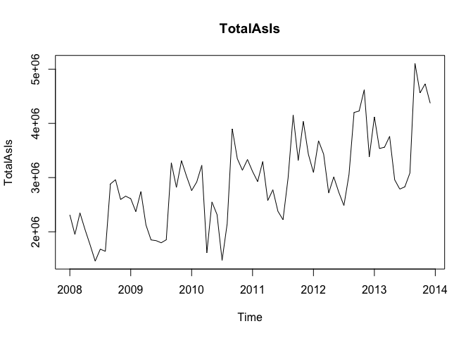<!-- -->

```r
plot(TotalEtelAsIs, col="green",main="TotalEtelAsIs")
```

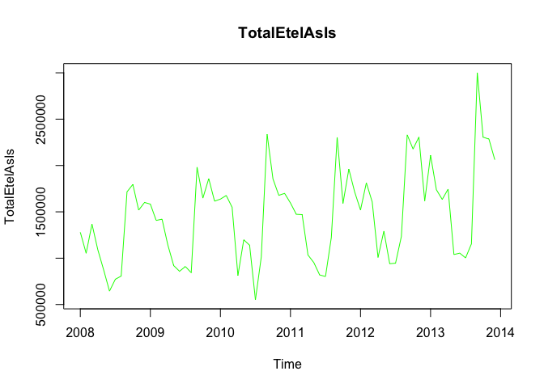<!-- -->

```r
mywait()
```

```
## <Tcl>
```
#####These graphs plot the data for the various As Is variables

```r
mywait()
```

```
## <Tcl>
```

```r
plot(TotalPlan , col="black", main="TotalPlan")
```

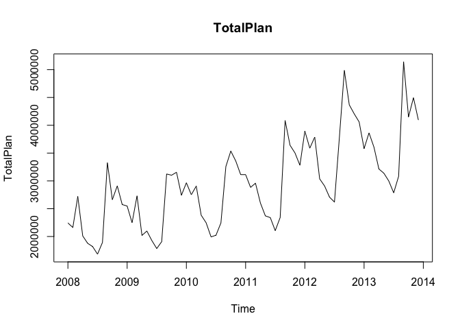<!-- -->

```r
plot(TotalEtelPlan, col="green",main="TotalEtelPlan")
```

<!-- -->

```r
mywait()
```

```
## <Tcl>
```
#####These graphs plot the data for the various Plan variables

****************************
<div id='id-section2.2'/>
####2.2 Correlation between As Is and Plan data

##### Test the correlation between As Is and Plan data in order to test how exact the planning is. Correlation is a measure of linear relationship between two variables. 

```r
cor(TotalAsIs, TotalPlan )
```

```
## [1] 0.9183402
```

```r
cor(TotalEtelAsIs, TotalEtelPlan)
```

```
## [1] 0.9159505
```

```r
cor(YearAsIs, YearPlan)
```

```
## [1] 0.9627401
```

```r
mywait()
```

```
## <Tcl>
```
#####The results show a very high planning accuracy since all the correlation coefficients are close to 1. 


```r
TotalAsIs_lm <- lm(TotalAsIs ~ TotalPlan , data = TotalAsIs)
summary(TotalAsIs_lm)
```

```
## 
## Call:
## lm(formula = TotalAsIs ~ TotalPlan, data = TotalAsIs)
## 
## Residuals:
##     Min      1Q  Median      3Q     Max 
## -770214 -196776   26017  182579  672705 
## 
## Coefficients:
##              Estimate Std. Error t value Pr(>|t|)    
## (Intercept) 8.959e+04  1.521e+05   0.589    0.558    
## TotalPlan   9.627e-01  4.959e-02  19.413   <2e-16 ***
## ---
## Signif. codes:  0 '***' 0.001 '**' 0.01 '*' 0.05 '.' 0.1 ' ' 1
## 
## Residual standard error: 332600 on 70 degrees of freedom
## Multiple R-squared:  0.8433,	Adjusted R-squared:  0.8411 
## F-statistic: 376.9 on 1 and 70 DF,  p-value: < 2.2e-16
```

```r
TotalAsIs_tslm <- tslm(TotalAsIs ~ TotalPlan )
summary(TotalAsIs_tslm)
```

```
## 
## Call:
## tslm(formula = TotalAsIs ~ TotalPlan)
## 
## Residuals:
##     Min      1Q  Median      3Q     Max 
## -770214 -196776   26017  182579  672705 
## 
## Coefficients:
##              Estimate Std. Error t value Pr(>|t|)    
## (Intercept) 8.959e+04  1.521e+05   0.589    0.558    
## TotalPlan   9.627e-01  4.959e-02  19.413   <2e-16 ***
## ---
## Signif. codes:  0 '***' 0.001 '**' 0.01 '*' 0.05 '.' 0.1 ' ' 1
## 
## Residual standard error: 332600 on 70 degrees of freedom
## Multiple R-squared:  0.8433,	Adjusted R-squared:  0.8411 
## F-statistic: 376.9 on 1 and 70 DF,  p-value: < 2.2e-16
```
#####Running a regression model on the Total As Is time series to compare the Total As Is data time series, we can see that the R-squared is 00.84 so our model is a good fit for linear regression

****************************
<div id='id-section2.3'/>
####2.3 Time series analysis

****************************
<div id='id-section2.3'/>
####2.3.1 "stl" function 
#####The time series can be analysed using the stl function in order to seperate the trend, seasonality and remainder (remaining coincidential) components from one another.


```r
TotalAsIs_stl <- stl(TotalAsIs, s.window=5)

TotalEtelAsIs_stl <- stl(TotalEtelAsIs, s.window=5)

YearAsIs_stl <- stl(YearAsIs, s.window=5)
```

#####Thus the individual time series can be shown graphically and tabularly. The trend of the total exports is almost linear. A relatively uniform seasonality can be seen.

```r
par(mfrow=c(3,2))

plot(TotalAsIs_stl, col="black", main="TotalAsIs_stl")
```

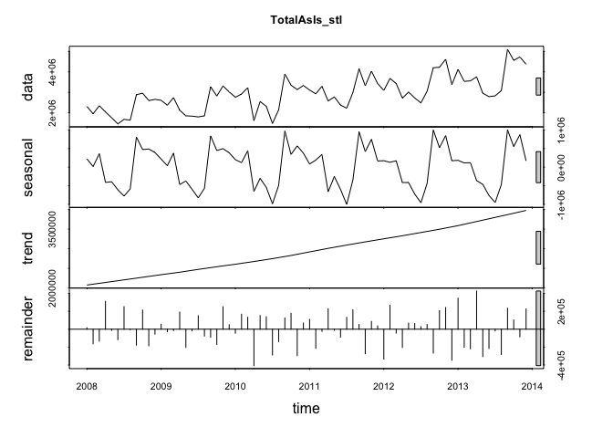<!-- -->

```r
TotalAsIs_stl
```

```
##  Call:
##  stl(x = TotalAsIs, s.window = 5)
## 
## Components
##             seasonal   trend  remainder
## Jan 2008   223320.67 2074233   15667.16
## Feb 2008    17036.99 2096208 -163113.80
## Mar 2008   361473.74 2118182 -133021.18
## Apr 2008  -410834.24 2140157  310464.16
## May 2008  -391831.93 2162114  -13317.80
## Jun 2008  -608564.13 2184070 -117204.25
## Jul 2008  -777993.52 2206027  251603.49
## Aug 2008  -583615.66 2228213   -4927.72
## Sep 2008   810939.36 2250400 -178453.09
## Oct 2008   474131.86 2272586  212998.05
## Nov 2008   488504.52 2294373 -186383.79
## Dec 2008   395452.58 2316160  -55045.03
## Jan 2009   217151.38 2337948   55473.99
## Feb 2009    39716.91 2359168  -27558.10
## Mar 2009   378507.21 2380389  -15109.96
## Apr 2009  -467522.18 2401609  191220.87
## May 2009  -371597.89 2425515 -203844.26
## Jun 2009  -595724.45 2449421  -17474.54
## Jul 2009  -827029.12 2473327  151013.28
## Aug 2009  -567342.69 2495885  -76573.99
## Sep 2009   843160.68 2518443  -90432.21
## Oct 2009   447562.71 2541000 -169675.09
## Nov 2009   497312.47 2562364  251099.75
## Dec 2009   388265.67 2583727   50520.14
## Jan 2010   201133.54 2605091  -45536.12
## Feb 2010   122776.46 2628120  167436.40
## Mar 2010   442825.47 2651150  133065.83
## Apr 2010  -652923.75 2674179 -407367.50
## May 2010  -301149.68 2698691  152615.46
## Jun 2010  -543850.29 2723203  138292.09
## Jul 2010  -985987.99 2747715 -287583.18
## Aug 2010  -487941.31 2774544 -138081.68
## Sep 2010   972415.73 2801373  124782.46
## Oct 2010   343206.82 2828202  177544.55
## Nov 2010   573281.74 2858572 -295909.05
## Dec 2010   375326.75 2888943   68616.25
## Jan 2011    84179.43 2919314  109367.89
## Feb 2011   190940.11 2949475 -213752.60
## Mar 2011   339598.68 2979637  -24451.98
## Apr 2011  -661193.66 3009799  228473.57
## May 2011  -252299.73 3037669  -11300.88
## Jun 2011  -597799.74 3065538  -89511.39
## Jul 2011 -1002974.31 3093408  132466.66
## Aug 2011  -345401.48 3120526  216662.97
## Sep 2011   951339.44 3147643   52548.18
## Oct 2011   418464.54 3174761 -274541.80
## Nov 2011   749466.48 3200972   86637.11
## Dec 2011   166063.96 3227184   36595.48
## Jan 2012   173825.10 3253395 -334131.81
## Feb 2012   131526.89 3279250  268531.13
## Mar 2012   171949.25 3305105  -43690.50
## Apr 2012  -412193.90 3330961 -203867.63
## May 2012  -414897.17 3358540   68124.29
## Jun 2012  -723606.43 3386119   63515.20
## Jul 2012  -957183.71 3413699   27319.12
## Aug 2012  -438041.15 3441507   52189.27
## Sep 2012   998725.79 3469315 -267244.98
## Oct 2012   523934.85 3497123  207665.66
## Nov 2012   847979.72 3527674  242886.44
## Dec 2012   172550.29 3558224 -347101.49
## Jan 2013   184195.89 3588775  346555.55
## Feb 2013   114297.14 3623803 -202355.91
## Mar 2013   121000.80 3658831 -218857.78
## Apr 2013  -360531.42 3693859  426737.22
## May 2013  -462506.26 3728897 -306457.92
## Jun 2013  -759940.89 3763935 -216096.28
## Jul 2013  -951772.71 3798973  -18456.45
## Aug 2013  -468011.67 3834192 -282067.53
## Sep 2013  1004335.28 3869411  234028.47
## Oct 2013   554713.70 3904630  102800.01
## Nov 2013   873598.66 3940742  -85027.53
## Dec 2013   169104.03 3976853  226223.51
```
######It is interesting to note that the almost linear trend is not seen in the individual segments. The individual trends run partially in opposite directions in the middle of the time scale, which causes the linear trend in the total As Is data.

```r
plot(TotalEtelAsIs_stl, col="black", main="TotalEtelAsIs_stl")
```

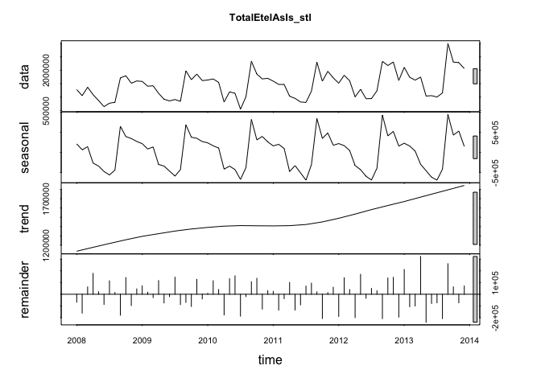<!-- -->

```r
TotalEtelAsIs_stl
```

```
##  Call:
##  stl(x = TotalEtelAsIs, s.window = 5)
## 
## Components
##            seasonal   trend   remainder
## Jan 2008  212543.90 1135393  -68268.686
## Feb 2008   64724.69 1149373 -160772.697
## Mar 2008  141647.42 1163353   62519.359
## Apr 2008 -264999.95 1177333  178391.504
## May 2008 -339776.29 1191010   22334.080
## Jun 2008 -473456.92 1204687  -86751.057
## Jul 2008 -560479.22 1218364  114773.472
## Aug 2008 -439963.23 1231709   14995.207
## Sep 2008  649360.43 1245054 -179149.730
## Oct 2008  394715.11 1258400  142636.314
## Nov 2008  343804.99 1270718  -96234.645
## Dec 2008  272635.02 1283036   45653.230
## Jan 2009  216526.66 1295354   71335.502
## Feb 2009   85366.77 1304840   17181.430
## Mar 2009  134597.06 1314326  -28121.833
## Apr 2009 -299576.10 1323812  116864.362
## May 2009 -339425.04 1333273  -73988.443
## Jun 2009 -463451.32 1342735  -20407.903
## Jul 2009 -588086.05 1352197  146023.090
## Aug 2009 -428334.97 1359570  -88185.300
## Sep 2009  684000.28 1366944  -69380.862
## Oct 2009  378107.74 1374317 -104490.629
## Nov 2009  350361.28 1380061  127414.131
## Dec 2009  269269.49 1385804  -39982.767
## Jan 2010  237811.58 1391548    8104.442
## Feb 2010  164697.76 1396069  115393.780
## Mar 2010  108887.92 1400591   40081.142
## Apr 2010 -414588.58 1405112 -177054.835
## May 2010 -341339.97 1406966  132774.500
## Jun 2010 -426196.92 1408821  157400.399
## Jul 2010 -672372.03 1410675 -187034.545
## Aug 2010 -377863.24 1410092  -19686.420
## Sep 2010  818966.77 1409509  107012.482
## Oct 2010  310866.57 1408926  136471.594
## Nov 2010  396380.37 1408474 -126731.546
## Dec 2010  260838.84 1408023   30201.636
## Jan 2011  162908.25 1407571   24787.879
## Feb 2011  200345.42 1408473 -135290.178
## Mar 2011   98058.73 1409375  -37705.374
## Apr 2011 -475991.41 1410277  100364.893
## May 2011 -326861.16 1414388 -134973.648
## Jun 2011 -508609.13 1418499  -90586.968
## Jul 2011 -690240.90 1422610   69706.513
## Aug 2011 -303950.41 1431899   94863.512
## Sep 2011  841755.54 1441187   20328.047
## Oct 2011  348453.95 1450476 -207345.878
## Nov 2011  482953.99 1463581   14139.587
## Dec 2011  177522.68 1476687   59781.396
## Jan 2012  219295.41 1489792 -189339.836
## Feb 2012  167343.82 1504763  140790.260
## Mar 2012   47565.92 1519733   39980.664
## Apr 2012 -327162.02 1534704 -199519.887
## May 2012 -429104.97 1550797  170291.408
## Jun 2012 -592640.70 1566889  -34090.529
## Jul 2012 -686742.76 1582982   49689.871
## Aug 2012 -391971.46 1597629   29488.941
## Sep 2012  926501.74 1612275 -208442.888
## Oct 2012  411978.67 1626922  138994.561
## Nov 2012  520321.23 1641216  144786.748
## Dec 2012  157545.15 1655510 -194908.427
## Jan 2013  228279.54 1669805  211412.939
## Feb 2013  159093.45 1685663 -106559.227
## Mar 2013   32529.79 1701521 -100106.827
## Apr 2013 -295207.15 1717379  322919.852
## May 2013 -454478.79 1733056 -239128.325
## Jun 2013 -615888.66 1748733  -78643.269
## Jul 2013 -688356.21 1764410  -72887.536
## Aug 2013 -417329.54 1779986 -207981.755
## Sep 2013  944212.59 1795563  261153.561
## Oct 2013  431257.90 1811139   63207.703
## Nov 2013  530407.87 1827035  -72771.039
## Dec 2013  148706.84 1842931   70522.228
```

```r
mywait()
```

```
## <Tcl>
```


```r
plot(TotalAsIs_stl$time.series[,"trend"], col="black")
```

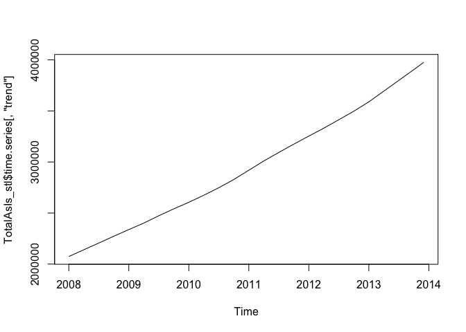<!-- -->

```r
plot(TotalEtelAsIs_stl$time.series[,"trend"], col="green")
```

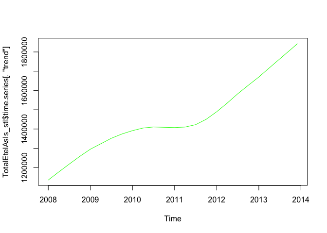<!-- -->

```r
mywait()
```

```
## <Tcl>
```

****************************
<div id='id-section2.3.2'/>
####2.3.2 Modification of the seasonal componant to a monthly base

##### The modification of the seasonlity component can also be changed into a monthly view. It only makes sense to do this if the seasonality componant as the trend looks almost identical and the remainder is then randomly spread.

```r
monthplot(TotalAsIs_stl$time.series[,"seasonal"], main="", ylab="Seasonal")
```

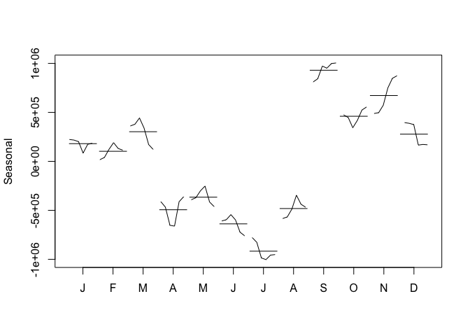<!-- -->

```r
monthplot(TotalEtelAsIs_stl$time.series[,"seasonal"], main="", ylab="Seasonal")
```

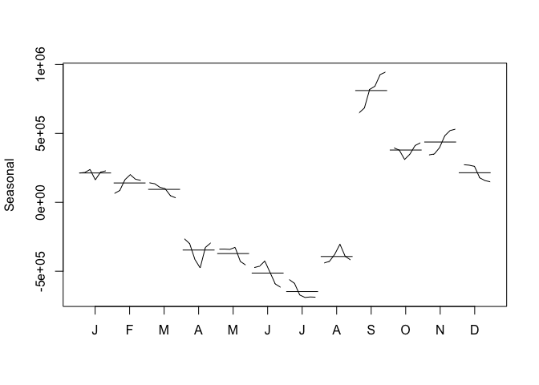<!-- -->

```r
mywait()
```

```
## <Tcl>
```

****************************
<div id='id-section3.0'/>
###3.0 [Correlation of different external indicators](#id-section3.0) 

****************************
<div id='id-section3.1'/>
####3.1 Definition of the indicators and their correlation with the basic data

####The following indicators are to be tested:

#####[1 Monthly Change in Export Price Index (CEPI)](#id-section3.1.1)

#####[2 Monthly Satisfaction Index (SI) government based data](#id-section3.1.2)

#####[3 Average monthly temperatures in Chulwalar](#id-section3.1.3)

#####[4 Monthly births in Chulwalar](#id-section3.1.4)

#####[5 Monthly Satisfaction Index (SI) external index](#id-section3.1.5) 

#####[6 Yearly Exports from Urbano](#id-section3.1.6)

#####[7 Yearly number of Globalisation Party members in Chulwalar](#id-section3.1.7)

#####[8 Monthly Average Export Price Index for Chulwalar](#id-section3.1.8)

#####[9 Monthly Producer Price Index (PPI) for Etel in Chulwalar](#id-section3.1.9)

#####[10 National Holidays](#id-section3.1.10)

#####[11 Chulwalar Index (Total value of all companies in Chulwalar)](#id-section3.1.11)

#####[12 Monthly Inflation rate in Chulwalar](#id-section3.1.12)

#####[13 Proposed spending for National Holidays](#id-section3.1.13)

#####[14 Influence of National Holiday](#id-section3.1.14)

****************************
#####The indicators will be converted into individual  vectors and subsequently converted into time series. The correlation of the indicators will then be tested against the As Is exports for Chulwalar. 

<div id='id-section3.1.1'/>
#####Monthly Change in Export Price Index (CEPI)

```r
CEPIVector <- c(ImportedIndicators[2:13,2],ImportedIndicators[2:13,3],ImportedIndicators[2:13,4],ImportedIndicators[2:13,5],ImportedIndicators[2:13,6],ImportedIndicators[2:13,7])
CEPI <- ts(CEPIVector , start=c(2008,1), end=c(2013,12), frequency=12)
plot(CEPI, main="CEPI")
```

<!-- -->

```r
cor(TotalAsIs, CEPI)
```

```
## [1] 0.663925
```

```r
cor(TotalEtelAsIs, CEPI)
```

```
## [1] 0.339713
```

```r
mywait()
```

```
## <Tcl>
```

<div id='id-section3.1.2'/>
##### Monthly Satisfaction Index (SI) government based data

```r
SIGovVector <- c(ImportedIndicators[16:27,2],ImportedIndicators[16:27,3],ImportedIndicators[16:27,4],ImportedIndicators[16:27,5],ImportedIndicators[16:27,6],ImportedIndicators[16:27,7])
SIGov <- ts(SIGovVector , start=c(2008,1), end=c(2013,12), frequency=12)
plot(SIGov, main="SIGov")
```

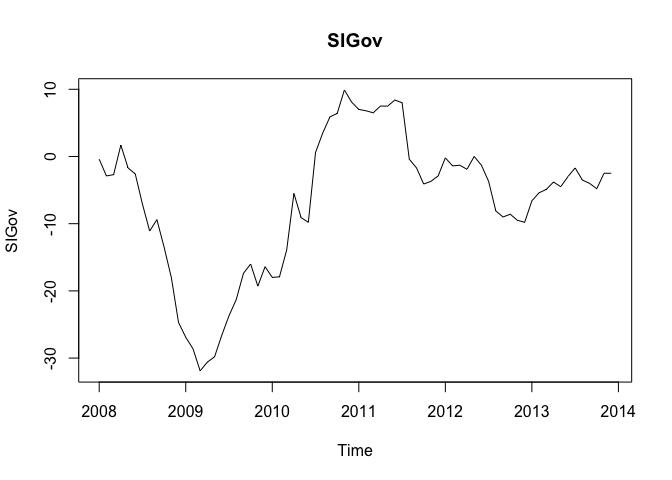<!-- -->

```r
cor(TotalAsIs, SIGov)
```

```
## [1] 0.2007768
```

```r
cor(TotalEtelAsIs, SIGov)
```

```
## [1] 0.002556094
```

```r
mywait()
```

```
## <Tcl>
```
#####The Satisfaction Index does not show any particular correlation with any of the exports data.

<div id='id-section3.1.3'/>
#####Average monthly temperatures in Chulwalar

```r
TemperatureVector <- c(ImportedIndicators[30:41,2],ImportedIndicators[30:41,3],ImportedIndicators[30:41,4],ImportedIndicators[30:41,5],ImportedIndicators[30:41,6],ImportedIndicators[30:41,7])
Temperature <- ts(TemperatureVector, start=c(2008,1), end=c(2013,12), frequency=12)
plot(Temperature, main="Temperature")
```

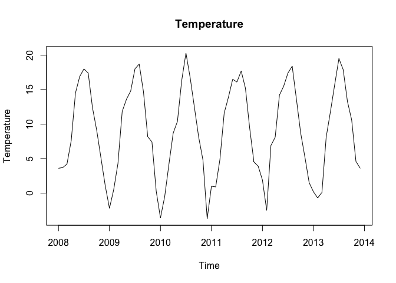<!-- -->

```r
cor(TotalAsIs, Temperature)
```

```
## [1] -0.3429684
```

```r
cor(TotalEtelAsIs, Temperature)
```

```
## [1] -0.453138
```

```r
mywait()
```

```
## <Tcl>
```
##### The temperatures have a negative correlation, exports increase in the colder months.

<div id='id-section3.1.4'/>
###### Monthly births in Chulwalar 

```r
BirthsVector <- c(ImportedIndicators[44:55,2],ImportedIndicators[44:55,3],ImportedIndicators[44:55,4],ImportedIndicators[44:55,5],ImportedIndicators[44:55,6],ImportedIndicators[44:55,7])
Births <- ts(BirthsVector, start=c(2008,1), end=c(2013,12), frequency=12)
plot(Births, main="Births")
```

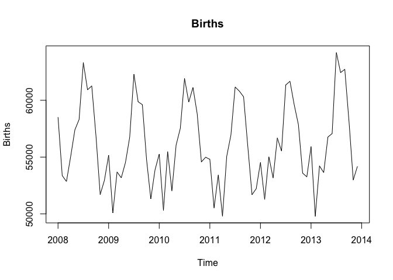<!-- -->

```r
cor(TotalAsIs, Births)
```

```
## [1] -0.1190228
```

```r
cor(TotalEtelAsIs, Births)
```

```
## [1] -0.1504242
```

```r
mywait()
```

```
## <Tcl>
```
#####The consideration by Chulwalar's experts was that expecting new parents to try to export more products to pay for the cost of a new child. However, this could not be confirmed.  

<div id='id-section3.1.5'/>
##### Monthly Satisfaction Index (SI) external index 

```r
SIExternVector <- c(ImportedIndicators[58:69,2],ImportedIndicators[58:69,3],ImportedIndicators[58:69,4],ImportedIndicators[58:69,5],ImportedIndicators[58:69,6],ImportedIndicators[58:69,7])
SIExtern <- ts(SIExternVector, start=c(2008,1), end=c(2013,12), frequency=12)
plot(SIExtern, main="SIExtern")
```

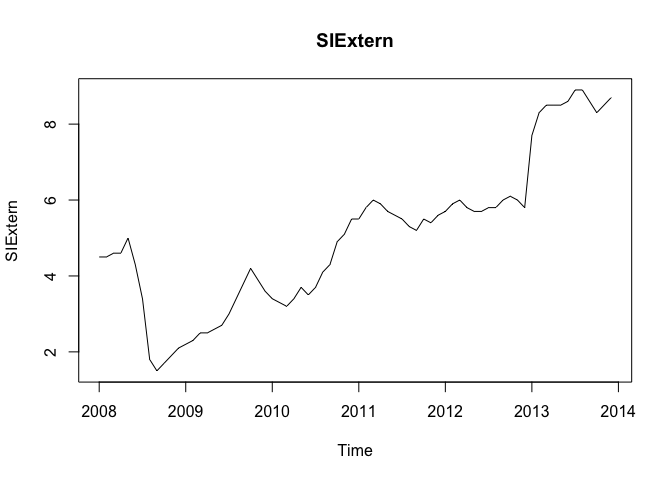<!-- -->

```r
cor(TotalAsIs, SIExtern)
```

```
## [1] 0.5883122
```

```r
cor(TotalEtelAsIs, SIExtern)
```

```
## [1] 0.2865672
```

```r
mywait()
```

```
## <Tcl>
```

<div id='id-section3.1.6'/>
#####Yearly exports from Urbano

```r
UrbanoExportsVector <- c(ImportedIndicators[72:83,2],ImportedIndicators[72:83,3],ImportedIndicators[72:83,4],ImportedIndicators[72:83,5],ImportedIndicators[72:83,6],ImportedIndicators[72:83,7])
UrbanoExports <- ts(UrbanoExportsVector, start=c(2008,1), end=c(2013,12), frequency=12)
plot(UrbanoExports, main="UrbanoExports")
```

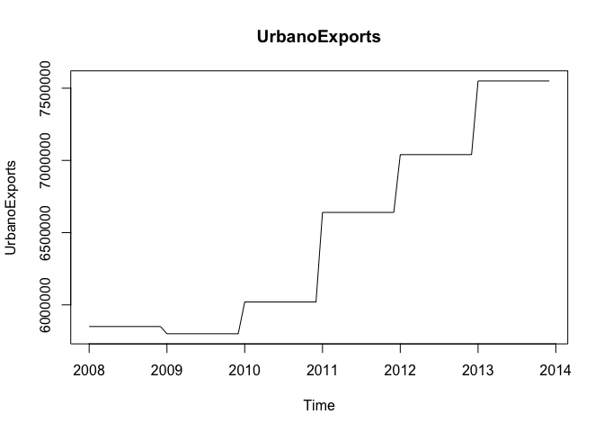<!-- -->

```r
cor(TotalAsIs, UrbanoExports)
```

```
## [1] 0.638178
```

```r
cor(TotalEtelAsIs, UrbanoExports)
```

```
## [1] 0.3182532
```

```r
mywait()
```

```
## <Tcl>
```

<div id='id-section3.1.7'/>
#####Yearly number of Globalisation Party members in Chulwalar

```r
GlobalisationPartyMembersVector <- c(ImportedIndicators[86:97,2],ImportedIndicators[86:97,3],ImportedIndicators[86:97,4],ImportedIndicators[86:97,5],ImportedIndicators[86:97,6],ImportedIndicators[86:97,7])
GlobalisationPartyMembers <- ts(GlobalisationPartyMembersVector, start=c(2008,1), end=c(2013,12), frequency=12)
plot(GlobalisationPartyMembers, main="GlobalisationPartyMembers")
```

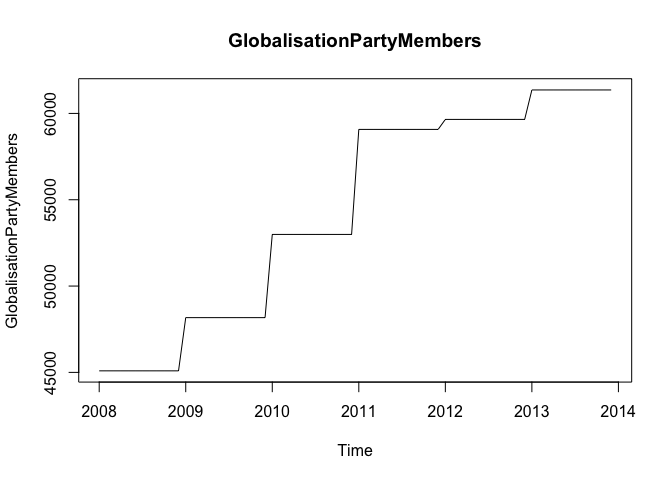<!-- -->

```r
cor(TotalAsIs, GlobalisationPartyMembers)
```

```
## [1] 0.630084
```

```r
cor(TotalEtelAsIs, GlobalisationPartyMembers)
```

```
## [1] 0.2994635
```

```r
mywait()
```

```
## <Tcl>
```
#####There is a similar picture here to that of Urbano Exports. It should however be noted that there is a continuos growth here and that the yearly view could lead to the data appearing to correlate, although this could just be due to an increase in trend. Although this could also be true for the Urbano Exports, the trend seems logical due to the Chulwalar's exports growing in accordance with the Urbano's Exports.

<div id='id-section3.1.8'/>
#####Monthly Average Export Price Index for Chulwalar

```r
AEPIVector <- c(ImportedIndicators[100:111,2],ImportedIndicators[100:111,3],ImportedIndicators[100:111,4],ImportedIndicators[100:111,5],ImportedIndicators[100:111,6],ImportedIndicators[100:111,7])
AEPI <- ts(AEPIVector, start=c(2008,1), end=c(2013,12), frequency=12)
plot(AEPI, main="AEPI")
```

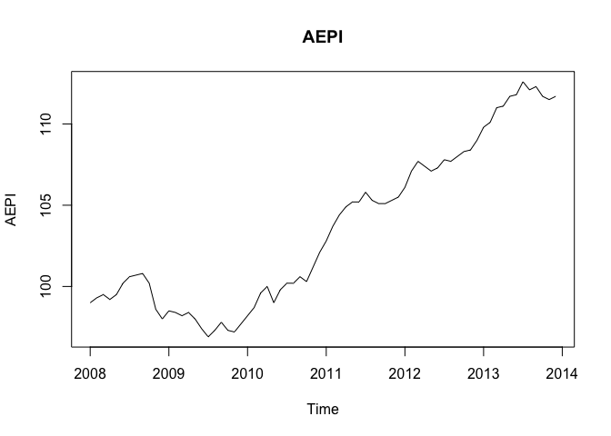<!-- -->

```r
cor(TotalAsIs, AEPI)
```

```
## [1] 0.625232
```

```r
cor(TotalEtelAsIs, AEPI)
```

```
## [1] 0.3035506
```

```r
mywait()
```

```
## <Tcl>
```
#####The continuous growth leads to a good correlation here too. See Above.

<div id='id-section3.1.9'/>
#####Monthly Producer Price Index (PPI) for Etel in Chulwalar

```r
PPIEtelVector <- c(ImportedIndicators[114:125,2],ImportedIndicators[114:125,3],ImportedIndicators[114:125,4],ImportedIndicators[114:125,5],ImportedIndicators[114:125,6],ImportedIndicators[114:125,7])
PPIEtel <- ts(PPIEtelVector, start=c(2008,1), end=c(2013,12), frequency=12)
plot(PPIEtel, main="PPIEtel")
```

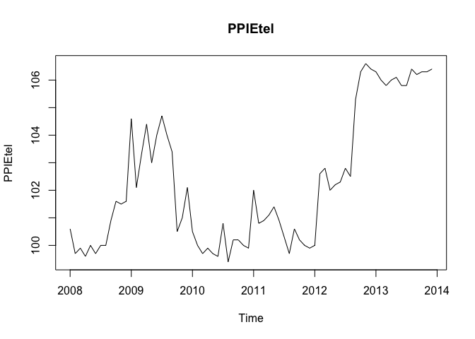<!-- -->

```r
cor(TotalAsIs, PPIEtel)
```

```
## [1] 0.4836129
```

```r
cor(TotalEtelAsIs, PPIEtel)
```

```
## [1] 0.3374707
```

```r
mywait()
```

```
## <Tcl>
```
#####This indicator does not give the expected results. It does not show any correlation worth mentioning, not even with the Etel segment. 

<div id='id-section3.1.10'/>
#####National Holidays

```r
NationalHolidaysVector <- c(ImportedIndicators[170:181,2],ImportedIndicators[170:181,3],ImportedIndicators[170:181,4],ImportedIndicators[170:181,5],ImportedIndicators[170:181,6],ImportedIndicators[170:181,7])
NationalHolidays <- ts(NationalHolidaysVector, start=c(2008,1), end=c(2013,12), frequency=12)
plot(NationalHolidays, main="NationalHolidays")
```

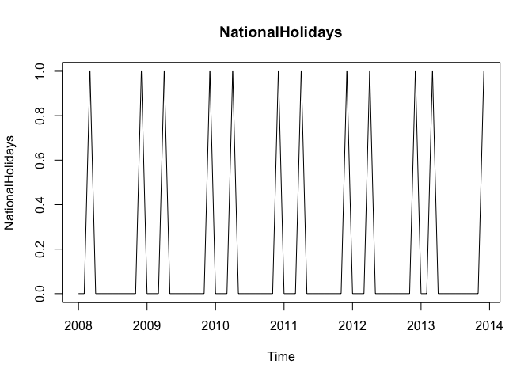<!-- -->

```r
cor(TotalAsIs, NationalHolidays)
```

```
## [1] -0.007883708
```

```r
cor(TotalEtelAsIs, NationalHolidays)
```

```
## [1] -0.01081446
```

```r
mywait()
```

```
## <Tcl>
```
#####The months April and December do not correlate well with the exports data. However later tests will show that these are worth considering. The missing correlation is just due to the sparse structure of the NationalHolidays time series.

<div id='id-section3.1.11'/>
#####Chulwalar Index (Total value of all companies in Chulwalar)

```r
ChulwalarIndexVector <- c(ImportedIndicators[128:139,2],ImportedIndicators[128:139,3],ImportedIndicators[128:139,4],ImportedIndicators[128:139,5],ImportedIndicators[128:139,6],ImportedIndicators[128:139,7])
ChulwalarIndex <- ts(ChulwalarIndexVector, start=c(2008,1), end=c(2013,12), frequency=12)
plot(ChulwalarIndex, main="ChulwalarIndex")
```

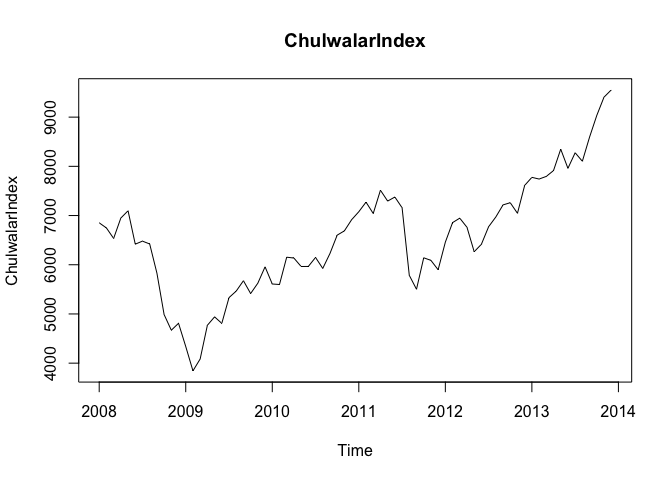<!-- -->

```r
cor(TotalAsIs, ChulwalarIndex)
```

```
## [1] 0.4837017
```

```r
cor(TotalEtelAsIs, ChulwalarIndex)
```

```
## [1] 0.2209171
```

```r
mywait()
```

```
## <Tcl>
```
#####No particular findings

<div id='id-section3.1.12'/>
#####Monthly Inflation rate in Chulwalar 

```r
InflationVector <- c(ImportedIndicators[142:153,2],ImportedIndicators[142:153,3],ImportedIndicators[142:153,4],ImportedIndicators[142:153,5],ImportedIndicators[142:153,6],ImportedIndicators[142:153,7])
Inflation <- ts(InflationVector, start=c(2008,1), end=c(2013,12), frequency=12)
plot(Inflation, main="Inflation")
```

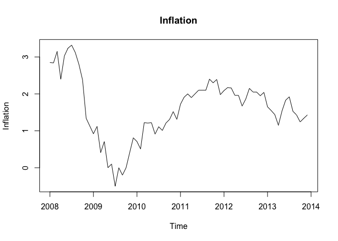<!-- -->

```r
cor(TotalAsIs, Inflation)
```

```
## [1] 0.002438708
```

```r
cor(TotalEtelAsIs, Inflation)
```

```
## [1] -0.08378282
```

```r
mywait()
```

```
## <Tcl>
```
#####No particular findings

<div id='id-section3.1.13'/>
#####Proposed spending for Independence day presents

```r
IndependenceDayPresentsVector <- c(ImportedIndicators[156:167,2],ImportedIndicators[156:167,3],ImportedIndicators[156:167,4],ImportedIndicators[156:167,5],ImportedIndicators[156:167,6],ImportedIndicators[156:167,7])
IndependenceDayPresents <- ts(IndependenceDayPresentsVector, start=c(2008,1), end=c(2013,12), frequency=12)
plot(IndependenceDayPresents, main="IndependenceDayPresents")
```

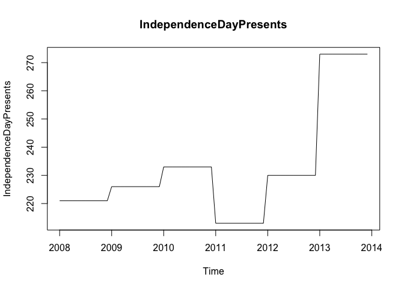<!-- -->

```r
cor(TotalAsIs, IndependenceDayPresents)
```

```
## [1] 0.4359522
```

```r
cor(TotalEtelAsIs, IndependenceDayPresents)
```

```
## [1] 0.2872013
```

```r
mywait()
```

```
## <Tcl>
```
#####No particular findings

<div id='id-section3.1.14'/>
#####Influence of National Holidays: This indicator is an experiment where the influence of National Holidays is extended into the months leading up to the holiday. However later tests show that this indicator is no better for forecasting than the orignial National Holidays indicator.    

```r
InfluenceNationalHolidaysVector <- c(ImportedIndicators[184:195,2],ImportedIndicators[184:195,3],ImportedIndicators[184:195,4],ImportedIndicators[184:195,5],ImportedIndicators[184:195,6],ImportedIndicators[184:195,7])
InfluenceNationalHolidays <- ts(InfluenceNationalHolidaysVector, start=c(2008,1), end=c(2013,12), frequency=12)
plot(InfluenceNationalHolidays, main="InfluenceNationalHolidays")
```

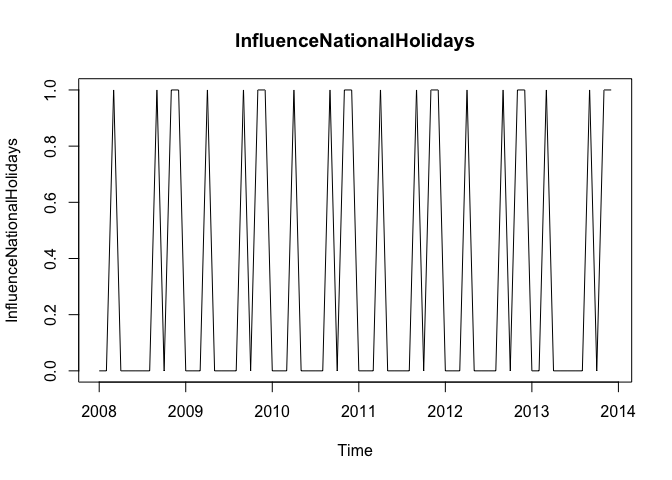<!-- -->

```r
cor(TotalAsIs, InfluenceNationalHolidays)
```

```
## [1] 0.3717463
```

```r
cor(TotalEtelAsIs, InfluenceNationalHolidays)
```

```
## [1] 0.4535836
```

```r
mywait()
```

```
## <Tcl>
```
#####Check that the data import has worked

```r
CEPI 
```

```
##        Jan   Feb   Mar   Apr   May   Jun   Jul   Aug   Sep   Oct   Nov
## 2008  97.4  97.8  98.3  98.1  98.7  98.9  99.5  99.2  99.1  98.9  98.4
## 2009  98.3  98.9  98.7  98.8  98.7  99.0  99.0  99.2  98.9  98.9  98.8
## 2010  99.0  99.4  99.9 100.0  99.9  99.9 100.1 100.2 100.1 100.2 100.3
## 2011 100.7 101.3 101.9 101.9 101.9 102.0 102.2 102.3 102.5 102.5 102.7
## 2012 102.8 103.5 104.1 103.9 103.9 103.7 104.1 104.5 104.6 104.6 104.7
## 2013 104.5 105.1 105.6 105.1 105.5 105.6 106.1 106.1 106.1 105.9 106.1
##        Dec
## 2008  98.8
## 2009  99.6
## 2010 100.9
## 2011 102.9
## 2012 105.0
## 2013 106.5
```

```r
SIGov  
```

```
##        Jan   Feb   Mar   Apr   May   Jun   Jul   Aug   Sep   Oct   Nov
## 2008  -0.4  -2.9  -2.7   1.7  -1.7  -2.6  -7.1 -11.1  -9.4 -13.5 -18.0
## 2009 -26.9 -28.6 -31.9 -30.6 -29.8 -26.6 -23.7 -21.3 -17.4 -16.0 -19.3
## 2010 -18.0 -17.9 -13.9  -5.5  -9.1  -9.8   0.6   3.5   5.9   6.4   9.9
## 2011   7.0   6.8   6.5   7.5   7.5   8.4   8.0  -0.4  -1.7  -4.1  -3.7
## 2012  -0.2  -1.4  -1.3  -1.9   0.0  -1.3  -3.7  -8.1  -9.0  -8.6  -9.5
## 2013  -6.6  -5.4  -4.9  -3.8  -4.5  -3.0  -1.7  -3.5  -4.0  -4.8  -2.5
##        Dec
## 2008 -24.7
## 2009 -16.4
## 2010   8.1
## 2011  -2.9
## 2012  -9.8
## 2013  -2.5
```

```r
Temperature 
```

```
##        Jan   Feb   Mar   Apr   May   Jun   Jul   Aug   Sep   Oct   Nov
## 2008  3.60  3.70  4.20  7.60 14.50 16.90 18.00 17.40 12.40  9.10  5.10
## 2009 -2.20  0.50  4.30 11.83 13.60 14.80 18.00 18.70 14.70  8.20  7.40
## 2010 -3.60 -0.50  4.20  8.70 10.40 16.30 20.30 16.70 12.40  8.10  4.80
## 2011  1.00  0.90  4.90 11.60 13.90 16.50 16.10 17.70 15.20  9.40  4.50
## 2012  1.90 -2.50  6.90  8.10 14.20 15.50 17.40 18.40 13.60  8.70  5.20
## 2013  0.20 -0.70  0.10  8.10 11.80 15.70 19.50 17.90 13.30 10.60  4.60
##        Dec
## 2008  1.10
## 2009  0.30
## 2010 -3.70
## 2011  3.90
## 2012  1.50
## 2013  3.60
```

```r
Births
```

```
##        Jan   Feb   Mar   Apr   May   Jun   Jul   Aug   Sep   Oct   Nov
## 2008 58519 53370 52852 55048 57398 58313 63315 60924 61263 56857 51703
## 2009 55155 50087 53692 53177 54535 56756 62292 59872 59612 54760 51319
## 2010 55273 50314 55486 52020 56054 57531 61918 59845 61125 58816 54576
## 2011 54802 50520 53433 49791 55059 56947 61169 60806 60308 55937 51691
## 2012 54528 51280 55026 53159 56683 55525 61346 61674 59615 57856 53590
## 2013 55919 49786 54222 53637 56768 57069 64208 62440 62725 58125 52985
##        Dec
## 2008 52952
## 2009 53869
## 2010 54989
## 2011 52222
## 2012 53262
## 2013 54185
```

```r
SIExtern 
```

```
##      Jan Feb Mar Apr May Jun Jul Aug Sep Oct Nov Dec
## 2008 4.5 4.5 4.6 4.6 5.0 4.3 3.4 1.8 1.5 1.7 1.9 2.1
## 2009 2.2 2.3 2.5 2.5 2.6 2.7 3.0 3.4 3.8 4.2 3.9 3.6
## 2010 3.4 3.3 3.2 3.4 3.7 3.5 3.7 4.1 4.3 4.9 5.1 5.5
## 2011 5.5 5.8 6.0 5.9 5.7 5.6 5.5 5.3 5.2 5.5 5.4 5.6
## 2012 5.7 5.9 6.0 5.8 5.7 5.7 5.8 5.8 6.0 6.1 6.0 5.8
## 2013 7.7 8.3 8.5 8.5 8.5 8.6 8.9 8.9 8.6 8.3 8.5 8.7
```

```r
UrbanoExports 
```

```
##          Jan     Feb     Mar     Apr     May     Jun     Jul     Aug
## 2008 5850000 5850000 5850000 5850000 5850000 5850000 5850000 5850000
## 2009 5800000 5800000 5800000 5800000 5800000 5800000 5800000 5800000
## 2010 6020000 6020000 6020000 6020000 6020000 6020000 6020000 6020000
## 2011 6640000 6640000 6640000 6640000 6640000 6640000 6640000 6640000
## 2012 7040000 7040000 7040000 7040000 7040000 7040000 7040000 7040000
## 2013 7550000 7550000 7550000 7550000 7550000 7550000 7550000 7550000
##          Sep     Oct     Nov     Dec
## 2008 5850000 5850000 5850000 5850000
## 2009 5800000 5800000 5800000 5800000
## 2010 6020000 6020000 6020000 6020000
## 2011 6640000 6640000 6640000 6640000
## 2012 7040000 7040000 7040000 7040000
## 2013 7550000 7550000 7550000 7550000
```

```r
GlobalisationPartyMembers
```

```
##        Jan   Feb   Mar   Apr   May   Jun   Jul   Aug   Sep   Oct   Nov
## 2008 45089 45089 45089 45089 45089 45089 45089 45089 45089 45089 45089
## 2009 48171 48171 48171 48171 48171 48171 48171 48171 48171 48171 48171
## 2010 52991 52991 52991 52991 52991 52991 52991 52991 52991 52991 52991
## 2011 59074 59074 59074 59074 59074 59074 59074 59074 59074 59074 59074
## 2012 59653 59653 59653 59653 59653 59653 59653 59653 59653 59653 59653
## 2013 61359 61359 61359 61359 61359 61359 61359 61359 61359 61359 61359
##        Dec
## 2008 45089
## 2009 48171
## 2010 52991
## 2011 59074
## 2012 59653
## 2013 61359
```

```r
AEPI
```

```
##        Jan   Feb   Mar   Apr   May   Jun   Jul   Aug   Sep   Oct   Nov
## 2008  99.0  99.3  99.5  99.2  99.5 100.2 100.6 100.7 100.8 100.2  98.6
## 2009  98.5  98.4  98.2  98.4  98.0  97.4  96.9  97.3  97.8  97.3  97.2
## 2010  98.2  98.7  99.6 100.0  99.0  99.8 100.2 100.2 100.6 100.3 101.2
## 2011 102.8 103.7 104.4 104.9 105.2 105.2 105.8 105.3 105.1 105.1 105.3
## 2012 106.1 107.1 107.7 107.4 107.1 107.3 107.8 107.7 108.0 108.3 108.4
## 2013 109.8 110.1 111.0 111.1 111.7 111.8 112.6 112.1 112.3 111.7 111.5
##        Dec
## 2008  98.0
## 2009  97.7
## 2010 102.1
## 2011 105.5
## 2012 109.0
## 2013 111.7
```

```r
PPIEtel
```

```
##        Jan   Feb   Mar   Apr   May   Jun   Jul   Aug   Sep   Oct   Nov
## 2008 100.6  99.7  99.9  99.6 100.0  99.7 100.0 100.0 100.9 101.6 101.5
## 2009 104.6 102.1 103.3 104.4 103.0 104.0 104.7 104.0 103.4 100.5 101.0
## 2010 100.5 100.0  99.7  99.9  99.7  99.6 100.8  99.4 100.2 100.2 100.0
## 2011 102.0 100.8 100.9 101.1 101.4 100.9 100.3  99.7 100.6 100.2 100.0
## 2012 100.0 102.6 102.8 102.0 102.2 102.3 102.8 102.5 105.3 106.3 106.6
## 2013 106.3 106.0 105.8 106.0 106.1 105.8 105.8 106.4 106.2 106.3 106.3
##        Dec
## 2008 101.6
## 2009 102.1
## 2010  99.9
## 2011  99.9
## 2012 106.4
## 2013 106.4
```

```r
NationalHolidays
```

```
##      Jan Feb Mar Apr May Jun Jul Aug Sep Oct Nov Dec
## 2008   0   0   1   0   0   0   0   0   0   0   0   1
## 2009   0   0   0   1   0   0   0   0   0   0   0   1
## 2010   0   0   0   1   0   0   0   0   0   0   0   1
## 2011   0   0   0   1   0   0   0   0   0   0   0   1
## 2012   0   0   0   1   0   0   0   0   0   0   0   1
## 2013   0   0   1   0   0   0   0   0   0   0   0   1
```

```r
ChulwalarIndex 
```

```
##          Jan     Feb     Mar     Apr     May     Jun     Jul     Aug
## 2008 6851.75 6748.13 6534.97 6948.82 7096.79 6418.32 6479.56 6422.30
## 2009 4338.35 3843.74 4084.76 4769.45 4940.82 4808.84 5332.14 5464.61
## 2010 5608.79 5598.46 6153.55 6135.70 5964.33 5965.52 6147.97 5925.22
## 2011 7077.48 7272.32 7041.31 7514.46 7293.69 7376.24 7158.77 5784.85
## 2012 6458.91 6856.08 6946.83 6761.19 6264.38 6416.28 6772.26 6970.79
## 2013 7776.05 7741.70 7795.31 7913.71 8348.84 7959.22 8275.97 8103.15
##          Sep     Oct     Nov     Dec
## 2008 5831.02 4987.97 4669.44 4810.20
## 2009 5675.16 5414.96 5625.95 5957.43
## 2010 6229.02 6601.37 6688.49 6914.19
## 2011 5502.02 6141.34 6088.84 5898.35
## 2012 7216.15 7260.63 7045.50 7612.39
## 2013 8594.40 9033.92 9405.30 9552.16
```

```r
Inflation 
```

```
##        Jan   Feb   Mar   Apr   May   Jun   Jul   Aug   Sep   Oct   Nov
## 2008  2.85  2.84  3.15  2.40  3.03  3.24  3.32  3.12  2.80  2.38  1.34
## 2009  0.92  1.12  0.41  0.71  0.00  0.10 -0.50  0.00 -0.20  0.00  0.41
## 2010  0.71  0.51  1.22  1.21  1.22  0.91  1.11  1.01  1.21  1.31  1.52
## 2011  1.72  1.91  2.00  1.90  2.00  2.10  2.10  2.10  2.40  2.30  2.39
## 2012  2.09  2.17  2.16  1.96  1.96  1.67  1.86  2.15  2.05  2.05  1.95
## 2013  1.65  1.55  1.44  1.15  1.54  1.83  1.92  1.53  1.43  1.24  1.34
##        Dec
## 2008  1.13
## 2009  0.81
## 2010  1.31
## 2011  1.98
## 2012  2.04
## 2013  1.43
```

```r
IndependenceDayPresents
```

```
##      Jan Feb Mar Apr May Jun Jul Aug Sep Oct Nov Dec
## 2008 221 221 221 221 221 221 221 221 221 221 221 221
## 2009 226 226 226 226 226 226 226 226 226 226 226 226
## 2010 233 233 233 233 233 233 233 233 233 233 233 233
## 2011 213 213 213 213 213 213 213 213 213 213 213 213
## 2012 230 230 230 230 230 230 230 230 230 230 230 230
## 2013 273 273 273 273 273 273 273 273 273 273 273 273
```

****************************
<div id='id-section3.2'/>
####3.2 Correlation of the indicators with a time offset 

#####The External Satisfaction Index indicator is to be offset by one month, to see if the index change makes itself first noticeable on exports in the following months.

```r
SIExternOffsetByOneMonthVector <- c(ImportedIndicators[57:68,2],ImportedIndicators[57:68,3],ImportedIndicators[57:68,4],ImportedIndicators[57:68,5],ImportedIndicators[57:68,6],ImportedIndicators[57:68,7])
SIExternOffsetByOneMonth <- ts(SIGovVector, start=c(2008,1), end=c(2013,11), frequency=12)
plot(SIExternOffsetByOneMonth, main="SIExternOffsetByOneMonth")
```

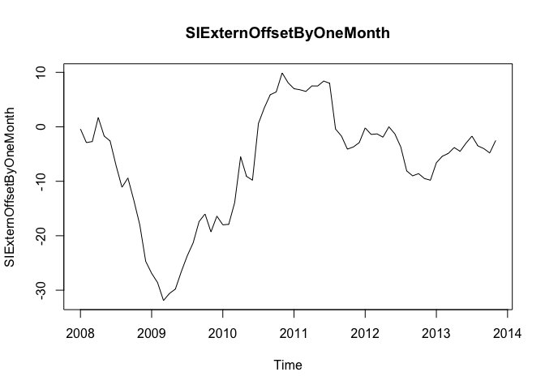<!-- -->

```r
mywait()
```

```
## <Tcl>
```
#####Delete December 2013 from the ts 

```r
TotalAsIsWithoutDec12013 <- ts(TotalAsIsVector , start=c(2008,1), end=c(2013,11), frequency=12)

TotalEtelAsIsWithoutDec12013 <- ts(TotalEtelAsIsVector, start=c(2008,1), end=c(2013,11), frequency=12)


cor(TotalAsIsWithoutDec12013, SIExternOffsetByOneMonth)
```

```
## [1] 0.1952995
```

```r
cor(TotalEtelAsIsWithoutDec12013, SIExternOffsetByOneMonth)
```

```
## [1] -0.004445279
```

```r
TotalAsIsWithoutDec2013_lm <- lm(TotalAsIsWithoutDec12013 ~ SIExternOffsetByOneMonth, data=TotalAsIsWithoutDec12013)
summary(TotalAsIsWithoutDec2013_lm)
```

```
## 
## Call:
## lm(formula = TotalAsIsWithoutDec12013 ~ SIExternOffsetByOneMonth, 
##     data = TotalAsIsWithoutDec12013)
## 
## Residuals:
##      Min       1Q   Median       3Q      Max 
## -1560602  -560765      246   437927  2142998 
## 
## Coefficients:
##                          Estimate Std. Error t value Pr(>|t|)    
## (Intercept)               3025619     114816  26.352   <2e-16 ***
## SIExternOffsetByOneMonth    15211       9196   1.654    0.103    
## ---
## Signif. codes:  0 '***' 0.001 '**' 0.01 '*' 0.05 '.' 0.1 ' ' 1
## 
## Residual standard error: 812500 on 69 degrees of freedom
## Multiple R-squared:  0.03814,	Adjusted R-squared:  0.0242 
## F-statistic: 2.736 on 1 and 69 DF,  p-value: 0.1026
```
#####The result is not very convincing.

#####Offset SIGov Indicator by two months

```r
SIGovVectorShifted2Months <- c(ImportedIndicators[15:26,2],ImportedIndicators[15:26,3],ImportedIndicators[15:26,4],ImportedIndicators[15:26,5],ImportedIndicators[15:26,6],ImportedIndicators[15:26,7])
SIGovShifted2Months <- ts(SIGovVectorShifted2Months , start=c(2008,1), end=c(2013,10), frequency=12)
plot(SIGovShifted2Months)
```

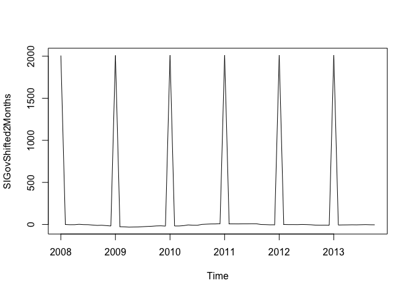<!-- -->

```r
mywait()
```

```
## <Tcl>
```
##### Delete November and December 2013 from the ts

```r
TotalAsIsWithoutNovDec2013 <- ts(TotalAsIsVector , start=c(2008,1), end=c(2013,10), frequency=12)

TotalEtelAsIsWithoutNovDec2013 <- ts(TotalEtelAsIsVector, start=c(2008,1), end=c(2013,10), frequency=12)


cor(TotalAsIsWithoutNovDec2013, SIGovShifted2Months)
```

```
## [1] 0.0446355
```

```r
cor(TotalEtelAsIsWithoutNovDec2013, SIGovShifted2Months)
```

```
## [1] 0.1173295
```

```r
TotalAsIsWithoutNovDec2013_lm <- lm(TotalAsIsWithoutNovDec2013 ~ SIGovShifted2Months, data=TotalAsIsWithoutNovDec2013)
summary(TotalAsIsWithoutNovDec2013)
```

```
##    Min. 1st Qu.  Median    Mean 3rd Qu.    Max. 
## 1458000 2353000 2901000 2897000 3329000 5108000
```
#####The correlation of the indicators has not really been improved by the offsets, so we will not continue with this approach. 

****************************
<div id='id-section3.3'/>
####3.3 Correlation of the indicators with each another 

#####In order to test which indicators could be used in a model with eachother, we need to look at the correlation of the indicators with eachother. All thirteen indicators will be compared with eachother in a correlation coefficient matrix. First of all it is necessary to summarise all indicators in a matrix.

```r
IndicatorsMatrix <-cbind(CEPIVector, SIGovVector, TemperatureVector, BirthsVector, SIGovVector, UrbanoExportsVector, GlobalisationPartyMembersVector, AEPIVector, PPIEtel, NationalHolidaysVector, ChulwalarIndexVector, InflationVector, IndependenceDayPresentsVector)
```
#####Establish the standardised data matrix

```r
IndicatorsmatrixStandardised=scale(IndicatorsMatrix)
IndicatorsmatrixStandardised
```

```
##           CEPIVector SIGovVector TemperatureVector BirthsVector
## Jan 2008 -1.52922324  0.60197865       -0.80158296   0.63571578
## Feb 2008 -1.38212361  0.36383325       -0.78670170  -0.75485223
## Mar 2008 -1.19824907  0.38288488       -0.71229542  -0.89474624
## Apr 2008 -1.27179889  0.80202078       -0.20633274  -0.30168208
## May 2008 -1.05114944  0.47814304        0.82047388   0.33297219
## Jun 2008 -0.97759963  0.39241070        1.17762401   0.58008225
## Jul 2008 -0.75695018 -0.03625102        1.34131782   1.93095061
## Aug 2008 -0.86727491 -0.41728366        1.25203029   1.28522365
## Sep 2008 -0.90404981 -0.25534479        0.50796752   1.37677591
## Oct 2008 -0.97759963 -0.64590324        0.01688609   0.18686667
## Nov 2008 -1.16147417 -1.07456496       -0.57836412  -1.20505167
## Dec 2008 -1.01437454 -1.71279463       -1.17361434  -0.86773967
## Jan 2009 -1.19824907 -1.92236259       -1.66469577  -0.27278506
## Feb 2009 -0.97759963 -2.08430146       -1.26290187  -1.64147775
## Mar 2009 -1.05114944 -2.39865338       -0.69741417  -0.66789110
## Apr 2009 -1.01437454 -2.27481778        0.42314436  -0.80697490
## May 2009 -1.05114944 -2.19861125        0.68654258  -0.44022576
## Jun 2009 -0.94082472 -1.89378514        0.86511765   0.15959004
## Jul 2009 -0.94082472 -1.61753647        1.34131782   1.65467346
## Aug 2009 -0.86727491 -1.38891689        1.44548661   1.00111459
## Sep 2009 -0.97759963 -1.01741007        0.85023639   0.93089753
## Oct 2009 -0.97759963 -0.88404864       -0.11704521  -0.37946099
## Nov 2009 -1.01437454 -1.19840057       -0.23609525  -1.30875687
## Dec 2009 -0.72017527 -0.92215191       -1.29266438  -0.62008948
## Jan 2010 -0.94082472 -1.07456496       -1.87303334  -0.24091731
## Feb 2010 -0.79372509 -1.06503915       -1.41171443  -1.58017285
## Mar 2010 -0.60985055 -0.68400651       -0.71229542  -0.18339333
## Apr 2010 -0.57307564  0.11616203       -0.04263893  -1.11944086
## May 2010 -0.60985055 -0.22676734        0.21034241  -0.02999604
## Jun 2010 -0.60985055 -0.29344805        1.08833648   0.36889092
## Jul 2010 -0.53630074  0.69723681        1.68358669   1.55366891
## Aug 2010 -0.49952583  0.97348547        1.14786150   0.99382282
## Sep 2010 -0.53630074  1.20210506        0.50796752   1.33950685
## Oct 2010 -0.49952583  1.24973414       -0.13192646   0.71592527
## Nov 2010 -0.46275092  1.58313769       -0.62300789  -0.42915307
## Dec 2010 -0.24210148  1.41167301       -1.88791460  -0.31761595
## Jan 2011 -0.31565129  1.30688903       -1.18849560  -0.36811823
## Feb 2011 -0.09500184  1.28783740       -1.20337685  -1.52453933
## Mar 2011  0.12564760  1.25925995       -0.60812664  -0.73783810
## Apr 2011  0.12564760  1.35451811        0.38891748  -1.72141718
## May 2011  0.12564760  1.35451811        0.73118635  -0.29871136
## Jun 2011  0.16242251  1.44025045        1.11809899   0.21117258
## Jul 2011  0.23597232  1.40214719        1.05857397   1.35138974
## Aug 2011  0.27274723  0.60197865        1.29667405   1.25335591
## Sep 2011  0.34629705  0.47814304        0.92464267   1.11886322
## Oct 2011  0.34629705  0.24952346        0.06152986  -0.06159372
## Nov 2011  0.41984686  0.28762672       -0.66765166  -1.20829245
## Dec 2011  0.49339668  0.36383325       -0.75693919  -1.06488760
## Jan 2012  0.45662177  0.62103028       -1.05456430  -0.44211622
## Feb 2012  0.71404612  0.50672049       -1.70933953  -1.31928943
## Mar 2012  0.93469557  0.51624630       -0.31050153  -0.30762353
## Apr 2012  0.86114575  0.45909141       -0.13192646  -0.81183609
## May 2012  0.86114575  0.64008191        0.77583012   0.13987525
## Jun 2012  0.78759594  0.51624630        0.96928644  -0.17286077
## Jul 2012  0.93469557  0.28762672        1.25203029   1.39919136
## Aug 2012  1.08179520 -0.13150918        1.40084284   1.48777289
## Sep 2012  1.11857011 -0.21724153        0.68654258   0.93170772
## Oct 2012  1.11857011 -0.17913826       -0.04263893   0.45666225
## Nov 2012  1.15534502 -0.26487061       -0.56348287  -0.69543779
## Dec 2012  1.26566974 -0.29344805       -1.11408932  -0.78401932
## Jan 2013  1.08179520  0.01137806       -1.30754564  -0.06645490
## Feb 2013  1.30244465  0.12568785       -1.44147694  -1.72276751
## Mar 2013  1.48631918  0.17331693       -1.32242689  -0.52475630
## Apr 2013  1.30244465  0.27810091       -0.13192646  -0.68274471
## May 2013  1.44954428  0.21142019        0.41867999   0.16283083
## Jun 2013  1.48631918  0.35430743        0.99904895   0.24412059
## Jul 2013  1.67019372  0.47814304        1.56453665   2.17211923
## Aug 2013  1.67019372  0.30667835        1.32643657   1.69464317
## Sep 2013  1.67019372  0.25904927        0.64189882   1.77161188
## Oct 2013  1.59664391  0.18284275        0.24010492   0.52930991
## Nov 2013  1.67019372  0.40193651       -0.65277040  -0.85882751
## Dec 2013  1.81729335  0.40193651       -0.80158296  -0.53474873
##          SIGovVector UrbanoExportsVector GlobalisationPartyMembersVector
## Jan 2008  0.60197865          -0.9637871                      -1.5070173
## Feb 2008  0.36383325          -0.9637871                      -1.5070173
## Mar 2008  0.38288488          -0.9637871                      -1.5070173
## Apr 2008  0.80202078          -0.9637871                      -1.5070173
## May 2008  0.47814304          -0.9637871                      -1.5070173
## Jun 2008  0.39241070          -0.9637871                      -1.5070173
## Jul 2008 -0.03625102          -0.9637871                      -1.5070173
## Aug 2008 -0.41728366          -0.9637871                      -1.5070173
## Sep 2008 -0.25534479          -0.9637871                      -1.5070173
## Oct 2008 -0.64590324          -0.9637871                      -1.5070173
## Nov 2008 -1.07456496          -0.9637871                      -1.5070173
## Dec 2008 -1.71279463          -0.9637871                      -1.5070173
## Jan 2009 -1.92236259          -1.0398756                      -1.0076219
## Feb 2009 -2.08430146          -1.0398756                      -1.0076219
## Mar 2009 -2.39865338          -1.0398756                      -1.0076219
## Apr 2009 -2.27481778          -1.0398756                      -1.0076219
## May 2009 -2.19861125          -1.0398756                      -1.0076219
## Jun 2009 -1.89378514          -1.0398756                      -1.0076219
## Jul 2009 -1.61753647          -1.0398756                      -1.0076219
## Aug 2009 -1.38891689          -1.0398756                      -1.0076219
## Sep 2009 -1.01741007          -1.0398756                      -1.0076219
## Oct 2009 -0.88404864          -1.0398756                      -1.0076219
## Nov 2009 -1.19840057          -1.0398756                      -1.0076219
## Dec 2009 -0.92215191          -1.0398756                      -1.0076219
## Jan 2010 -1.07456496          -0.7050864                      -0.2266076
## Feb 2010 -1.06503915          -0.7050864                      -0.2266076
## Mar 2010 -0.68400651          -0.7050864                      -0.2266076
## Apr 2010  0.11616203          -0.7050864                      -0.2266076
## May 2010 -0.22676734          -0.7050864                      -0.2266076
## Jun 2010 -0.29344805          -0.7050864                      -0.2266076
## Jul 2010  0.69723681          -0.7050864                      -0.2266076
## Aug 2010  0.97348547          -0.7050864                      -0.2266076
## Sep 2010  1.20210506          -0.7050864                      -0.2266076
## Oct 2010  1.24973414          -0.7050864                      -0.2266076
## Nov 2010  1.58313769          -0.7050864                      -0.2266076
## Dec 2010  1.41167301          -0.7050864                      -0.2266076
## Jan 2011  1.30688903           0.2384105                       0.7590584
## Feb 2011  1.28783740           0.2384105                       0.7590584
## Mar 2011  1.25925995           0.2384105                       0.7590584
## Apr 2011  1.35451811           0.2384105                       0.7590584
## May 2011  1.35451811           0.2384105                       0.7590584
## Jun 2011  1.44025045           0.2384105                       0.7590584
## Jul 2011  1.40214719           0.2384105                       0.7590584
## Aug 2011  0.60197865           0.2384105                       0.7590584
## Sep 2011  0.47814304           0.2384105                       0.7590584
## Oct 2011  0.24952346           0.2384105                       0.7590584
## Nov 2011  0.28762672           0.2384105                       0.7590584
## Dec 2011  0.36383325           0.2384105                       0.7590584
## Jan 2012  0.62103028           0.8471181                       0.8528773
## Feb 2012  0.50672049           0.8471181                       0.8528773
## Mar 2012  0.51624630           0.8471181                       0.8528773
## Apr 2012  0.45909141           0.8471181                       0.8528773
## May 2012  0.64008191           0.8471181                       0.8528773
## Jun 2012  0.51624630           0.8471181                       0.8528773
## Jul 2012  0.28762672           0.8471181                       0.8528773
## Aug 2012 -0.13150918           0.8471181                       0.8528773
## Sep 2012 -0.21724153           0.8471181                       0.8528773
## Oct 2012 -0.17913826           0.8471181                       0.8528773
## Nov 2012 -0.26487061           0.8471181                       0.8528773
## Dec 2012 -0.29344805           0.8471181                       0.8528773
## Jan 2013  0.01137806           1.6232204                       1.1293110
## Feb 2013  0.12568785           1.6232204                       1.1293110
## Mar 2013  0.17331693           1.6232204                       1.1293110
## Apr 2013  0.27810091           1.6232204                       1.1293110
## May 2013  0.21142019           1.6232204                       1.1293110
## Jun 2013  0.35430743           1.6232204                       1.1293110
## Jul 2013  0.47814304           1.6232204                       1.1293110
## Aug 2013  0.30667835           1.6232204                       1.1293110
## Sep 2013  0.25904927           1.6232204                       1.1293110
## Oct 2013  0.18284275           1.6232204                       1.1293110
## Nov 2013  0.40193651           1.6232204                       1.1293110
## Dec 2013  0.40193651           1.6232204                       1.1293110
##           AEPIVector      PPIEtel NationalHolidaysVector
## Jan 2008 -0.91646681 -0.693775997             -0.4440971
## Feb 2008 -0.85615089 -1.062575707             -0.4440971
## Mar 2008 -0.81594028 -0.980620216              2.2204854
## Apr 2008 -0.87625620 -1.103553452             -0.4440971
## May 2008 -0.81594028 -0.939642470             -0.4440971
## Jun 2008 -0.67520315 -1.062575707             -0.4440971
## Jul 2008 -0.59478193 -0.939642470             -0.4440971
## Aug 2008 -0.57467663 -0.939642470             -0.4440971
## Sep 2008 -0.55457132 -0.570842760             -0.4440971
## Oct 2008 -0.67520315 -0.283998542             -0.4440971
## Nov 2008 -0.99688803 -0.324976287             -0.4440971
## Dec 2008 -1.11751986 -0.283998542              2.2204854
## Jan 2009 -1.01699333  0.945333824             -0.4440971
## Feb 2009 -1.03709864 -0.079109814             -0.4440971
## Mar 2009 -1.07730925  0.412623132             -0.4440971
## Apr 2009 -1.03709864  0.863378333              2.2204854
## May 2009 -1.11751986  0.289689895             -0.4440971
## Jun 2009 -1.23815168  0.699467350             -0.4440971
## Jul 2009 -1.33867821  0.986311569             -0.4440971
## Aug 2009 -1.25825699  0.699467350             -0.4440971
## Sep 2009 -1.15773047  0.453600877             -0.4440971
## Oct 2009 -1.25825699 -0.734753742             -0.4440971
## Nov 2009 -1.27836229 -0.529865015             -0.4440971
## Dec 2009 -1.17783577 -0.079109814              2.2204854
## Jan 2010 -1.07730925 -0.734753742             -0.4440971
## Feb 2010 -0.97678272 -0.939642470             -0.4440971
## Mar 2010 -0.79583498 -1.062575707             -0.4440971
## Apr 2010 -0.71541376 -0.980620216              2.2204854
## May 2010 -0.91646681 -1.062575707             -0.4440971
## Jun 2010 -0.75562437 -1.103553452             -0.4440971
## Jul 2010 -0.67520315 -0.611820506             -0.4440971
## Aug 2010 -0.67520315 -1.185508943             -0.4440971
## Sep 2010 -0.59478193 -0.857686979             -0.4440971
## Oct 2010 -0.65509785 -0.857686979             -0.4440971
## Nov 2010 -0.47415010 -0.939642470             -0.4440971
## Dec 2010 -0.29320236 -0.980620216              2.2204854
## Jan 2011 -0.15246523 -0.120087560             -0.4440971
## Feb 2011  0.02848252 -0.611820506             -0.4440971
## Mar 2011  0.16921965 -0.570842760             -0.4440971
## Apr 2011  0.26974617 -0.488887269              2.2204854
## May 2011  0.33006209 -0.365954033             -0.4440971
## Jun 2011  0.33006209 -0.570842760             -0.4440971
## Jul 2011  0.45069391 -0.816709233             -0.4440971
## Aug 2011  0.35016739 -1.062575707             -0.4440971
## Sep 2011  0.30995678 -0.693775997             -0.4440971
## Oct 2011  0.30995678 -0.857686979             -0.4440971
## Nov 2011  0.35016739 -0.939642470             -0.4440971
## Dec 2011  0.39037800 -0.980620216              2.2204854
## Jan 2012  0.51100983 -0.939642470             -0.4440971
## Feb 2012  0.71206288  0.125778913             -0.4440971
## Mar 2012  0.83269471  0.207734404             -0.4440971
## Apr 2012  0.77237879 -0.120087560              2.2204854
## May 2012  0.71206288 -0.038132069             -0.4440971
## Jun 2012  0.75227349  0.002845677             -0.4440971
## Jul 2012  0.85280001  0.207734404             -0.4440971
## Aug 2012  0.83269471  0.084801168             -0.4440971
## Sep 2012  0.89301062  1.232178042             -0.4440971
## Oct 2012  0.95332653  1.641955497             -0.4440971
## Nov 2012  0.97343184  1.764888734             -0.4440971
## Dec 2012  1.09406367  1.682933243              2.2204854
## Jan 2013  1.25490611  1.641955497             -0.4440971
## Feb 2013  1.31522202  1.519022261             -0.4440971
## Mar 2013  1.49616976  1.437066770              2.2204854
## Apr 2013  1.51627507  1.519022261             -0.4440971
## May 2013  1.63690690  1.560000006             -0.4440971
## Jun 2013  1.65701220  1.437066770             -0.4440971
## Jul 2013  1.81785464  1.437066770             -0.4440971
## Aug 2013  1.71732811  1.682933243             -0.4440971
## Sep 2013  1.75753872  1.600977752             -0.4440971
## Oct 2013  1.63690690  1.641955497             -0.4440971
## Nov 2013  1.59669629  1.641955497             -0.4440971
## Dec 2013  1.63690690  1.682933243              2.2204854
##          ChulwalarIndexVector InflationVector
## Jan 2008           0.25840362      1.46874959
## Feb 2008           0.17119839      1.45693527
## Mar 2008          -0.00819425      1.82317917
## Apr 2008           0.34009645      0.93710523
## May 2008           0.46462605      1.68140734
## Jun 2008          -0.10636535      1.92950804
## Jul 2008          -0.05482658      2.02402259
## Aug 2008          -0.10301584      1.78773621
## Sep 2008          -0.60062928      1.40967800
## Oct 2008          -1.31012904      0.91347659
## Nov 2008          -1.57819968     -0.31521260
## Dec 2008          -1.45973792     -0.56331330
## Jan 2009          -1.85684066     -0.81141400
## Feb 2009          -2.27309791     -0.57512762
## Mar 2009          -2.07025865     -1.41394428
## Apr 2009          -1.49403258     -1.05951471
## May 2009          -1.34980985     -1.89833137
## Jun 2009          -1.46088248     -1.78018817
## Jul 2009          -1.02048011     -2.48904732
## Aug 2009          -0.90899510     -1.89833137
## Sep 2009          -0.73179900     -2.13461775
## Oct 2009          -0.95077989     -1.89833137
## Nov 2009          -0.77321349     -1.41394428
## Dec 2009          -0.49424429     -0.94137151
## Jan 2010          -0.78765512     -1.05951471
## Feb 2010          -0.79634871     -1.29580109
## Mar 2010          -0.32919229     -0.45698443
## Apr 2010          -0.34421461     -0.46879875
## May 2010          -0.48843734     -0.45698443
## Jun 2010          -0.48743586     -0.82322832
## Jul 2010          -0.33388834     -0.58694194
## Aug 2010          -0.52135180     -0.70508513
## Sep 2010          -0.26567773     -0.46879875
## Oct 2010           0.04768711     -0.35065556
## Nov 2010           0.12100616     -0.10255485
## Dec 2010           0.31095230     -0.35065556
## Jan 2011           0.44837501      0.13373153
## Feb 2011           0.61234978      0.35820359
## Mar 2011           0.41793481      0.46453247
## Apr 2011           0.81613161      0.34638927
## May 2011           0.63033449      0.46453247
## Jun 2011           0.69980748      0.58267566
## Jul 2011           0.51678760      0.58267566
## Aug 2011          -0.63948534      0.58267566
## Sep 2011          -0.87751134      0.93710523
## Oct 2011          -0.33946806      0.81896204
## Nov 2011          -0.38365137      0.92529091
## Dec 2011          -0.54396524      0.44090383
## Jan 2012          -0.07220534      0.57086134
## Feb 2012           0.26204769      0.66537589
## Mar 2012           0.33842169      0.65356157
## Apr 2012           0.18218952      0.41727519
## May 2012          -0.23591922      0.41727519
## Jun 2012          -0.10808219      0.07465993
## Jul 2012           0.19150588      0.29913200
## Aug 2012           0.35858611      0.64174725
## Sep 2012           0.56507785      0.52360406
## Oct 2012           0.60251163      0.52360406
## Nov 2012           0.42146106      0.40546087
## Dec 2012           0.89854820      0.51178974
## Jan 2013           1.03628230      0.05103130
## Feb 2013           1.00737379     -0.06711190
## Mar 2013           1.05249126     -0.19706941
## Apr 2013           1.15213514     -0.53968466
## May 2013           1.51833481     -0.07892622
## Jun 2013           1.19043576      0.26368904
## Jul 2013           1.45700838      0.37001791
## Aug 2013           1.31156534     -0.09074053
## Sep 2013           1.72499486     -0.20888373
## Oct 2013           2.09488909     -0.43335579
## Nov 2013           2.40743760     -0.31521260
## Dec 2013           2.53103304     -0.20888373
##          IndependenceDayPresentsVector
## Jan 2008                   -0.60484269
## Feb 2008                   -0.60484269
## Mar 2008                   -0.60484269
## Apr 2008                   -0.60484269
## May 2008                   -0.60484269
## Jun 2008                   -0.60484269
## Jul 2008                   -0.60484269
## Aug 2008                   -0.60484269
## Sep 2008                   -0.60484269
## Oct 2008                   -0.60484269
## Nov 2008                   -0.60484269
## Dec 2008                   -0.60484269
## Jan 2009                   -0.34562439
## Feb 2009                   -0.34562439
## Mar 2009                   -0.34562439
## Apr 2009                   -0.34562439
## May 2009                   -0.34562439
## Jun 2009                   -0.34562439
## Jul 2009                   -0.34562439
## Aug 2009                   -0.34562439
## Sep 2009                   -0.34562439
## Oct 2009                   -0.34562439
## Nov 2009                   -0.34562439
## Dec 2009                   -0.34562439
## Jan 2010                    0.01728122
## Feb 2010                    0.01728122
## Mar 2010                    0.01728122
## Apr 2010                    0.01728122
## May 2010                    0.01728122
## Jun 2010                    0.01728122
## Jul 2010                    0.01728122
## Aug 2010                    0.01728122
## Sep 2010                    0.01728122
## Oct 2010                    0.01728122
## Nov 2010                    0.01728122
## Dec 2010                    0.01728122
## Jan 2011                   -1.01959196
## Feb 2011                   -1.01959196
## Mar 2011                   -1.01959196
## Apr 2011                   -1.01959196
## May 2011                   -1.01959196
## Jun 2011                   -1.01959196
## Jul 2011                   -1.01959196
## Aug 2011                   -1.01959196
## Sep 2011                   -1.01959196
## Oct 2011                   -1.01959196
## Nov 2011                   -1.01959196
## Dec 2011                   -1.01959196
## Jan 2012                   -0.13824976
## Feb 2012                   -0.13824976
## Mar 2012                   -0.13824976
## Apr 2012                   -0.13824976
## May 2012                   -0.13824976
## Jun 2012                   -0.13824976
## Jul 2012                   -0.13824976
## Aug 2012                   -0.13824976
## Sep 2012                   -0.13824976
## Oct 2012                   -0.13824976
## Nov 2012                   -0.13824976
## Dec 2012                   -0.13824976
## Jan 2013                    2.09102758
## Feb 2013                    2.09102758
## Mar 2013                    2.09102758
## Apr 2013                    2.09102758
## May 2013                    2.09102758
## Jun 2013                    2.09102758
## Jul 2013                    2.09102758
## Aug 2013                    2.09102758
## Sep 2013                    2.09102758
## Oct 2013                    2.09102758
## Nov 2013                    2.09102758
## Dec 2013                    2.09102758
## attr(,"scaled:center")
##                      CEPIVector                     SIGovVector 
##                    1.015583e+02                   -6.719444e+00 
##               TemperatureVector                    BirthsVector 
##                    8.986528e+00                    5.616507e+04 
##                     SIGovVector             UrbanoExportsVector 
##                   -6.719444e+00                    6.483333e+06 
## GlobalisationPartyMembersVector                      AEPIVector 
##                    5.438950e+04                    1.035583e+02 
##                         PPIEtel          NationalHolidaysVector 
##                    1.022931e+02                    1.666667e-01 
##            ChulwalarIndexVector                 InflationVector 
##                    6.544707e+03                    1.606806e+00 
##   IndependenceDayPresentsVector 
##                    2.326667e+02 
## attr(,"scaled:scale")
##                      CEPIVector                     SIGovVector 
##                    2.719245e+00                    1.049779e+01 
##               TemperatureVector                    BirthsVector 
##                    6.719863e+00                    3.702803e+03 
##                     SIGovVector             UrbanoExportsVector 
##                    1.049779e+01                    6.571299e+05 
## GlobalisationPartyMembersVector                      AEPIVector 
##                    6.171462e+03                    4.973812e+00 
##                         PPIEtel          NationalHolidaysVector 
##                    2.440349e+00                    3.752933e-01 
##            ChulwalarIndexVector                 InflationVector 
##                    1.188232e+03                    8.464305e-01 
##   IndependenceDayPresentsVector 
##                    1.928876e+01
```
#####The dimensions of the matrix are determined by the number of indicators

```r
NumberOfIndicators=dim(IndicatorsmatrixStandardised)[1]
NumberOfIndicators
```

```
## [1] 72
```
#####Produce the IndicatorsCorrelationCoefficientMatrix

```r
IndicatorsCorrelationCoefficientMatrix=(1/(NumberOfIndicators-1))*t(IndicatorsmatrixStandardised)%*%IndicatorsmatrixStandardised
IndicatorsCorrelationCoefficientMatrix
```

```
##                                 CEPIVector SIGovVector TemperatureVector
## CEPIVector                      1.00000000  0.38443508       0.061196862
## SIGovVector                     0.38443508  1.00000000       0.088109231
## TemperatureVector               0.06119686  0.08810923       1.000000000
## BirthsVector                    0.08872676  0.12753378       0.744270853
## SIGovVector                     0.38443508  1.00000000       0.088109231
## UrbanoExportsVector             0.97660022  0.40700264      -0.001244458
## GlobalisationPartyMembersVector 0.91557949  0.49433954      -0.009695828
## AEPIVector                      0.97697428  0.45955807       0.055196145
## PPIEtel                         0.65446147 -0.23602751      -0.013959906
## NationalHolidaysVector          0.04830482 -0.02025819      -0.316148237
## ChulwalarIndexVector            0.76208613  0.63652935       0.036317166
## InflationVector                 0.16379793  0.55866085       0.054966975
## IndependenceDayPresentsVector   0.64887003  0.03237405      -0.040110690
##                                 BirthsVector SIGovVector
## CEPIVector                        0.08872676  0.38443508
## SIGovVector                       0.12753378  1.00000000
## TemperatureVector                 0.74427085  0.08810923
## BirthsVector                      1.00000000  0.12753378
## SIGovVector                       0.12753378  1.00000000
## UrbanoExportsVector               0.03139251  0.40700264
## GlobalisationPartyMembersVector  -0.01768274  0.49433954
## AEPIVector                        0.09673808  0.45955807
## PPIEtel                           0.05960084 -0.23602751
## NationalHolidaysVector           -0.37785553 -0.02025819
## ChulwalarIndexVector              0.11795545  0.63652935
## InflationVector                   0.11231574  0.55866085
## IndependenceDayPresentsVector     0.10063892  0.03237405
##                                 UrbanoExportsVector
## CEPIVector                             9.766002e-01
## SIGovVector                            4.070026e-01
## TemperatureVector                     -1.244458e-03
## BirthsVector                           3.139251e-02
## SIGovVector                            4.070026e-01
## UrbanoExportsVector                    1.000000e+00
## GlobalisationPartyMembersVector        9.121013e-01
## AEPIVector                             9.827920e-01
## PPIEtel                                6.521194e-01
## NationalHolidaysVector                -1.876433e-17
## ChulwalarIndexVector                   7.856783e-01
## InflationVector                        1.985267e-01
## IndependenceDayPresentsVector          6.699996e-01
##                                 GlobalisationPartyMembersVector AEPIVector
## CEPIVector                                         9.155795e-01 0.97697428
## SIGovVector                                        4.943395e-01 0.45955807
## TemperatureVector                                 -9.695828e-03 0.05519615
## BirthsVector                                      -1.768274e-02 0.09673808
## SIGovVector                                        4.943395e-01 0.45955807
## UrbanoExportsVector                                9.121013e-01 0.98279202
## GlobalisationPartyMembersVector                    1.000000e+00 0.88225030
## AEPIVector                                         8.822503e-01 1.00000000
## PPIEtel                                            4.583532e-01 0.62229942
## NationalHolidaysVector                             1.250956e-17 0.01886347
## ChulwalarIndexVector                               6.647301e-01 0.80958140
## InflationVector                                    9.009471e-02 0.30646256
## IndependenceDayPresentsVector                      4.606363e-01 0.64313387
##                                     PPIEtel NationalHolidaysVector
## CEPIVector                       0.65446147           4.830482e-02
## SIGovVector                     -0.23602751          -2.025819e-02
## TemperatureVector               -0.01395991          -3.161482e-01
## BirthsVector                     0.05960084          -3.778555e-01
## SIGovVector                     -0.23602751          -2.025819e-02
## UrbanoExportsVector              0.65211942          -1.876433e-17
## GlobalisationPartyMembersVector  0.45835315           1.250956e-17
## AEPIVector                       0.62229942           1.886347e-02
## PPIEtel                          1.00000000           2.896317e-02
## NationalHolidaysVector           0.02896317           1.000000e+00
## ChulwalarIndexVector             0.45429124           5.430333e-02
## InflationVector                 -0.25048037          -9.384951e-03
## IndependenceDayPresentsVector    0.71474813           0.000000e+00
##                                 ChulwalarIndexVector InflationVector
## CEPIVector                                0.76208613     0.163797927
## SIGovVector                               0.63652935     0.558660851
## TemperatureVector                         0.03631717     0.054966975
## BirthsVector                              0.11795545     0.112315739
## SIGovVector                               0.63652935     0.558660851
## UrbanoExportsVector                       0.78567826     0.198526676
## GlobalisationPartyMembersVector           0.66473014     0.090094706
## AEPIVector                                0.80958140     0.306462559
## PPIEtel                                   0.45429124    -0.250480368
## NationalHolidaysVector                    0.05430333    -0.009384951
## ChulwalarIndexVector                      1.00000000     0.341955823
## InflationVector                           0.34195582     1.000000000
## IndependenceDayPresentsVector             0.62615921    -0.185842679
##                                 IndependenceDayPresentsVector
## CEPIVector                                         0.64887003
## SIGovVector                                        0.03237405
## TemperatureVector                                 -0.04011069
## BirthsVector                                       0.10063892
## SIGovVector                                        0.03237405
## UrbanoExportsVector                                0.66999963
## GlobalisationPartyMembersVector                    0.46063633
## AEPIVector                                         0.64313387
## PPIEtel                                            0.71474813
## NationalHolidaysVector                             0.00000000
## ChulwalarIndexVector                               0.62615921
## InflationVector                                   -0.18584268
## IndependenceDayPresentsVector                      1.00000000
```

```r
mywait()
```

```
## <Tcl>
```
#####The Correlation Coefficient Matrix shows that CEPI has a high correlation with SIExtern, UrbanoExports, GlobalisationPartyMembers and AEPI. These will become the set of indicators used later, although we are aware of the dangers of multicollinearity.

#####However it is interesting to note that NationalHolidays, UrbanoExports, GlobalisationPartyMembers have a very low correlation with one another. Therefore these will also  become a set of indicators used later.
****************************
<div id='id-section4.0'/>
###4.0 Development of forecasting models 
#####With help of the tslm function, we will produce a model based on the time series. Possible inputs could be Trend and Seasonality as well as the time series of the indicators. 
****************************
<div id='id-section4.1'/>
###4.1 Model WithAll Indicators and with each indicator individually  
#####All Indiators in one model:

```r
ModelWithAlllIndicators <- tslm(TotalAsIs ~ trend + season + CEPI + SIGov + Temperature + Births + SIExtern + UrbanoExports + GlobalisationPartyMembers + AEPI + PPIEtel + NationalHolidays + ChulwalarIndex + Inflation + IndependenceDayPresents)
summary(ModelWithAlllIndicators)
```

```
## 
## Call:
## tslm(formula = TotalAsIs ~ trend + season + CEPI + SIGov + Temperature + 
##     Births + SIExtern + UrbanoExports + GlobalisationPartyMembers + 
##     AEPI + PPIEtel + NationalHolidays + ChulwalarIndex + Inflation + 
##     IndependenceDayPresents)
## 
## Residuals:
##     Min      1Q  Median      3Q     Max 
## -458389 -119426    1119  165463  342741 
## 
## Coefficients:
##                             Estimate Std. Error t value Pr(>|t|)   
## (Intercept)               -8.982e+05  2.301e+07  -0.039  0.96904   
## trend                      3.176e+03  3.849e+04   0.083  0.93458   
## season2                    3.146e+05  2.678e+05   1.175  0.24624   
## season3                    5.172e+05  2.649e+05   1.953  0.05695 . 
## season4                    2.972e+05  3.413e+05   0.871  0.38836   
## season5                   -7.277e+04  3.661e+05  -0.199  0.84333   
## season6                   -2.597e+05  4.199e+05  -0.618  0.53932   
## season7                   -7.550e+05  5.225e+05  -1.445  0.15525   
## season8                   -2.869e+05  4.990e+05  -0.575  0.56809   
## season9                    1.066e+06  4.225e+05   2.523  0.01517 * 
## season10                   8.033e+05  3.352e+05   2.396  0.02068 * 
## season11                   1.226e+06  3.555e+05   3.449  0.00122 **
## season12                   9.734e+05  3.645e+05   2.670  0.01044 * 
## CEPI                      -3.551e+04  2.516e+05  -0.141  0.88838   
## SIGov                     -1.506e+04  9.150e+03  -1.646  0.10657   
## Temperature               -3.108e+04  2.069e+04  -1.502  0.14003   
## Births                     8.045e+01  3.894e+01   2.066  0.04448 * 
## SIExtern                   3.706e+04  5.872e+04   0.631  0.53109   
## UrbanoExports              5.323e-01  5.675e-01   0.938  0.35317   
## GlobalisationPartyMembers  7.324e+01  6.583e+01   1.113  0.27163   
## AEPI                      -6.003e+04  7.476e+04  -0.803  0.42612   
## PPIEtel                    7.799e+03  3.622e+04   0.215  0.83048   
## NationalHolidays          -3.192e+05  1.718e+05  -1.858  0.06963 . 
## ChulwalarIndex             6.102e+01  7.545e+01   0.809  0.42284   
## Inflation                  7.058e+04  1.555e+05   0.454  0.65213   
## IndependenceDayPresents    4.211e+01  6.187e+03   0.007  0.99460   
## ---
## Signif. codes:  0 '***' 0.001 '**' 0.01 '*' 0.05 '.' 0.1 ' ' 1
## 
## Residual standard error: 249400 on 46 degrees of freedom
## Multiple R-squared:  0.9421,	Adjusted R-squared:  0.9106 
## F-statistic: 29.94 on 25 and 46 DF,  p-value: < 2.2e-16
```
#####Adjusted R-Squared: 0.9106

####CEPI:
#####The CEPI Indicator correlated best with total exports. Indeed the multiple R? improved the model slighltly compared to the simple ModelWithTrendAndSeasonalityOnly However the adjusted R? remains the same.

```r
ModelWithCEPI <- tslm(TotalAsIs ~ trend + season + CEPI)
summary(ModelWithCEPI)    
```

```
## 
## Call:
## tslm(formula = TotalAsIs ~ trend + season + CEPI)
## 
## Residuals:
##     Min      1Q  Median      3Q     Max 
## -670684 -142117    7024  168664  495366 
## 
## Coefficients:
##             Estimate Std. Error t value Pr(>|t|)    
## (Intercept) -2946424    5153463  -0.572 0.569710    
## trend          19698       6926   2.844 0.006145 ** 
## season2      -153664     153683  -1.000 0.321523    
## season3         8677     156732   0.055 0.956039    
## season4      -634082     154130  -4.114 0.000124 ***
## season5      -648875     154240  -4.207 9.09e-05 ***
## season6      -906108     153943  -5.886 2.10e-07 ***
## season7     -1112258     155872  -7.136 1.73e-09 ***
## season8      -755526     155490  -4.859 9.34e-06 ***
## season9       683382     154129   4.434 4.18e-05 ***
## season10      287071     153168   1.874 0.065940 .  
## season11      465878     152885   3.047 0.003474 ** 
## season12       50523     154712   0.327 0.745176    
## CEPI           53135      53376   0.995 0.323636    
## ---
## Signif. codes:  0 '***' 0.001 '**' 0.01 '*' 0.05 '.' 0.1 ' ' 1
## 
## Residual standard error: 263300 on 58 degrees of freedom
## Multiple R-squared:  0.9187,	Adjusted R-squared:  0.9004 
## F-statistic: 50.39 on 13 and 58 DF,  p-value: < 2.2e-16
```
#####Adjusted R-Squared: 0.9004

####SIGov:
#####The Satisfaction Index (gov)  hardly changes the function of the model.

```r
ModelWithSIGov <- tslm(TotalAsIs ~ trend + season + SIGov)
summary(ModelWithSIGov)
```

```
## 
## Call:
## tslm(formula = TotalAsIs ~ trend + season + SIGov)
## 
## Residuals:
##     Min      1Q  Median      3Q     Max 
## -697126 -157160   22782  161382  486711 
## 
## Coefficients:
##             Estimate Std. Error t value Pr(>|t|)    
## (Intercept)  2154992     126151  17.083  < 2e-16 ***
## trend          26826       1656  16.196  < 2e-16 ***
## season2      -133003     152843  -0.870 0.387782    
## season3        44751     152866   0.293 0.770763    
## season4      -606128     152952  -3.963 0.000205 ***
## season5      -622634     152935  -4.071 0.000143 ***
## season6      -881666     153013  -5.762 3.35e-07 ***
## season7     -1075681     153182  -7.022 2.69e-09 ***
## season8      -726089     153194  -4.740 1.43e-05 ***
## season9       705690     153291   4.604 2.31e-05 ***
## season10      297924     153457   1.941 0.057071 .  
## season11      468770     153659   3.051 0.003439 ** 
## season12       68494     153977   0.445 0.658095    
## SIGov          -2003       3274  -0.612 0.543174    
## ---
## Signif. codes:  0 '***' 0.001 '**' 0.01 '*' 0.05 '.' 0.1 ' ' 1
## 
## Residual standard error: 264700 on 58 degrees of freedom
## Multiple R-squared:  0.9178,	Adjusted R-squared:  0.8994 
## F-statistic: 49.81 on 13 and 58 DF,  p-value: < 2.2e-16
```
#####Adjusted R-Squared: 0.8994

####Temperature:

```r
ModelWithTemperature <- tslm(TotalAsIs ~ trend + season + Temperature)
summary(ModelWithTemperature)
```

```
## 
## Call:
## tslm(formula = TotalAsIs ~ trend + season + Temperature)
## 
## Residuals:
##     Min      1Q  Median      3Q     Max 
## -706803 -154965   23511  160215  483373 
## 
## Coefficients:
##             Estimate Std. Error t value Pr(>|t|)    
## (Intercept)  2185999     118102  18.509  < 2e-16 ***
## trend          26366       1526  17.278  < 2e-16 ***
## season2      -130163     152874  -0.851  0.39803    
## season3        91513     171443   0.534  0.59553    
## season4      -504879     236159  -2.138  0.03675 *  
## season5      -476774     296010  -1.611  0.11268    
## season6      -703538     345717  -2.035  0.04643 *  
## season7      -873818     386156  -2.263  0.02740 *  
## season8      -524053     378812  -1.383  0.17184    
## season9       858772     305542   2.811  0.00673 ** 
## season10      401142     232466   1.726  0.08974 .  
## season11      530742     183984   2.885  0.00549 ** 
## season12       85552     155077   0.552  0.58329    
## Temperature   -11344      19587  -0.579  0.56473    
## ---
## Signif. codes:  0 '***' 0.001 '**' 0.01 '*' 0.05 '.' 0.1 ' ' 1
## 
## Residual standard error: 264800 on 58 degrees of freedom
## Multiple R-squared:  0.9177,	Adjusted R-squared:  0.8993 
## F-statistic: 49.78 on 13 and 58 DF,  p-value: < 2.2e-16
```
#####Adjusted R-Squared: 0.8993 

####Births:

```r
ModelWithBirths <- tslm(TotalAsIs ~ trend + season + Births)
summary(ModelWithBirths) 
```

```
## 
## Call:
## tslm(formula = TotalAsIs ~ trend + season + Births)
## 
## Residuals:
##     Min      1Q  Median      3Q     Max 
## -648252 -106586   23124  166173  443675 
## 
## Coefficients:
##               Estimate Std. Error t value Pr(>|t|)    
## (Intercept) -1.485e+06  1.452e+06  -1.023 0.310779    
## trend        2.633e+04  1.449e+03  18.163  < 2e-16 ***
## season2      1.856e+05  1.918e+05   0.968 0.337199    
## season3      1.510e+05  1.512e+05   0.998 0.322286    
## season4     -4.181e+05  1.639e+05  -2.551 0.013402 *  
## season5     -6.484e+05  1.459e+05  -4.444 4.04e-05 ***
## season6     -9.698e+05  1.496e+05  -6.482 2.16e-08 ***
## season7     -1.518e+06  2.265e+05  -6.704 9.20e-09 ***
## season8     -1.068e+06  1.992e+05  -5.364 1.48e-06 ***
## season9      3.721e+05  1.966e+05   1.893 0.063345 .  
## season10     2.114e+05  1.502e+05   1.407 0.164622    
## season11     6.744e+05  1.666e+05   4.049 0.000155 ***
## season12     2.147e+05  1.565e+05   1.372 0.175458    
## Births       6.589e+01  2.601e+01   2.533 0.014026 *  
## ---
## Signif. codes:  0 '***' 0.001 '**' 0.01 '*' 0.05 '.' 0.1 ' ' 1
## 
## Residual standard error: 251900 on 58 degrees of freedom
## Multiple R-squared:  0.9255,	Adjusted R-squared:  0.9088 
## F-statistic: 55.43 on 13 and 58 DF,  p-value: < 2.2e-16
```
#####Adjusted R-Squared: 0.9088 

####SIExtern:

```r
ModelWithSIExtern <- tslm(TotalAsIs ~ trend + season + SIExtern)
summary(ModelWithSIExtern) 
```

```
## 
## Call:
## tslm(formula = TotalAsIs ~ trend + season + SIExtern)
## 
## Residuals:
##     Min      1Q  Median      3Q     Max 
## -667444 -154044   -5891  162628  473612 
## 
## Coefficients:
##             Estimate Std. Error t value Pr(>|t|)    
## (Intercept)  2124425     137869  15.409  < 2e-16 ***
## trend          24163       3191   7.572 3.20e-10 ***
## season2      -133767     152487  -0.877 0.383979    
## season3        43156     152535   0.283 0.778243    
## season4      -609825     152516  -3.998 0.000183 ***
## season5      -624208     152569  -4.091 0.000134 ***
## season6      -877941     152767  -5.747 3.55e-07 ***
## season7     -1071287     153026  -7.001 2.92e-09 ***
## season8      -710172     153872  -4.615 2.22e-05 ***
## season9       722059     154265   4.681 1.76e-05 ***
## season10      312879     153885   2.033 0.046617 *  
## season11      486780     154278   3.155 0.002542 ** 
## season12       88661     154442   0.574 0.568139    
## SIExtern       26522      32881   0.807 0.423187    
## ---
## Signif. codes:  0 '***' 0.001 '**' 0.01 '*' 0.05 '.' 0.1 ' ' 1
## 
## Residual standard error: 264000 on 58 degrees of freedom
## Multiple R-squared:  0.9182,	Adjusted R-squared:  0.8998 
## F-statistic: 50.07 on 13 and 58 DF,  p-value: < 2.2e-16
```
#####Adjusted R-Squared: 0.8998 

####UrbanoExports:
#####Indicator with adjusted R? shows a better result than the reference model (ModelWithTrendAndSeasonalityOnly).The individual months are also very significant.

```r
ModelWithTotalUrbanoExports <- tslm(TotalAsIs ~ trend + season + UrbanoExports)
summary(ModelWithTotalUrbanoExports) 
```

```
## 
## Call:
## tslm(formula = TotalAsIs ~ trend + season + UrbanoExports)
## 
## Residuals:
##     Min      1Q  Median      3Q     Max 
## -651323 -145654    7297  172919  469753 
## 
## Coefficients:
##                 Estimate Std. Error t value Pr(>|t|)    
## (Intercept)    1.232e+06  9.485e+05   1.299 0.199178    
## trend          2.118e+04  5.414e+03   3.912 0.000243 ***
## season2       -1.259e+05  1.521e+05  -0.828 0.411030    
## season3        5.708e+04  1.524e+05   0.375 0.709261    
## season4       -5.934e+05  1.528e+05  -3.882 0.000267 ***
## season5       -6.025e+05  1.535e+05  -3.925 0.000232 ***
## season6       -8.568e+05  1.544e+05  -5.551 7.40e-07 ***
## season7       -1.048e+06  1.554e+05  -6.741 7.96e-09 ***
## season8       -6.879e+05  1.566e+05  -4.392 4.82e-05 ***
## season9        7.477e+05  1.580e+05   4.732 1.47e-05 ***
## season10       3.473e+05  1.596e+05   2.176 0.033640 *  
## season11       5.246e+05  1.613e+05   3.252 0.001913 ** 
## season12       1.317e+05  1.632e+05   0.807 0.423118    
## UrbanoExports  1.717e-01  1.700e-01   1.010 0.316698    
## ---
## Signif. codes:  0 '***' 0.001 '**' 0.01 '*' 0.05 '.' 0.1 ' ' 1
## 
## Residual standard error: 263200 on 58 degrees of freedom
## Multiple R-squared:  0.9187,	Adjusted R-squared:  0.9005 
## F-statistic: 50.41 on 13 and 58 DF,  p-value: < 2.2e-16
```
#####Adjusted R-Squared: 0.9005 

####GlobalisationPartyMembers:

```r
ModelWithGlobalisationPartyMembers <- tslm(TotalAsIs ~ trend + season + GlobalisationPartyMembers)
summary(ModelWithGlobalisationPartyMembers) 
```

```
## 
## Call:
## tslm(formula = TotalAsIs ~ trend + season + GlobalisationPartyMembers)
## 
## Residuals:
##     Min      1Q  Median      3Q     Max 
## -696019 -161848   22345  172443  478347 
## 
## Coefficients:
##                             Estimate Std. Error t value Pr(>|t|)    
## (Intercept)                2.629e+06  9.653e+05   2.724 0.008517 ** 
## trend                      2.928e+04  6.311e+03   4.640 2.04e-05 ***
## season2                   -1.340e+05  1.531e+05  -0.875 0.385097    
## season3                    4.087e+04  1.535e+05   0.266 0.791010    
## season4                   -6.177e+05  1.542e+05  -4.006 0.000178 ***
## season5                   -6.350e+05  1.551e+05  -4.094 0.000133 ***
## season6                   -8.973e+05  1.562e+05  -5.744 3.59e-07 ***
## season7                   -1.096e+06  1.576e+05  -6.955 3.49e-09 ***
## season8                   -7.447e+05  1.593e+05  -4.676 1.79e-05 ***
## season9                    6.829e+05  1.611e+05   4.238 8.18e-05 ***
## season10                   2.743e+05  1.632e+05   1.681 0.098191 .  
## season11                   4.435e+05  1.655e+05   2.680 0.009573 ** 
## season12                   4.252e+04  1.680e+05   0.253 0.801132    
## GlobalisationPartyMembers -9.840e+00  2.111e+01  -0.466 0.642806    
## ---
## Signif. codes:  0 '***' 0.001 '**' 0.01 '*' 0.05 '.' 0.1 ' ' 1
## 
## Residual standard error: 265000 on 58 degrees of freedom
## Multiple R-squared:  0.9176,	Adjusted R-squared:  0.8991 
## F-statistic: 49.67 on 13 and 58 DF,  p-value: < 2.2e-16
```
#####Adjusted R-Squared: 0.8991 

####AEPI:

```r
ModelWithAEPI <- tslm(TotalAsIs ~ trend + season + AEPI)
summary(ModelWithAEPI) 
```

```
## 
## Call:
## tslm(formula = TotalAsIs ~ trend + season + AEPI)
## 
## Residuals:
##     Min      1Q  Median      3Q     Max 
## -668980 -141696    1689  169009  482621 
## 
## Coefficients:
##             Estimate Std. Error t value Pr(>|t|)    
## (Intercept)   839421    1642691   0.511 0.611288    
## trend          23290       4116   5.658 4.95e-07 ***
## season2      -134830     152491  -0.884 0.380247    
## season3        38792     152744   0.254 0.800419    
## season4      -615164     152666  -4.029 0.000165 ***
## season5      -625294     152554  -4.099 0.000131 ***
## season6      -884504     152617  -5.796 2.95e-07 ***
## season7     -1082577     152748  -7.087 2.09e-09 ***
## season8      -723603     152794  -4.736 1.45e-05 ***
## season9       706895     152908   4.623 2.16e-05 ***
## season10      308319     153364   2.010 0.049049 *  
## season11      485176     154001   3.150 0.002578 ** 
## season12       85919     154027   0.558 0.579115    
## AEPI           14065      17159   0.820 0.415759    
## ---
## Signif. codes:  0 '***' 0.001 '**' 0.01 '*' 0.05 '.' 0.1 ' ' 1
## 
## Residual standard error: 264000 on 58 degrees of freedom
## Multiple R-squared:  0.9182,	Adjusted R-squared:  0.8999 
## F-statistic: 50.09 on 13 and 58 DF,  p-value: < 2.2e-16
```
#####Adjusted R-Squared: 0.8999

####PPIEtel:

```r
ModelWithPPIEtel <- tslm(TotalAsIs ~ trend + season + PPIEtel)
summary(ModelWithPPIEtel)
```

```
## 
## Call:
## tslm(formula = TotalAsIs ~ trend + season + PPIEtel)
## 
## Residuals:
##     Min      1Q  Median      3Q     Max 
## -670282 -185589   19856  172554  468929 
## 
## Coefficients:
##             Estimate Std. Error t value Pr(>|t|)    
## (Intercept)   593668    1640506   0.362 0.718756    
## trend          25282       1919  13.172  < 2e-16 ***
## season2      -122617     152330  -0.805 0.424141    
## season3        53107     152246   0.349 0.728486    
## season4      -603022     152264  -3.960 0.000207 ***
## season5      -614727     152458  -4.032 0.000163 ***
## season6      -872851     152619  -5.719 3.94e-07 ***
## season7     -1073314     152456  -7.040 2.51e-09 ***
## season8      -711389     153051  -4.648 1.98e-05 ***
## season9       707996     152568   4.641 2.03e-05 ***
## season10      307412     152867   2.011 0.048984 *  
## season11      479843     153028   3.136 0.002692 ** 
## season12       80433     153124   0.525 0.601390    
## PPIEtel        15872      16347   0.971 0.335606    
## ---
## Signif. codes:  0 '***' 0.001 '**' 0.01 '*' 0.05 '.' 0.1 ' ' 1
## 
## Residual standard error: 263400 on 58 degrees of freedom
## Multiple R-squared:  0.9186,	Adjusted R-squared:  0.9003 
## F-statistic: 50.34 on 13 and 58 DF,  p-value: < 2.2e-16
```
#####Adjusted R-Squared: 0.9003 

####NationalHolidays:
#####Indicator with the best adjusted R?. The months remain very significant and the indicator itself has a p-value of 0,00636**

```r
ModelWithNationalHolidays <- tslm(TotalAsIs ~ trend + season + NationalHolidays)
summary(ModelWithNationalHolidays)
```

```
## 
## Call:
## tslm(formula = TotalAsIs ~ trend + season + NationalHolidays)
## 
## Residuals:
##     Min      1Q  Median      3Q     Max 
## -555545 -153976       4  150487  404837 
## 
## Coefficients:
##                  Estimate Std. Error t value Pr(>|t|)    
## (Intercept)       2182435     110867  19.685  < 2e-16 ***
## trend               26427       1431  18.465  < 2e-16 ***
## season2           -131168     143696  -0.913  0.36512    
## season3            190430     152432   1.249  0.21658    
## season4           -321411     176034  -1.826  0.07302 .  
## season5           -623539     143803  -4.336 5.86e-05 ***
## season6           -883072     143867  -6.138 8.06e-08 ***
## season7          -1079124     143945  -7.497 4.29e-10 ***
## season8           -724693     144037  -5.031 5.02e-06 ***
## season9            705716     144144   4.896 8.18e-06 ***
## season10           300019     144265   2.080  0.04199 *  
## season11           472099     144400   3.269  0.00182 ** 
## season12           505461     210051   2.406  0.01932 *  
## NationalHolidays  -431536     152405  -2.832  0.00636 ** 
## ---
## Signif. codes:  0 '***' 0.001 '**' 0.01 '*' 0.05 '.' 0.1 ' ' 1
## 
## Residual standard error: 248900 on 58 degrees of freedom
## Multiple R-squared:  0.9273,	Adjusted R-squared:  0.911 
## F-statistic: 56.92 on 13 and 58 DF,  p-value: < 2.2e-16
```
#####Adjusted R-Squared: 0.9110 

####ChulwalarIndex:

```r
ModelWithChulwalarIndex <- tslm(TotalAsIs ~ trend + season + ChulwalarIndex)
summary(ModelWithChulwalarIndex) 
```

```
## 
## Call:
## tslm(formula = TotalAsIs ~ trend + season + ChulwalarIndex)
## 
## Residuals:
##     Min      1Q  Median      3Q     Max 
## -689635 -153608    9444  166039  495113 
## 
## Coefficients:
##                  Estimate Std. Error t value Pr(>|t|)    
## (Intercept)     2.013e+06  2.262e+05   8.898 1.96e-12 ***
## trend           2.506e+04  2.176e+03  11.515  < 2e-16 ***
## season2        -1.295e+05  1.523e+05  -0.850 0.398630    
## season3         4.684e+04  1.523e+05   0.308 0.759534    
## season4        -6.157e+05  1.525e+05  -4.036 0.000161 ***
## season5        -6.281e+05  1.525e+05  -4.119 0.000122 ***
## season6        -8.809e+05  1.525e+05  -5.776 3.18e-07 ***
## season7        -1.082e+06  1.526e+05  -7.092 2.05e-09 ***
## season8        -7.182e+05  1.528e+05  -4.699 1.65e-05 ***
## season9         7.115e+05  1.529e+05   4.653 1.95e-05 ***
## season10        3.049e+05  1.530e+05   1.993 0.050965 .  
## season11        4.779e+05  1.532e+05   3.120 0.002817 ** 
## season12        7.433e+04  1.532e+05   0.485 0.629364    
## ChulwalarIndex  3.339e+01  3.805e+01   0.878 0.383723    
## ---
## Signif. codes:  0 '***' 0.001 '**' 0.01 '*' 0.05 '.' 0.1 ' ' 1
## 
## Residual standard error: 263800 on 58 degrees of freedom
## Multiple R-squared:  0.9184,	Adjusted R-squared:  0.9001 
## F-statistic: 50.18 on 13 and 58 DF,  p-value: < 2.2e-16
```
#####Adjusted R-Squared: 0.9001

####Inflation:

```r
ModelWithInflation <- tslm(TotalAsIs ~ trend + season + Inflation)
summary(ModelWithInflation)
```

```
## 
## Call:
## tslm(formula = TotalAsIs ~ trend + season + Inflation)
## 
## Residuals:
##     Min      1Q  Median      3Q     Max 
## -694867 -148205    9248  156635  501218 
## 
## Coefficients:
##             Estimate Std. Error t value Pr(>|t|)    
## (Intercept)  2160745     132862  16.263  < 2e-16 ***
## trend          26414       1526  17.313  < 2e-16 ***
## season2      -131511     153141  -0.859 0.394009    
## season3        45633     153184   0.298 0.766848    
## season4      -607707     153248  -3.966 0.000204 ***
## season5      -623065     153258  -4.065 0.000146 ***
## season6      -882807     153322  -5.758 3.41e-07 ***
## season7     -1078758     153407  -7.032 2.59e-09 ***
## season8      -724536     153503  -4.720 1.53e-05 ***
## season9       706375     153627   4.598 2.36e-05 ***
## season10      301603     153808   1.961 0.054698 .  
## season11      474428     154026   3.080 0.003160 ** 
## season12       76824     154260   0.498 0.620359    
## Inflation      13335      37358   0.357 0.722422    
## ---
## Signif. codes:  0 '***' 0.001 '**' 0.01 '*' 0.05 '.' 0.1 ' ' 1
## 
## Residual standard error: 265200 on 58 degrees of freedom
## Multiple R-squared:  0.9174,	Adjusted R-squared:  0.8989 
## F-statistic: 49.58 on 13 and 58 DF,  p-value: < 2.2e-16
```
#####Adjusted R-Squared: 0.8989

####IndependenceDayPresents:

```r
ModelWithIndependenceDayPresents <- tslm(TotalAsIs ~ trend + season + IndependenceDayPresents)
summary(ModelWithIndependenceDayPresents)
```

```
## 
## Call:
## tslm(formula = TotalAsIs ~ trend + season + IndependenceDayPresents)
## 
## Residuals:
##     Min      1Q  Median      3Q     Max 
## -704113 -161955   23265  169241  468613 
## 
## Coefficients:
##                         Estimate Std. Error t value Pr(>|t|)    
## (Intercept)              1925395     469903   4.097 0.000131 ***
## trend                      25706       1986  12.944  < 2e-16 ***
## season2                  -130448     152891  -0.853 0.397053    
## season3                    48026     152930   0.314 0.754620    
## season4                  -606940     152994  -3.967 0.000203 ***
## season5                  -620657     153084  -4.054 0.000152 ***
## season6                  -879470     153200  -5.741 3.63e-07 ***
## season7                 -1074801     153342  -7.009 2.83e-09 ***
## season8                  -719650     153509  -4.688 1.72e-05 ***
## season9                   711480     153702   4.629 2.12e-05 ***
## season10                  306503     153919   1.991 0.051162 .  
## season11                  479303     154163   3.109 0.002907 ** 
## season12                   81850     154431   0.530 0.598127    
## IndependenceDayPresents     1201       2125   0.565 0.574184    
## ---
## Signif. codes:  0 '***' 0.001 '**' 0.01 '*' 0.05 '.' 0.1 ' ' 1
## 
## Residual standard error: 264800 on 58 degrees of freedom
## Multiple R-squared:  0.9177,	Adjusted R-squared:  0.8993 
## F-statistic: 49.76 on 13 and 58 DF,  p-value: < 2.2e-16
```
#####Adjusted R-Squared: 0.8993

####InfluenceNationalHolidays:
#####Indicator with the best adjusted R?. The months remain very significant and the indicator itself has a p-value of 0,00636**

```r
ModelWithInfluenceNationalHolidays <- tslm(TotalAsIs ~ trend + season + InfluenceNationalHolidays)
summary(ModelWithInfluenceNationalHolidays)
```

```
## 
## Call:
## tslm(formula = TotalAsIs ~ trend + season + InfluenceNationalHolidays)
## 
## Residuals:
##     Min      1Q  Median      3Q     Max 
## -555545 -153976       4  150487  404837 
## 
## Coefficients:
##                           Estimate Std. Error t value Pr(>|t|)    
## (Intercept)                2182435     110867  19.685  < 2e-16 ***
## trend                        26427       1431  18.465  < 2e-16 ***
## season2                    -131168     143696  -0.913  0.36512    
## season3                     190430     152432   1.249  0.21658    
## season4                    -321411     176034  -1.826  0.07302 .  
## season5                    -623539     143803  -4.336 5.86e-05 ***
## season6                    -883072     143867  -6.138 8.06e-08 ***
## season7                   -1079124     143945  -7.497 4.29e-10 ***
## season8                    -724693     144037  -5.031 5.02e-06 ***
## season9                    1137252     209773   5.421 1.20e-06 ***
## season10                    300019     144265   2.080  0.04199 *  
## season11                    903634     209949   4.304 6.53e-05 ***
## season12                    505461     210051   2.406  0.01932 *  
## InfluenceNationalHolidays  -431536     152405  -2.832  0.00636 ** 
## ---
## Signif. codes:  0 '***' 0.001 '**' 0.01 '*' 0.05 '.' 0.1 ' ' 1
## 
## Residual standard error: 248900 on 58 degrees of freedom
## Multiple R-squared:  0.9273,	Adjusted R-squared:  0.911 
## F-statistic: 56.92 on 13 and 58 DF,  p-value: < 2.2e-16
```
#####Adjusted R-Squared: 0.9110 

****************************
<div id='id-section4.2.1'/>
###4.2.1 Model With High Correlating Indicators
#####In this model only the indicators that correlate well with eachother have been used. See the CorrelationCoefficientMatrix for clarification.

```r
IndicatorsCorrelationCoefficientMatrix
```

```
##                                 CEPIVector SIGovVector TemperatureVector
## CEPIVector                      1.00000000  0.38443508       0.061196862
## SIGovVector                     0.38443508  1.00000000       0.088109231
## TemperatureVector               0.06119686  0.08810923       1.000000000
## BirthsVector                    0.08872676  0.12753378       0.744270853
## SIGovVector                     0.38443508  1.00000000       0.088109231
## UrbanoExportsVector             0.97660022  0.40700264      -0.001244458
## GlobalisationPartyMembersVector 0.91557949  0.49433954      -0.009695828
## AEPIVector                      0.97697428  0.45955807       0.055196145
## PPIEtel                         0.65446147 -0.23602751      -0.013959906
## NationalHolidaysVector          0.04830482 -0.02025819      -0.316148237
## ChulwalarIndexVector            0.76208613  0.63652935       0.036317166
## InflationVector                 0.16379793  0.55866085       0.054966975
## IndependenceDayPresentsVector   0.64887003  0.03237405      -0.040110690
##                                 BirthsVector SIGovVector
## CEPIVector                        0.08872676  0.38443508
## SIGovVector                       0.12753378  1.00000000
## TemperatureVector                 0.74427085  0.08810923
## BirthsVector                      1.00000000  0.12753378
## SIGovVector                       0.12753378  1.00000000
## UrbanoExportsVector               0.03139251  0.40700264
## GlobalisationPartyMembersVector  -0.01768274  0.49433954
## AEPIVector                        0.09673808  0.45955807
## PPIEtel                           0.05960084 -0.23602751
## NationalHolidaysVector           -0.37785553 -0.02025819
## ChulwalarIndexVector              0.11795545  0.63652935
## InflationVector                   0.11231574  0.55866085
## IndependenceDayPresentsVector     0.10063892  0.03237405
##                                 UrbanoExportsVector
## CEPIVector                             9.766002e-01
## SIGovVector                            4.070026e-01
## TemperatureVector                     -1.244458e-03
## BirthsVector                           3.139251e-02
## SIGovVector                            4.070026e-01
## UrbanoExportsVector                    1.000000e+00
## GlobalisationPartyMembersVector        9.121013e-01
## AEPIVector                             9.827920e-01
## PPIEtel                                6.521194e-01
## NationalHolidaysVector                -1.876433e-17
## ChulwalarIndexVector                   7.856783e-01
## InflationVector                        1.985267e-01
## IndependenceDayPresentsVector          6.699996e-01
##                                 GlobalisationPartyMembersVector AEPIVector
## CEPIVector                                         9.155795e-01 0.97697428
## SIGovVector                                        4.943395e-01 0.45955807
## TemperatureVector                                 -9.695828e-03 0.05519615
## BirthsVector                                      -1.768274e-02 0.09673808
## SIGovVector                                        4.943395e-01 0.45955807
## UrbanoExportsVector                                9.121013e-01 0.98279202
## GlobalisationPartyMembersVector                    1.000000e+00 0.88225030
## AEPIVector                                         8.822503e-01 1.00000000
## PPIEtel                                            4.583532e-01 0.62229942
## NationalHolidaysVector                             1.250956e-17 0.01886347
## ChulwalarIndexVector                               6.647301e-01 0.80958140
## InflationVector                                    9.009471e-02 0.30646256
## IndependenceDayPresentsVector                      4.606363e-01 0.64313387
##                                     PPIEtel NationalHolidaysVector
## CEPIVector                       0.65446147           4.830482e-02
## SIGovVector                     -0.23602751          -2.025819e-02
## TemperatureVector               -0.01395991          -3.161482e-01
## BirthsVector                     0.05960084          -3.778555e-01
## SIGovVector                     -0.23602751          -2.025819e-02
## UrbanoExportsVector              0.65211942          -1.876433e-17
## GlobalisationPartyMembersVector  0.45835315           1.250956e-17
## AEPIVector                       0.62229942           1.886347e-02
## PPIEtel                          1.00000000           2.896317e-02
## NationalHolidaysVector           0.02896317           1.000000e+00
## ChulwalarIndexVector             0.45429124           5.430333e-02
## InflationVector                 -0.25048037          -9.384951e-03
## IndependenceDayPresentsVector    0.71474813           0.000000e+00
##                                 ChulwalarIndexVector InflationVector
## CEPIVector                                0.76208613     0.163797927
## SIGovVector                               0.63652935     0.558660851
## TemperatureVector                         0.03631717     0.054966975
## BirthsVector                              0.11795545     0.112315739
## SIGovVector                               0.63652935     0.558660851
## UrbanoExportsVector                       0.78567826     0.198526676
## GlobalisationPartyMembersVector           0.66473014     0.090094706
## AEPIVector                                0.80958140     0.306462559
## PPIEtel                                   0.45429124    -0.250480368
## NationalHolidaysVector                    0.05430333    -0.009384951
## ChulwalarIndexVector                      1.00000000     0.341955823
## InflationVector                           0.34195582     1.000000000
## IndependenceDayPresentsVector             0.62615921    -0.185842679
##                                 IndependenceDayPresentsVector
## CEPIVector                                         0.64887003
## SIGovVector                                        0.03237405
## TemperatureVector                                 -0.04011069
## BirthsVector                                       0.10063892
## SIGovVector                                        0.03237405
## UrbanoExportsVector                                0.66999963
## GlobalisationPartyMembersVector                    0.46063633
## AEPIVector                                         0.64313387
## PPIEtel                                            0.71474813
## NationalHolidaysVector                             0.00000000
## ChulwalarIndexVector                               0.62615921
## InflationVector                                   -0.18584268
## IndependenceDayPresentsVector                      1.00000000
```

```r
ModelWithHighCorrelatingIndicators <- tslm(TotalAsIs ~ trend + season + CEPI + SIExtern + UrbanoExports + GlobalisationPartyMembers + AEPI)
summary(ModelWithHighCorrelatingIndicators) 
```

```
## 
## Call:
## tslm(formula = TotalAsIs ~ trend + season + CEPI + SIExtern + 
##     UrbanoExports + GlobalisationPartyMembers + AEPI)
## 
## Residuals:
##     Min      1Q  Median      3Q     Max 
## -651383 -159842   14275  171424  489393 
## 
## Coefficients:
##                             Estimate Std. Error t value Pr(>|t|)    
## (Intercept)               -4.625e+06  1.240e+07  -0.373  0.71054    
## trend                      1.446e+04  1.650e+04   0.876  0.38477    
## season2                   -1.584e+05  1.724e+05  -0.919  0.36213    
## season3                    7.086e+03  1.984e+05   0.036  0.97164    
## season4                   -6.221e+05  1.862e+05  -3.341  0.00152 ** 
## season5                   -6.417e+05  1.944e+05  -3.302  0.00171 ** 
## season6                   -8.872e+05  1.983e+05  -4.473 4.01e-05 ***
## season7                   -1.088e+06  2.218e+05  -4.904 8.99e-06 ***
## season8                   -7.287e+05  2.260e+05  -3.225  0.00214 ** 
## season9                    7.236e+05  2.261e+05   3.201  0.00230 ** 
## season10                   3.199e+05  2.231e+05   1.434  0.15741    
## season11                   4.997e+05  2.246e+05   2.225  0.03027 *  
## season12                   7.986e+04  2.585e+05   0.309  0.75853    
## CEPI                       9.245e+04  1.672e+05   0.553  0.58252    
## SIExtern                   2.378e+04  4.559e+04   0.522  0.60401    
## UrbanoExports              1.504e-01  5.104e-01   0.295  0.76934    
## GlobalisationPartyMembers  3.463e+00  2.546e+01   0.136  0.89233    
## AEPI                      -3.307e+04  5.992e+04  -0.552  0.58327    
## ---
## Signif. codes:  0 '***' 0.001 '**' 0.01 '*' 0.05 '.' 0.1 ' ' 1
## 
## Residual standard error: 271600 on 54 degrees of freedom
## Multiple R-squared:  0.9194,	Adjusted R-squared:  0.8941 
## F-statistic: 36.25 on 17 and 54 DF,  p-value: < 2.2e-16
```
#####Adjusted R-Squared: 0.8941
#####It can be seen that the addition of these indicators causes the seasonality to be weakened. The individual indicators are not very significant either. Is this a multicollinearity effect? Or is it just because we have chose irrelevant indicators? 
#####An experimental idea comes from the next section:

****************************
<div id='id-section4.2.2'/>
###4.2.2 Model With Low Correlating Indicators
#####In this model only the indicators that hardly correlate at all with eachother have been used.See the CorrelationCoefficientMatrix for clarification.

```r
IndicatorsCorrelationCoefficientMatrix
```

```
##                                 CEPIVector SIGovVector TemperatureVector
## CEPIVector                      1.00000000  0.38443508       0.061196862
## SIGovVector                     0.38443508  1.00000000       0.088109231
## TemperatureVector               0.06119686  0.08810923       1.000000000
## BirthsVector                    0.08872676  0.12753378       0.744270853
## SIGovVector                     0.38443508  1.00000000       0.088109231
## UrbanoExportsVector             0.97660022  0.40700264      -0.001244458
## GlobalisationPartyMembersVector 0.91557949  0.49433954      -0.009695828
## AEPIVector                      0.97697428  0.45955807       0.055196145
## PPIEtel                         0.65446147 -0.23602751      -0.013959906
## NationalHolidaysVector          0.04830482 -0.02025819      -0.316148237
## ChulwalarIndexVector            0.76208613  0.63652935       0.036317166
## InflationVector                 0.16379793  0.55866085       0.054966975
## IndependenceDayPresentsVector   0.64887003  0.03237405      -0.040110690
##                                 BirthsVector SIGovVector
## CEPIVector                        0.08872676  0.38443508
## SIGovVector                       0.12753378  1.00000000
## TemperatureVector                 0.74427085  0.08810923
## BirthsVector                      1.00000000  0.12753378
## SIGovVector                       0.12753378  1.00000000
## UrbanoExportsVector               0.03139251  0.40700264
## GlobalisationPartyMembersVector  -0.01768274  0.49433954
## AEPIVector                        0.09673808  0.45955807
## PPIEtel                           0.05960084 -0.23602751
## NationalHolidaysVector           -0.37785553 -0.02025819
## ChulwalarIndexVector              0.11795545  0.63652935
## InflationVector                   0.11231574  0.55866085
## IndependenceDayPresentsVector     0.10063892  0.03237405
##                                 UrbanoExportsVector
## CEPIVector                             9.766002e-01
## SIGovVector                            4.070026e-01
## TemperatureVector                     -1.244458e-03
## BirthsVector                           3.139251e-02
## SIGovVector                            4.070026e-01
## UrbanoExportsVector                    1.000000e+00
## GlobalisationPartyMembersVector        9.121013e-01
## AEPIVector                             9.827920e-01
## PPIEtel                                6.521194e-01
## NationalHolidaysVector                -1.876433e-17
## ChulwalarIndexVector                   7.856783e-01
## InflationVector                        1.985267e-01
## IndependenceDayPresentsVector          6.699996e-01
##                                 GlobalisationPartyMembersVector AEPIVector
## CEPIVector                                         9.155795e-01 0.97697428
## SIGovVector                                        4.943395e-01 0.45955807
## TemperatureVector                                 -9.695828e-03 0.05519615
## BirthsVector                                      -1.768274e-02 0.09673808
## SIGovVector                                        4.943395e-01 0.45955807
## UrbanoExportsVector                                9.121013e-01 0.98279202
## GlobalisationPartyMembersVector                    1.000000e+00 0.88225030
## AEPIVector                                         8.822503e-01 1.00000000
## PPIEtel                                            4.583532e-01 0.62229942
## NationalHolidaysVector                             1.250956e-17 0.01886347
## ChulwalarIndexVector                               6.647301e-01 0.80958140
## InflationVector                                    9.009471e-02 0.30646256
## IndependenceDayPresentsVector                      4.606363e-01 0.64313387
##                                     PPIEtel NationalHolidaysVector
## CEPIVector                       0.65446147           4.830482e-02
## SIGovVector                     -0.23602751          -2.025819e-02
## TemperatureVector               -0.01395991          -3.161482e-01
## BirthsVector                     0.05960084          -3.778555e-01
## SIGovVector                     -0.23602751          -2.025819e-02
## UrbanoExportsVector              0.65211942          -1.876433e-17
## GlobalisationPartyMembersVector  0.45835315           1.250956e-17
## AEPIVector                       0.62229942           1.886347e-02
## PPIEtel                          1.00000000           2.896317e-02
## NationalHolidaysVector           0.02896317           1.000000e+00
## ChulwalarIndexVector             0.45429124           5.430333e-02
## InflationVector                 -0.25048037          -9.384951e-03
## IndependenceDayPresentsVector    0.71474813           0.000000e+00
##                                 ChulwalarIndexVector InflationVector
## CEPIVector                                0.76208613     0.163797927
## SIGovVector                               0.63652935     0.558660851
## TemperatureVector                         0.03631717     0.054966975
## BirthsVector                              0.11795545     0.112315739
## SIGovVector                               0.63652935     0.558660851
## UrbanoExportsVector                       0.78567826     0.198526676
## GlobalisationPartyMembersVector           0.66473014     0.090094706
## AEPIVector                                0.80958140     0.306462559
## PPIEtel                                   0.45429124    -0.250480368
## NationalHolidaysVector                    0.05430333    -0.009384951
## ChulwalarIndexVector                      1.00000000     0.341955823
## InflationVector                           0.34195582     1.000000000
## IndependenceDayPresentsVector             0.62615921    -0.185842679
##                                 IndependenceDayPresentsVector
## CEPIVector                                         0.64887003
## SIGovVector                                        0.03237405
## TemperatureVector                                 -0.04011069
## BirthsVector                                       0.10063892
## SIGovVector                                        0.03237405
## UrbanoExportsVector                                0.66999963
## GlobalisationPartyMembersVector                    0.46063633
## AEPIVector                                         0.64313387
## PPIEtel                                            0.71474813
## NationalHolidaysVector                             0.00000000
## ChulwalarIndexVector                               0.62615921
## InflationVector                                   -0.18584268
## IndependenceDayPresentsVector                      1.00000000
```

```r
ModelWithLowCorrelatingIndicators <- tslm(TotalAsIs ~ trend + season + NationalHolidays + UrbanoExports + GlobalisationPartyMembers)
summary(ModelWithLowCorrelatingIndicators) 
```

```
## 
## Call:
## tslm(formula = TotalAsIs ~ trend + season + NationalHolidays + 
##     UrbanoExports + GlobalisationPartyMembers)
## 
## Residuals:
##     Min      1Q  Median      3Q     Max 
## -508755 -122676    7119  173089  403964 
## 
## Coefficients:
##                             Estimate Std. Error t value Pr(>|t|)    
## (Intercept)                1.467e+06  1.517e+06   0.967 0.337647    
## trend                      2.264e+04  9.148e+03   2.474 0.016399 *  
## season2                   -1.274e+05  1.450e+05  -0.878 0.383528    
## season3                    1.980e+05  1.546e+05   1.281 0.205562    
## season4                   -3.100e+05  1.794e+05  -1.728 0.089424 .  
## season5                   -6.084e+05  1.493e+05  -4.075 0.000146 ***
## season6                   -8.641e+05  1.518e+05  -5.693 4.78e-07 ***
## season7                   -1.056e+06  1.548e+05  -6.824 6.75e-09 ***
## season8                   -6.982e+05  1.583e+05  -4.411 4.72e-05 ***
## season9                    7.360e+05  1.622e+05   4.538 3.05e-05 ***
## season10                   3.341e+05  1.665e+05   2.007 0.049635 *  
## season11                   5.100e+05  1.712e+05   2.979 0.004276 ** 
## season12                   5.471e+05  2.338e+05   2.341 0.022838 *  
## NationalHolidays          -4.315e+05  1.535e+05  -2.811 0.006794 ** 
## UrbanoExports              1.622e-01  1.692e-01   0.959 0.341873    
## GlobalisationPartyMembers -4.032e+00  2.086e+01  -0.193 0.847464    
## ---
## Signif. codes:  0 '***' 0.001 '**' 0.01 '*' 0.05 '.' 0.1 ' ' 1
## 
## Residual standard error: 250700 on 56 degrees of freedom
## Multiple R-squared:  0.9288,	Adjusted R-squared:  0.9097 
## F-statistic: 48.69 on 15 and 56 DF,  p-value: < 2.2e-16
```
#####Adjusted R-Squared: 0.9097
#####It can be seen that the addition of these indicators causes the seasonality to be weakened. The individual indicators are not very significant either. Thus we should continue with trend and *seasonality*; the comparison of 4.3 and 4.4 confirms this: 

****************************
<div id='id-section4.3'/>
###4.3 Model With Trend And Seasonality Only

```r
ModelWithTrendAndSeasonalityOnly <- tslm(TotalAsIs ~ trend + season)
summary(ModelWithTrendAndSeasonalityOnly)
```

```
## 
## Call:
## tslm(formula = TotalAsIs ~ trend + season)
## 
## Residuals:
##     Min      1Q  Median      3Q     Max 
## -699390 -154210   17753  150363  495430 
## 
## Coefficients:
##             Estimate Std. Error t value Pr(>|t|)    
## (Intercept)  2182435     117276  18.609  < 2e-16 ***
## trend          26427       1514  17.456  < 2e-16 ***
## season2      -131168     152001  -0.863 0.391663    
## season3        46585     152024   0.306 0.760356    
## season4      -609102     152062  -4.006 0.000176 ***
## season5      -623539     152114  -4.099 0.000129 ***
## season6      -883072     152182  -5.803 2.74e-07 ***
## season7     -1079124     152265  -7.087 1.93e-09 ***
## season8      -724693     152363  -4.756 1.31e-05 ***
## season9       705716     152476   4.628 2.07e-05 ***
## season10      300019     152603   1.966 0.054009 .  
## season11      472099     152746   3.091 0.003045 ** 
## season12       73925     152903   0.483 0.630546    
## ---
## Signif. codes:  0 '***' 0.001 '**' 0.01 '*' 0.05 '.' 0.1 ' ' 1
## 
## Residual standard error: 263300 on 59 degrees of freedom
## Multiple R-squared:  0.9173,	Adjusted R-squared:  0.9004 
## F-statistic: 54.51 on 12 and 59 DF,  p-value: < 2.2e-16
```
#####Adjusted R-Squared: 0.9004
#####Remains one of the best models when looking at total exports.

****************************
<div id='id-section4.4'/>
###4.4 Model Without Trend And Seasonality 

```r
ModelWithoutTrendAndSeasonality <- tslm(TotalAsIs ~ CEPI + SIExtern + UrbanoExports + GlobalisationPartyMembers + AEPI)
summary(ModelWithoutTrendAndSeasonality)
```

```
## 
## Call:
## tslm(formula = TotalAsIs ~ CEPI + SIExtern + UrbanoExports + 
##     GlobalisationPartyMembers + AEPI)
## 
## Residuals:
##      Min       1Q   Median       3Q      Max 
## -1246553  -546934   -10272   433938  1304765 
## 
## Coefficients:
##                             Estimate Std. Error t value Pr(>|t|)  
## (Intercept)               -2.101e+07  1.024e+07  -2.052   0.0442 *
## CEPI                       3.277e+05  1.591e+05   2.059   0.0434 *
## SIExtern                   4.274e+04  9.598e+04   0.445   0.6575  
## UrbanoExports             -7.051e-04  7.794e-01  -0.001   0.9993  
## GlobalisationPartyMembers  1.126e+01  3.341e+01   0.337   0.7372  
## AEPI                      -9.807e+04  9.917e+04  -0.989   0.3263  
## ---
## Signif. codes:  0 '***' 0.001 '**' 0.01 '*' 0.05 '.' 0.1 ' ' 1
## 
## Residual standard error: 638100 on 66 degrees of freedom
## Multiple R-squared:  0.4562,	Adjusted R-squared:  0.415 
## F-statistic: 11.07 on 5 and 66 DF,  p-value: 9.091e-08
```
#####Adjusted R-Squared: 0.415

****************************
<div id='id-section4.5'/>
###4.5 Model Total Etel 

#####The model for the etel segment, including both subcategories, work best with trend and seasonality. An attempt to improve the model by adding Temperature showed no improvement worth mentioning.  

```r
ModelTotalEtel <- tslm(TotalEtelAsIs~ trend + season)
summary(ModelTotalEtel)
```

```
## 
## Call:
## tslm(formula = TotalEtelAsIs ~ trend + season)
## 
## Residuals:
##     Min      1Q  Median      3Q     Max 
## -352676 -105634    5934  107814  481013 
## 
## Coefficients:
##             Estimate Std. Error t value Pr(>|t|)    
## (Intercept)  1370632      81168  16.886  < 2e-16 ***
## trend           8070       1048   7.702 1.75e-10 ***
## season2      -101964     105202  -0.969   0.3364    
## season3      -128812     105218  -1.224   0.2257    
## season4      -506178     105244  -4.810 1.08e-05 ***
## season5      -607122     105280  -5.767 3.14e-07 ***
## season6      -751654     105327  -7.136 1.59e-09 ***
## season7      -838360     105385  -7.955 6.51e-11 ***
## season8      -631474     105452  -5.988 1.35e-07 ***
## season9       592436     105530   5.614 5.60e-07 ***
## season10      202397     105619   1.916   0.0602 .  
## season11      232807     105718   2.202   0.0316 *  
## season12        8713     105827   0.082   0.9347    
## ---
## Signif. codes:  0 '***' 0.001 '**' 0.01 '*' 0.05 '.' 0.1 ' ' 1
## 
## Residual standard error: 182200 on 59 degrees of freedom
## Multiple R-squared:  0.8905,	Adjusted R-squared:  0.8683 
## F-statistic:    40 on 12 and 59 DF,  p-value: < 2.2e-16
```
#####Adjusted R squared: 0.8683

****************************
<div id='id-section5.0'/>
###5.0 Forecasts with the models 

****************************
<div id='id-section5.1'/>
###5.1 Shorten the time series in order to test the forecasts 

#####Shortening the exports data in the Time Series in order to be able to compare the produced forecasts with the As Is data.

```r
TotalAsIs_2012 <- ts(TotalAsIsVector , start=c(2008,1), end=c(2012,12), frequency=12)
TotalEtelAsIs_2012 <- ts(TotalEtelAsIsVector, start=c(2008,1), end=c(2012,12), frequency=12)
YearAsIs_2012 <- ts(YearAsIsVector, start=c(2008,1), end=c(2012,12), frequency=12)
```
#####Shortening the indicators by the same amount

```r
CEPI_2012 <- ts(CEPIVector , start=c(2008,1), end=c(2012,12), frequency=12)
SIGov_2012 <- ts(SIGovVector , start=c(2008,1), end=c(2012,12), frequency=12)
Temperature_2012 <- ts(TemperatureVector, start=c(2008,1), end=c(2012,12), frequency=12)
Births_2012 <- ts(BirthsVector, start=c(2008,1), end=c(2012,12), frequency=12)
SIExtern_2012 <- ts(SIExternVector, start=c(2008,1), end=c(2012,12), frequency=12)
UrbanoExports_2012 <- ts(UrbanoExportsVector, start=c(2008,1), end=c(2012,12), frequency=12)
GlobalisationPartyMembers_2012 <- ts(GlobalisationPartyMembersVector, start=c(2008,1), end=c(2012,12), frequency=12)
AEPI_2012 <- ts(AEPIVector, start=c(2008,1), end=c(2012,12), frequency=12)
PPIEtel_2012 <- ts(PPIEtel, start=c(2008,1), end=c(2012,12), frequency=12)
NationalHolidays_2012 <- ts(NationalHolidaysVector, start=c(2008,1), end=c(2012,12), frequency=12)
ChulwalarIndex_2012 <- ts(ChulwalarIndexVector, start=c(2008,1), end=c(2012,12), frequency=12)
Inflation_2012 <- ts(InflationVector, start=c(2008,1), end=c(2012,12), frequency=12)
InfluenceNationalHolidays_2012 <- ts(InfluenceNationalHolidaysVector, start=c(2008,1), end=c(2012,12), frequency=12)
```
#####Seperate the As Is and Plan data for 2013 in order to be able to compare the forecast to this data.

```r
TotalAsIsVector_2013 <- c(ImportedAsIsData [2:13,7])
TotalEtelAsIsVector_2013 <- c(ImportedAsIsData [44:55,7])
YearAsIsVector_2013 <- c(ImportedAsIsData [86,7])
TotalAsIs_2013 <- ts(TotalAsIsVector_2013, start=c(2013,1), end=c(2013,12), frequency=12)
TotalEtelAsIs_2013 <- ts(TotalEtelAsIsVector_2013, start=c(2013,1), end=c(2013,12), frequency=12)
YearAsIs_2013 <- ts(YearAsIsVector_2013, start=c(2013,1), end=c(2013,12), frequency=12)
PlanVector_2013 <- c(ImportedPlanData[2:13,7])
TotalEtelPlanVector_2013 <- c(ImportedPlanData[44:55,7])
YearPlanVector_2013 <- c(ImportedPlanData[86,7])

TotalPlan_2013 <- ts(PlanVector_2013, start=c(2013,1), end=c(2013,12), frequency=12)
TotalEtelPlan_2013 <- ts(TotalEtelPlanVector_2013, start=c(2013,1), end=c(2013,12), frequency=12)
YearPlan_2013 <- ts(YearPlanVector_2013, start=c(2013,1), end=c(2013,12), frequency=12)
```
#####Seperate the indicator data for 2013 and 2014 in order to use these in the forecasts. First as a vector and then as a time series.

```r
CEPIVector_2013 <- c(ImportedIndicators[2:13,7])
CEPIVector_2014 <- c(ImportedIndicators[2:13,8])
SIGovVector_2013 <- c(ImportedIndicators[16:27,7])
SIGovVector_2014 <- c(ImportedIndicators[16:27,8])
TemperatureVector_2013 <- c(ImportedIndicators[30:41,7])
TemperatureVector_2014 <- c(ImportedIndicators[30:41,8])
BirthsVector_2013 <- c(ImportedIndicators[44:55,7])
BirthsVector_2014 <- c(ImportedIndicators[44:55,8])
SIExternVector_2013 <- c(ImportedIndicators[58:69,7])
SIExternVector_2014 <- c(ImportedIndicators[58:69,8])
UrbanoExportsVector_2013 <- c(ImportedIndicators[72:83,7])
UrbanoExportsVector_2014 <- c(ImportedIndicators[72:83,8])
GlobalisationPartyMembersVector_2013 <- c(ImportedIndicators[86:97,7])
GlobalisationPartyMembersVector_2014 <- c(ImportedIndicators[86:97,8])
AEPIVector_2013 <- c(ImportedIndicators[100:111,7])
AEPIVector_2014 <- c(ImportedIndicators[100:111,8])
PPIEtelVector_2013 <- c(ImportedIndicators[114:125,7])
PPIEtelVector_2014 <- c(ImportedIndicators[114:125,8])
NationalHolidaysVector_2013 <-c(ImportedIndicators[170:181,7])
NationalHolidaysVector_2014 <-c(ImportedIndicators[170:181,8])
ChulwalarIndexVector_2013 <- c(ImportedIndicators[128:139,7])
ChulwalarIndexVector_2014 <- c(ImportedIndicators[128:139,8])
InflationVector_2013 <- c(ImportedIndicators[142:153,7])
InflationVector_2014 <- c(ImportedIndicators[142:153,8])
InfluenceNationalHolidaysVector_2013 <-c(ImportedIndicators[184:195,7])
InfluenceNationalHolidaysVector_2014 <-c(ImportedIndicators[184:195,8])

CEPI_2013 <- ts(CEPIVector_2013 , start=c(2013,1), end=c(2013,12), frequency=12)
CEPI_2014 <- ts(CEPIVector_2014 , start=c(2013,1), end=c(2013,12), frequency=12)
SIGov_2013 <- ts(SIGovVector_2013 , start=c(2013,1), end=c(2013,12), frequency=12)
SIGov_2014 <- ts(SIGovVector_2014 , start=c(2013,1), end=c(2013,12), frequency=12)
Temperature_2013 <- ts(TemperatureVector_2013, start=c(2013,1), end=c(2013,12), frequency=12)
Temperature_2014 <- ts(TemperatureVector_2014, start=c(2013,1), end=c(2013,12), frequency=12)
Births_2013 <- ts(BirthsVector_2013, start=c(2013,1), end=c(2013,12), frequency=12)
Births_2014 <- ts(BirthsVector_2014, start=c(2013,1), end=c(2013,12), frequency=12)
SIExtern_2013 <- ts(SIExternVector_2013, start=c(2013,1), end=c(2013,12), frequency=12)
SIExtern_2014 <- ts(SIExternVector_2014, start=c(2013,1), end=c(2013,12), frequency=12)
UrbanoExports_2013 <- ts(UrbanoExportsVector_2013, start=c(2013,1), end=c(2013,12), frequency=12)
UrbanoExports_2014 <- ts(UrbanoExportsVector_2014, start=c(2013,1), end=c(2013,12), frequency=12)
GlobalisationPartyMembers_2013 <- ts(GlobalisationPartyMembersVector_2013, start=c(2013,1), end=c(2013,12), frequency=12)
GlobalisationPartyMembers_2014 <- ts(GlobalisationPartyMembersVector_2014, start=c(2013,1), end=c(2013,12), frequency=12)
AEPI_2013 <- ts(AEPIVector_2013, start=c(2013,1), end=c(2013,12), frequency=12)
AEPI_2014 <- ts(AEPIVector_2013, start=c(2013,1), end=c(2013,12), frequency=12)
PPIEtel_2013 <- ts(PPIEtelVector_2013, start=c(2013,1), end=c(2013,12), frequency=12)
PPIEtel_2014 <- ts(PPIEtelVector_2014, start=c(2013,1), end=c(2013,12), frequency=12)
NationalHolidays_2013 <- ts(NationalHolidaysVector_2013, start=c(2013,1), end=c(2013,12), frequency=12)
NationalHolidays_2014 <- ts(NationalHolidaysVector_2014, start=c(2014,1), end=c(2014,12), frequency=12)
ChulwalarIndex_2013 <- ts(ChulwalarIndexVector_2013, start=c(2013,1), end=c(2013,12), frequency=12)
ChulwalarIndex_2014 <- ts(ChulwalarIndexVector_2014, start=c(2013,1), end=c(2013,12), frequency=12)
Inflation_2013 <- ts(InflationVector_2013, start=c(2013,1), end=c(2013,12), frequency=12)
Inflation_2014 <- ts(InflationVector_2014, start=c(2013,1), end=c(2013,12), frequency=12)
InfluenceNationalHolidaysVector_2013 <- ts(InfluenceNationalHolidaysVector_2013, start=c(2013,1), end=c(2013,12), frequency=12)
InfluenceNationalHolidaysVector_2014 <- ts(InfluenceNationalHolidaysVector_2014, start=c(2013,1), end=c(2013,12), frequency=12)
```

****************************
<div id='id-section5.2'/>
###5.2 Forecasting und testing the models

****************************
<div id='id-section5.2.1.1'/>
###5.2.1.1 Forecast Model With High Correlating Indicators
#####Shorten ModelWithHighCorrelatingIndicators by one year in order to be able to produce a forecast for 2013. 

```r
ModelWithHighCorrelatingIndicators_2012 <- tslm(TotalAsIs_2012 ~ trend + season + CEPI_2012 + SIExtern_2012 + UrbanoExports_2012 + GlobalisationPartyMembers_2012 + AEPI_2012)
summary(ModelWithHighCorrelatingIndicators_2012) 
```

```
## 
## Call:
## tslm(formula = TotalAsIs_2012 ~ trend + season + CEPI_2012 + 
##     SIExtern_2012 + UrbanoExports_2012 + GlobalisationPartyMembers_2012 + 
##     AEPI_2012)
## 
## Residuals:
##     Min      1Q  Median      3Q     Max 
## -590682 -148874   23944  148648  423243 
## 
## Coefficients:
##                                  Estimate Std. Error t value Pr(>|t|)    
## (Intercept)                    -1.542e+07  1.461e+07  -1.056 0.297224    
## trend                           2.827e+02  2.096e+04   0.013 0.989301    
## season2                        -1.071e+05  1.777e+05  -0.603 0.549946    
## season3                         6.219e+04  2.031e+05   0.306 0.760993    
## season4                        -7.186e+05  1.935e+05  -3.715 0.000595 ***
## season5                        -5.757e+05  1.978e+05  -2.910 0.005752 ** 
## season6                        -8.241e+05  1.994e+05  -4.134 0.000167 ***
## season7                        -1.083e+06  2.186e+05  -4.955 1.23e-05 ***
## season8                        -6.963e+05  2.236e+05  -3.113 0.003325 ** 
## season9                         6.649e+05  2.219e+05   2.996 0.004572 ** 
## season10                        3.046e+05  2.223e+05   1.370 0.177909    
## season11                        5.136e+05  2.230e+05   2.303 0.026314 *  
## season12                        4.974e+04  2.530e+05   0.197 0.845057    
## CEPI_2012                       2.248e+05  1.922e+05   1.169 0.248882    
## SIExtern_2012                   2.369e+04  4.590e+04   0.516 0.608451    
## UrbanoExports_2012             -1.522e-01  5.208e-01  -0.292 0.771535    
## GlobalisationPartyMembers_2012  3.142e+01  3.844e+01   0.817 0.418370    
## AEPI_2012                      -4.974e+04  6.236e+04  -0.798 0.429556    
## ---
## Signif. codes:  0 '***' 0.001 '**' 0.01 '*' 0.05 '.' 0.1 ' ' 1
## 
## Residual standard error: 256600 on 42 degrees of freedom
## Multiple R-squared:  0.9145,	Adjusted R-squared:  0.8798 
## F-statistic: 26.41 on 17 and 42 DF,  p-value: < 2.2e-16
```

#####Add "newdata" to the 2013 indicator values for the forecast 

```r
ModelWithHighCorrelatingIndicators_Forecast <- forecast(ModelWithHighCorrelatingIndicators_2012,newdata=data.frame(CEPI_2012=CEPI_2013, SIExtern_2012=SIExtern_2013, UrbanoExports_2012= UrbanoExports_2013, GlobalisationPartyMembers_2012=GlobalisationPartyMembers_2013, AEPI_2012=AEPI_2013),h=12)
plot(ModelWithHighCorrelatingIndicators_Forecast, main="ModelWithHighCorrelatingIndicators_Forecast")
```

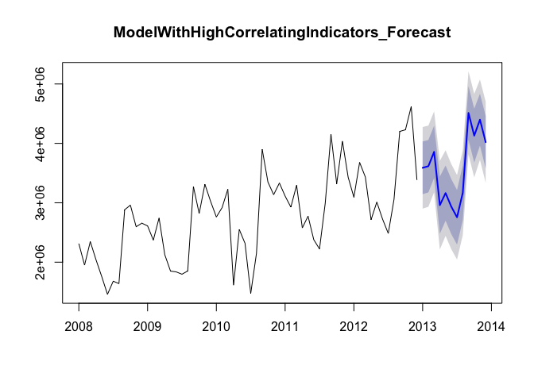<!-- -->

```r
ModelWithHighCorrelatingIndicators_Forecast
```

```
##          Point Forecast   Lo 80   Hi 80   Lo 95   Hi 95
## Jan 2013        3588409 3145307 4031511 2901625 4275193
## Feb 2013        3615751 3174780 4056722 2932271 4299231
## Mar 2013        3857685 3418316 4297055 3176687 4538684
## Apr 2013        2959830 2478742 3440918 2214171 3705489
## May 2013        3163014 2698603 3627424 2443204 3882824
## Jun 2013        2934791 2472811 3396771 2218748 3650835
## Jul 2013        2755659 2296827 3214490 2044495 3466822
## Aug 2013        3167751 2707972 3627531 2455119 3880384
## Sep 2013        4512206 4061044 4963367 3812930 5211481
## Oct 2013        4129962 3677062 4582861 3427993 4831931
## Nov 2013        4398869 3963060 4834678 3723389 5074349
## Dec 2013        4019999 3580235 4459762 3338390 4701608
```
#####In order to be able to correlate the Forecast with the As Is Data, it is necessary to convert the Point Estimator into a time series. 

```r
ModelWithHighCorrelatingIndicators_Forecast_df <-as.data.frame(ModelWithHighCorrelatingIndicators_Forecast) 
ModelWithHighCorrelatingIndicators_PointForecast <- ts(ModelWithHighCorrelatingIndicators_Forecast_df$"Point Forecast", start=c(2013,1), end=c(2013,12), frequency=12)
```
#####Correlation of the forecasts and As Is Data. As a comparison, the correlation of the As Is Data for 2013 with the Plan Data. 

```r
cor(ModelWithHighCorrelatingIndicators_PointForecast, TotalAsIs_2013) 
```

```
## [1] 0.9028604
```

```r
cor(TotalAsIs_2013, TotalPlan_2013)
```

```
## [1] 0.929769
```
#####A Comparison with linear regression also supports the result.

```r
ModelWithHighCorrelatingIndicators_forecast_lm <- lm(TotalAsIs_2013 ~ ModelWithHighCorrelatingIndicators_PointForecast, data = TotalAsIs_2013)
TotalAsIs_2013_lm <- lm(TotalAsIs_2013 ~ TotalPlan_2013, data = TotalAsIs_2013)
summary(ModelWithHighCorrelatingIndicators_forecast_lm)
```

```
## 
## Call:
## lm(formula = TotalAsIs_2013 ~ ModelWithHighCorrelatingIndicators_PointForecast, 
##     data = TotalAsIs_2013)
## 
## Residuals:
##     Min      1Q  Median      3Q     Max 
## -540546 -227283   12596  157487  731430 
## 
## Coefficients:
##                                                    Estimate Std. Error
## (Intercept)                                      -5.082e+05  6.545e+05
## ModelWithHighCorrelatingIndicators_PointForecast  1.195e+00  1.799e-01
##                                                  t value Pr(>|t|)    
## (Intercept)                                       -0.776    0.455    
## ModelWithHighCorrelatingIndicators_PointForecast   6.641 5.78e-05 ***
## ---
## Signif. codes:  0 '***' 0.001 '**' 0.01 '*' 0.05 '.' 0.1 ' ' 1
## 
## Residual standard error: 357000 on 10 degrees of freedom
## Multiple R-squared:  0.8152,	Adjusted R-squared:  0.7967 
## F-statistic:  44.1 on 1 and 10 DF,  p-value: 5.776e-05
```

```r
summary(TotalAsIs_2013_lm)
```

```
## 
## Call:
## lm(formula = TotalAsIs_2013 ~ TotalPlan_2013, data = TotalAsIs_2013)
## 
## Residuals:
##     Min      1Q  Median      3Q     Max 
## -441885 -227385  -43470  184761  466401 
## 
## Coefficients:
##                  Estimate Std. Error t value Pr(>|t|)    
## (Intercept)    -8.972e+04  4.930e+05  -0.182    0.859    
## TotalPlan_2013  1.053e+00  1.318e-01   7.987  1.2e-05 ***
## ---
## Signif. codes:  0 '***' 0.001 '**' 0.01 '*' 0.05 '.' 0.1 ' ' 1
## 
## Residual standard error: 305700 on 10 degrees of freedom
## Multiple R-squared:  0.8645,	Adjusted R-squared:  0.8509 
## F-statistic: 63.78 on 1 and 10 DF,  p-value: 1.195e-05
```

****************************
<div id='id-section5.2.1.2'/>
###5.2.1.2 Forecast Model With Low Correlating Indicators                          
#####Shorten ModelWithLowCorrelatingIndicators by one year in order to be able to produce a forecast for 2013. 

```r
ModelWithLowCorrelatingIndicators_2012 <- tslm(TotalAsIs_2012 ~ trend + season + NationalHolidays_2012 + UrbanoExports_2012 + GlobalisationPartyMembers_2012)
summary(ModelWithLowCorrelatingIndicators_2012) 
```

```
## 
## Call:
## tslm(formula = TotalAsIs_2012 ~ trend + season + NationalHolidays_2012 + 
##     UrbanoExports_2012 + GlobalisationPartyMembers_2012)
## 
## Residuals:
##     Min      1Q  Median      3Q     Max 
## -508808 -130098   11746  177748  466017 
## 
## Coefficients:
##                                  Estimate Std. Error t value Pr(>|t|)    
## (Intercept)                     1.211e+06  1.549e+06   0.782 0.438428    
## trend                           2.004e+04  1.028e+04   1.950 0.057515 .  
## season2                        -2.898e+04  1.573e+05  -0.184 0.854714    
## season3                         2.520e+05  1.631e+05   1.545 0.129609    
## season4                        -3.800e+05  2.242e+05  -1.695 0.097100 .  
## season5                        -4.697e+05  1.623e+05  -2.894 0.005897 ** 
## season6                        -7.350e+05  1.652e+05  -4.450 5.79e-05 ***
## season7                        -9.668e+05  1.687e+05  -5.732 8.35e-07 ***
## season8                        -5.809e+05  1.727e+05  -3.364 0.001602 ** 
## season9                         7.426e+05  1.772e+05   4.190 0.000132 ***
## season10                        3.765e+05  1.822e+05   2.066 0.044712 *  
## season11                        5.612e+05  1.876e+05   2.991 0.004541 ** 
## season12                        4.716e+05  2.756e+05   1.711 0.094062 .  
## NationalHolidays_2012          -3.051e+05  1.962e+05  -1.554 0.127234    
## UrbanoExports_2012              1.218e-01  1.838e-01   0.663 0.510937    
## GlobalisationPartyMembers_2012  5.692e+00  2.753e+01   0.207 0.837165    
## ---
## Signif. codes:  0 '***' 0.001 '**' 0.01 '*' 0.05 '.' 0.1 ' ' 1
## 
## Residual standard error: 248200 on 44 degrees of freedom
## Multiple R-squared:  0.9162,	Adjusted R-squared:  0.8876 
## F-statistic: 32.05 on 15 and 44 DF,  p-value: < 2.2e-16
```
#####Add "newdata" to the 2013 indicator values for the forecast 

```r
ModelWithLowCorrelatingIndicators_Forecast <- forecast(ModelWithLowCorrelatingIndicators_2012,newdata=data.frame(NationalHolidays_2012=NationalHolidays_2013, UrbanoExports_2012= UrbanoExports_2013, GlobalisationPartyMembers_2012=GlobalisationPartyMembers_2013),h=12)
plot(ModelWithLowCorrelatingIndicators_Forecast, main="ModelWithLowCorrelatingIndicators_Forecast")
```

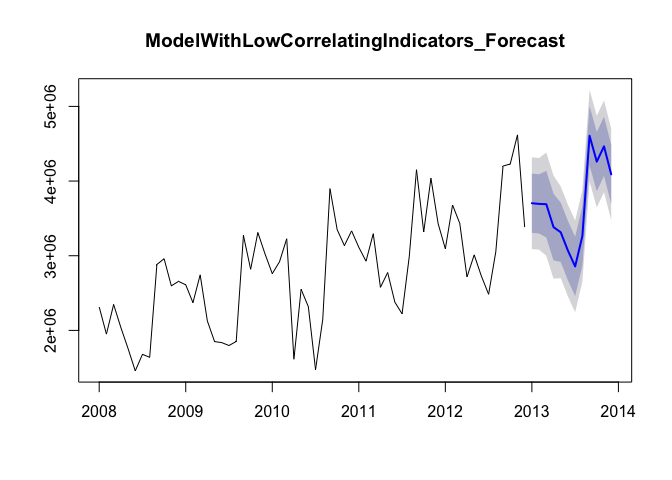<!-- -->

```r
ModelWithLowCorrelatingIndicators_Forecast
```

```
##          Point Forecast   Lo 80   Hi 80   Lo 95   Hi 95
## Jan 2013        3703214 3306827 4099602 3089217 4317212
## Feb 2013        3694280 3297893 4090668 3080283 4308278
## Mar 2013        3690209 3244288 4136130 2999485 4380933
## Apr 2013        3383361 2937440 3829282 2692637 4074085
## May 2013        3313734 2917347 3710121 2699736 3927731
## Jun 2013        3068413 2672026 3464800 2454415 3682410
## Jul 2013        2856693 2460306 3253081 2242696 3470691
## Aug 2013        3262648 2866261 3659036 2648651 3876646
## Sep 2013        4606119 4209732 5002506 3992121 5220117
## Oct 2013        4260121 3863734 4656508 3646123 4874119
## Nov 2013        4464894 4068507 4861282 3850897 5078892
## Dec 2013        4090225 3693837 4486612 3476227 4704222
```
#####In order to be able to correlate the Forecast with the As Is Data, it is necessary to convert the Point Estimator into a time series. 

```r
ModelWithLowCorrelatingIndicators_Forecast_df <-as.data.frame(ModelWithLowCorrelatingIndicators_Forecast) 
ModelWithLowCorrelatingIndicators_PointForecast <- ts(ModelWithLowCorrelatingIndicators_Forecast_df$"Point Forecast", start=c(2013,1), end=c(2013,12), frequency=12)
```
#####Correlation of the forecasts and As Is Data. As a comparison, the correlation of the As Is Data for 2013 with the Plan Data. 

```r
cor(ModelWithLowCorrelatingIndicators_PointForecast, TotalAsIs_2013) 
```

```
## [1] 0.9590162
```

```r
cor(TotalAsIs_2013, TotalPlan_2013)
```

```
## [1] 0.929769
```
#####A Comparison with linear regression also supports the result.

```r
ModelWithLowCorrelatingIndicators_forecast_lm <- lm(TotalAsIs_2013 ~ ModelWithLowCorrelatingIndicators_PointForecast, data = TotalAsIs_2013)
TotalAsIs_2013_lm <- lm(TotalAsIs_2013 ~ TotalPlan_2013, data = TotalAsIs_2013)
summary(ModelWithLowCorrelatingIndicators_forecast_lm)
```

```
## 
## Call:
## lm(formula = TotalAsIs_2013 ~ ModelWithLowCorrelatingIndicators_PointForecast, 
##     data = TotalAsIs_2013)
## 
## Residuals:
##     Min      1Q  Median      3Q     Max 
## -299026 -155463  -40768  115237  406333 
## 
## Coefficients:
##                                                   Estimate Std. Error
## (Intercept)                                     -1.252e+06  4.754e+05
## ModelWithLowCorrelatingIndicators_PointForecast  1.361e+00  1.272e-01
##                                                 t value Pr(>|t|)    
## (Intercept)                                      -2.633    0.025 *  
## ModelWithLowCorrelatingIndicators_PointForecast  10.703  8.5e-07 ***
## ---
## Signif. codes:  0 '***' 0.001 '**' 0.01 '*' 0.05 '.' 0.1 ' ' 1
## 
## Residual standard error: 235300 on 10 degrees of freedom
## Multiple R-squared:  0.9197,	Adjusted R-squared:  0.9117 
## F-statistic: 114.6 on 1 and 10 DF,  p-value: 8.5e-07
```

```r
summary(TotalAsIs_2013_lm)
```

```
## 
## Call:
## lm(formula = TotalAsIs_2013 ~ TotalPlan_2013, data = TotalAsIs_2013)
## 
## Residuals:
##     Min      1Q  Median      3Q     Max 
## -441885 -227385  -43470  184761  466401 
## 
## Coefficients:
##                  Estimate Std. Error t value Pr(>|t|)    
## (Intercept)    -8.972e+04  4.930e+05  -0.182    0.859    
## TotalPlan_2013  1.053e+00  1.318e-01   7.987  1.2e-05 ***
## ---
## Signif. codes:  0 '***' 0.001 '**' 0.01 '*' 0.05 '.' 0.1 ' ' 1
## 
## Residual standard error: 305700 on 10 degrees of freedom
## Multiple R-squared:  0.8645,	Adjusted R-squared:  0.8509 
## F-statistic: 63.78 on 1 and 10 DF,  p-value: 1.195e-05
```

****************************
<div id='id-section5.2.2'/>
###5.2.2 Forecast Model With Trend And Seasonality Only 
#####Shorten ModelWithTrendAndSeasonalityOnly by one year in order to be able to produce a forecast for 2013.

```r
ModelWithTrendAndSeasonalityOnly_2012 <- tslm(TotalAsIs_2012 ~ trend + season)
summary(ModelWithTrendAndSeasonalityOnly_2012) 
```

```
## 
## Call:
## tslm(formula = TotalAsIs_2012 ~ trend + season)
## 
## Residuals:
##     Min      1Q  Median      3Q     Max 
## -600304 -116717   -7864  163111  473692 
## 
## Coefficients:
##             Estimate Std. Error t value Pr(>|t|)    
## (Intercept)  2147792     120530  17.820  < 2e-16 ***
## trend          25212       1887  13.363  < 2e-16 ***
## season2       -34146     156872  -0.218 0.828632    
## season3       180612     156906   1.151 0.255518    
## season4      -639529     156962  -4.074 0.000176 ***
## season5      -490327     157042  -3.122 0.003068 ** 
## season6      -760860     157144  -4.842 1.43e-05 ***
## season7      -997792     157268  -6.345 8.09e-08 ***
## season8      -617048     157415  -3.920 0.000286 ***
## season9       701211     157585   4.450 5.26e-05 ***
## season10      330001     157777   2.092 0.041907 *  
## season11      509562     157991   3.225 0.002292 ** 
## season12      109681     158227   0.693 0.491603    
## ---
## Signif. codes:  0 '***' 0.001 '**' 0.01 '*' 0.05 '.' 0.1 ' ' 1
## 
## Residual standard error: 248000 on 47 degrees of freedom
## Multiple R-squared:  0.9106,	Adjusted R-squared:  0.8878 
## F-statistic: 39.89 on 12 and 47 DF,  p-value: < 2.2e-16
```
#####Add "newdata" to the 2013 indicator values for the forecast.

```r
ModelWithTrendAndSeasonalityOnly_Forecast <- forecast(ModelWithTrendAndSeasonalityOnly_2012,h=12)
plot(ModelWithTrendAndSeasonalityOnly_Forecast, main="ModelWithTrendAndSeasonalityOnly_Forecast")
```

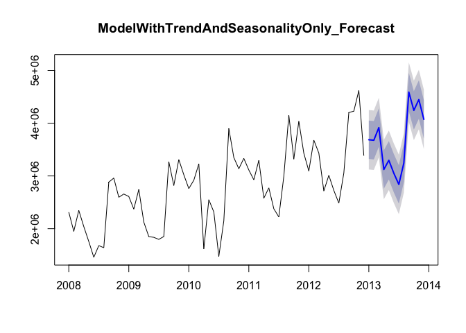<!-- -->

```r
ModelWithTrendAndSeasonalityOnly_Forecast
```

```
##          Point Forecast   Lo 80   Hi 80   Lo 95   Hi 95
## Jan 2013        3685709 3321691 4049727 3122318 4249100
## Feb 2013        3676775 3312757 4040793 3113384 4240166
## Mar 2013        3916745 3552727 4280763 3353354 4480136
## Apr 2013        3121815 2757797 3485833 2558424 3685206
## May 2013        3296229 2932211 3660247 2732838 3859620
## Jun 2013        3050908 2686890 3414926 2487517 3614299
## Jul 2013        2839188 2475170 3203206 2275797 3402579
## Aug 2013        3245143 2881125 3609161 2681752 3808534
## Sep 2013        4588614 4224596 4952632 4025223 5152005
## Oct 2013        4242616 3878598 4606634 3679225 4806007
## Nov 2013        4447389 4083371 4811407 3883998 5010780
## Dec 2013        4072720 3708702 4436737 3509329 4636110
```
#####In order to be able to correlate the Forecast with the As Is Data, it is necessary to convert the Point Estimator into a time series. 

```r
ModelWithTrendAndSeasonalityOnly_Forecast_df <-as.data.frame(ModelWithTrendAndSeasonalityOnly_Forecast) 
ModelWithTrendAndSeasonalityOnly_PointForecast <- ts(ModelWithTrendAndSeasonalityOnly_Forecast_df$"Point Forecast", start=c(2013,1), end=c(2013,12), frequency=12)
```
#####Correlation of the forecasts and As Is Data. As a comparison, the correlation of the As Is Data for 2013 with the Plan Data.

```r
cor(ModelWithTrendAndSeasonalityOnly_PointForecast, TotalAsIs_2013) 
```

```
## [1] 0.9138049
```

```r
cor(TotalAsIs_2013, TotalPlan_2013)
```

```
## [1] 0.929769
```
#####A Comparison with linear regression also supports the result.

```r
ModelWithTrendAndSeasonalityOnly_Forecast_lm <- lm(TotalAsIs_2013 ~ ModelWithTrendAndSeasonalityOnly_PointForecast, data = TotalAsIs_2013)
TotalAsIs_2013_lm <- lm(TotalAsIs_2013 ~ TotalPlan_2013, data = TotalAsIs_2013)
summary(ModelWithTrendAndSeasonalityOnly_Forecast_lm)
```

```
## 
## Call:
## lm(formula = TotalAsIs_2013 ~ ModelWithTrendAndSeasonalityOnly_PointForecast, 
##     data = TotalAsIs_2013)
## 
## Residuals:
##     Min      1Q  Median      3Q     Max 
## -516239 -216450   33683  123007  675607 
## 
## Coefficients:
##                                                  Estimate Std. Error
## (Intercept)                                    -8.142e+05  6.536e+05
## ModelWithTrendAndSeasonalityOnly_PointForecast  1.249e+00  1.755e-01
##                                                t value Pr(>|t|)    
## (Intercept)                                     -1.246    0.241    
## ModelWithTrendAndSeasonalityOnly_PointForecast   7.115 3.24e-05 ***
## ---
## Signif. codes:  0 '***' 0.001 '**' 0.01 '*' 0.05 '.' 0.1 ' ' 1
## 
## Residual standard error: 337300 on 10 degrees of freedom
## Multiple R-squared:  0.835,	Adjusted R-squared:  0.8185 
## F-statistic: 50.62 on 1 and 10 DF,  p-value: 3.238e-05
```

```r
summary(TotalAsIs_2013_lm)
```

```
## 
## Call:
## lm(formula = TotalAsIs_2013 ~ TotalPlan_2013, data = TotalAsIs_2013)
## 
## Residuals:
##     Min      1Q  Median      3Q     Max 
## -441885 -227385  -43470  184761  466401 
## 
## Coefficients:
##                  Estimate Std. Error t value Pr(>|t|)    
## (Intercept)    -8.972e+04  4.930e+05  -0.182    0.859    
## TotalPlan_2013  1.053e+00  1.318e-01   7.987  1.2e-05 ***
## ---
## Signif. codes:  0 '***' 0.001 '**' 0.01 '*' 0.05 '.' 0.1 ' ' 1
## 
## Residual standard error: 305700 on 10 degrees of freedom
## Multiple R-squared:  0.8645,	Adjusted R-squared:  0.8509 
## F-statistic: 63.78 on 1 and 10 DF,  p-value: 1.195e-05
```

****************************
<div id='id-section5.2.3'/>
###5.2.3 Forecast Model Total Etel
#####Shorten the variables in Model Total Etel by one year in order to be able to produce a forecast for 2013.

```r
ModelTotalEtel_2012 <- tslm(TotalEtelAsIs_2012 ~ trend + season)

summary(ModelTotalEtel_2012) 
```

```
## 
## Call:
## tslm(formula = TotalEtelAsIs_2012 ~ trend + season)
## 
## Residuals:
##     Min      1Q  Median      3Q     Max 
## -299816  -89175   -2539  108720  287047 
## 
## Coefficients:
##             Estimate Std. Error t value Pr(>|t|)    
## (Intercept)  1361585      78100  17.434  < 2e-16 ***
## trend           6460       1223   5.284 3.20e-06 ***
## season2       -44872     101648  -0.441  0.66091    
## season3       -53014     101670  -0.521  0.60452    
## season4      -524858     101707  -5.160 4.88e-06 ***
## season5      -501638     101759  -4.930 1.07e-05 ***
## season6      -674802     101825  -6.627 3.01e-08 ***
## season7      -765417     101905  -7.511 1.38e-09 ***
## season8      -544231     102001  -5.336 2.68e-06 ***
## season9       558436     102110   5.469 1.70e-06 ***
## season10      232677     102235   2.276  0.02745 *  
## season11      276582     102374   2.702  0.00957 ** 
## season12       55396     102527   0.540  0.59154    
## ---
## Signif. codes:  0 '***' 0.001 '**' 0.01 '*' 0.05 '.' 0.1 ' ' 1
## 
## Residual standard error: 160700 on 47 degrees of freedom
## Multiple R-squared:  0.9008,	Adjusted R-squared:  0.8755 
## F-statistic: 35.58 on 12 and 47 DF,  p-value: < 2.2e-16
```
#####Forecast

```r
ModelTotalEtel_Forecast <- forecast(ModelTotalEtel_2012,h=12)


plot(ModelTotalEtel_Forecast,main="ModelTotalEtel_Forecast")
```

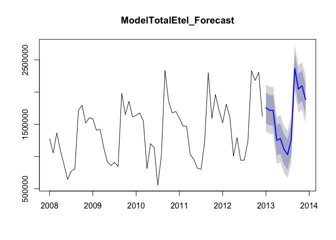<!-- -->

```r
ModelTotalEtel_Forecast
```

```
##          Point Forecast     Lo 80   Hi 80     Lo 95   Hi 95
## Jan 2013        1755615 1519741.4 1991488 1390553.3 2120676
## Feb 2013        1717202 1481328.6 1953076 1352140.5 2082264
## Mar 2013        1715520 1479646.6 1951394 1350458.5 2080582
## Apr 2013        1250135 1014262.0 1486009  885073.9 1615197
## May 2013        1279815 1043941.8 1515689  914753.7 1644877
## Jun 2013        1113110  877236.8 1348984  748048.7 1478172
## Jul 2013        1028955  793081.8 1264829  663893.7 1394017
## Aug 2013        1256600 1020727.0 1492474  891538.9 1621662
## Sep 2013        2365726 2129853.0 2601600 2000664.9 2730788
## Oct 2013        2046428 1810554.4 2282301 1681366.3 2411489
## Nov 2013        2096791 1860918.0 2332665 1731729.9 2461853
## Dec 2013        1882065 1646192.0 2117939 1517003.9 2247127
```

```r
mywait()
```

```
## <Tcl>
```
#####In order to be able to correlate the Forecast with the As Is Data, it is necessary to convert the Point Estimator into a time series.

```r
ModelTotalEtel_Forecast_df <-as.data.frame(ModelTotalEtel_Forecast) 

ModelTotalEtel_PointForecast <- ts(ModelTotalEtel_Forecast_df$"Point Forecast", start=c(2013,1), end=c(2013,12), frequency=12)
```
#####Correlation of the forecasts and As Is Data. As a comparison, the correlation of the As Is Data for 2013 with the Plan Data.

```r
cor(ModelTotalEtel_PointForecast, TotalEtelAsIs_2013) 
```

```
## [1] 0.9392717
```

```r
cor(TotalEtelPlan_2013, TotalEtelAsIs_2013)
```

```
## [1] 0.9602983
```

****************************
<div id='id-section5.2.4'/>
###5.2.4 Forecast Model With Total Urbano Exports
#####Shorten the variables in Model With Total Urbano Exports by one year in order to be able to produce a forecast for 2013.

```r
ModelWithTotalUrbanoExports_2012 <- tslm(TotalAsIs_2012 ~ trend + season + UrbanoExports_2012)
summary(ModelWithTotalUrbanoExports_2012) 
```

```
## 
## Call:
## tslm(formula = TotalAsIs_2012 ~ trend + season + UrbanoExports_2012)
## 
## Residuals:
##     Min      1Q  Median      3Q     Max 
## -569149 -128266    8067  181935  457990 
## 
## Coefficients:
##                      Estimate Std. Error t value Pr(>|t|)    
## (Intercept)         1.450e+06  1.039e+06   1.396 0.169437    
## trend               2.187e+04  5.296e+03   4.129 0.000152 ***
## season2            -3.080e+04  1.579e+05  -0.195 0.846161    
## season3             1.873e+05  1.581e+05   1.184 0.242307    
## season4            -6.295e+05  1.586e+05  -3.970 0.000250 ***
## season5            -4.770e+05  1.592e+05  -2.996 0.004395 ** 
## season6            -7.441e+05  1.600e+05  -4.651 2.80e-05 ***
## season7            -9.777e+05  1.609e+05  -6.075 2.23e-07 ***
## season8            -5.936e+05  1.621e+05  -3.663 0.000643 ***
## season9             7.280e+05  1.634e+05   4.456 5.31e-05 ***
## season10            3.601e+05  1.648e+05   2.185 0.034032 *  
## season11            5.430e+05  1.664e+05   3.263 0.002084 ** 
## season12            1.465e+05  1.682e+05   0.871 0.388352    
## UrbanoExports_2012  1.246e-01  1.843e-01   0.676 0.502194    
## ---
## Signif. codes:  0 '***' 0.001 '**' 0.01 '*' 0.05 '.' 0.1 ' ' 1
## 
## Residual standard error: 249500 on 46 degrees of freedom
## Multiple R-squared:  0.9115,	Adjusted R-squared:  0.8864 
## F-statistic: 36.43 on 13 and 46 DF,  p-value: < 2.2e-16
```
#####Add "newdata" to the 2013 indicator values for the forecast.

```r
ModelWithTotalUrbanoExports_Forecast <- forecast(ModelWithTotalUrbanoExports_2012, newdata=data.frame(UrbanoExports_2012=UrbanoExports_2013), h=12)
plot(ModelWithTotalUrbanoExports_Forecast,main="ModelWithTotalUrbanoExports_Forecast")
```

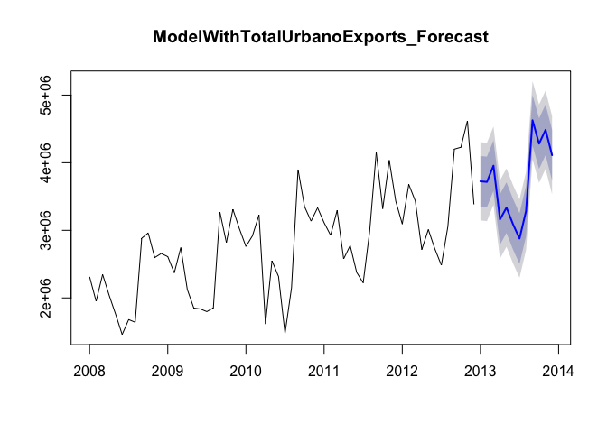<!-- -->

```r
ModelWithTotalUrbanoExports_Forecast
```

```
##          Point Forecast   Lo 80   Hi 80   Lo 95   Hi 95
## Jan 2013        3724840 3350944 4098736 3146008 4303672
## Feb 2013        3715906 3342010 4089802 3137074 4294739
## Mar 2013        3955876 3581980 4329772 3377044 4534708
## Apr 2013        3160946 2787050 3534842 2582114 3739778
## May 2013        3335360 2961464 3709256 2756527 3914192
## Jun 2013        3090039 2716143 3463935 2511206 3668871
## Jul 2013        2878319 2504423 3252215 2299487 3457151
## Aug 2013        3284274 2910378 3658170 2705442 3863106
## Sep 2013        4627745 4253849 5001641 4048913 5206577
## Oct 2013        4281747 3907851 4655643 3702915 4860579
## Nov 2013        4486520 4112624 4860416 3907688 5065352
## Dec 2013        4111851 3737954 4485747 3533018 4690683
```

```r
mywait()
```

```
## <Tcl>
```
#####In order to be able to correlate the Forecast with the As Is data, it is necessary to convert the Point Estimator into a time series. 

```r
ModelWithTotalUrbanoExports_Forecast_df <-as.data.frame(ModelWithTotalUrbanoExports_Forecast) 
ModelWithTotalUrbanoExports_PointForecast <- ts(ModelWithTotalUrbanoExports_Forecast_df$"Point Forecast", start=c(2013,1), end=c(2013,12), frequency=12)
```
#####Correlation of the forecasts and As Is Data. As a comparison, the correlation of the As Is Data for 2013 with the Plan Data.

```r
cor(ModelWithTotalUrbanoExports_PointForecast, TotalAsIs_2013) 
```

```
## [1] 0.9138049
```

```r
cor(TotalAsIs_2013, TotalPlan_2013)
```

```
## [1] 0.929769
```

****************************
<div id='id-section5.2.5'/>
###5.2.5 Forecast Model With National Holidays
#####Shorten the variables in Model With National Holidays by one year in order to be able to produce a forecast for 2013.

```r
ModelWithNationalHolidays_2012 <- tslm(TotalAsIs_2012 ~ trend + season + NationalHolidays_2012)
summary(ModelWithNationalHolidays_2012) 
```

```
## 
## Call:
## tslm(formula = TotalAsIs_2012 ~ trend + season + NationalHolidays_2012)
## 
## Residuals:
##     Min      1Q  Median      3Q     Max 
## -539294 -116717   -7864  163111  473692 
## 
## Coefficients:
##                       Estimate Std. Error t value Pr(>|t|)    
## (Intercept)            2147792     118654  18.101  < 2e-16 ***
## trend                    25212       1857  13.574  < 2e-16 ***
## season2                 -34146     154430  -0.221 0.825988    
## season3                 241622     159215   1.518 0.135962    
## season4                -395488     218453  -1.810 0.076768 .  
## season5                -490327     154598  -3.172 0.002699 ** 
## season6                -760860     154698  -4.918 1.16e-05 ***
## season7                -997792     154821  -6.445 6.22e-08 ***
## season8                -617048     154966  -3.982 0.000241 ***
## season9                 701211     155133   4.520 4.31e-05 ***
## season10                330001     155322   2.125 0.039022 *  
## season11                509562     155532   3.276 0.002005 ** 
## season12                414732     248034   1.672 0.101299    
## NationalHolidays_2012  -305051     193024  -1.580 0.120873    
## ---
## Signif. codes:  0 '***' 0.001 '**' 0.01 '*' 0.05 '.' 0.1 ' ' 1
## 
## Residual standard error: 244200 on 46 degrees of freedom
## Multiple R-squared:  0.9152,	Adjusted R-squared:  0.8912 
## F-statistic: 38.19 on 13 and 46 DF,  p-value: < 2.2e-16
```
#####Add "newdata" to the 2013 indicator values for the forecast.

```r
ModelWithNationalHolidays_Forecast <- forecast(ModelWithNationalHolidays_2012, newdata=data.frame(NationalHolidays_2012=NationalHolidays_2013), h=12)
plot(ModelWithNationalHolidays_Forecast,main="ModelWithNationalHolidays_Forecast")
```

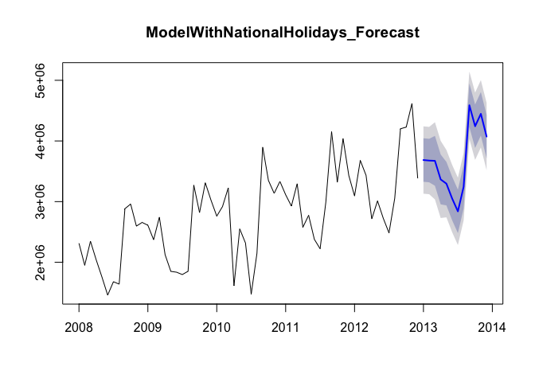<!-- -->

```r
ModelWithNationalHolidays_Forecast
```

```
##          Point Forecast   Lo 80   Hi 80   Lo 95   Hi 95
## Jan 2013        3685709 3327245 4044174 3130767 4240652
## Feb 2013        3676775 3318311 4035240 3121833 4231718
## Mar 2013        3672704 3261840 4083568 3036641 4308767
## Apr 2013        3365856 2954992 3776720 2729793 4001919
## May 2013        3296229 2937764 3654693 2741286 3851171
## Jun 2013        3050908 2692443 3409372 2495965 3605850
## Jul 2013        2839188 2480724 3197653 2284246 3394131
## Aug 2013        3245143 2886679 3603608 2690201 3800086
## Sep 2013        4588614 4230149 4947079 4033671 5143556
## Oct 2013        4242616 3884151 4601081 3687673 4797558
## Nov 2013        4447389 4088925 4805854 3892447 5002332
## Dec 2013        4072720 3714255 4431184 3517777 4627662
```

```r
mywait()
```

```
## <Tcl>
```
#####In order to be able to correlate the Forecast with the As Is data, it is necessary to convert the Point Estimator into a time series.

```r
ModelWithNationalHolidays_Forecast_df <-as.data.frame(ModelWithNationalHolidays_Forecast) 
ModelWithNationalHolidays_PointForecast <- ts(ModelWithNationalHolidays_Forecast_df$"Point Forecast", start=c(2013,1), end=c(2013,12), frequency=12)
```
#####Correlation of the forecasts and As Is Data. As a comparison, the correlation of the As Is data for 2013 with the Plan Data.

```r
cor(ModelWithNationalHolidays_PointForecast, TotalAsIs_2013) 
```

```
## [1] 0.9590162
```

****************************
<div id='id-section5.2.6'/>
###5.2.6 Forecast Model With Influence National Holidays 
#####Shorten the variables in ModelWithInfluenceNationalHolidays by one year in order to be able to produce a forecast for 2013.

```r
ModelWithInfluenceNationalHolidays_2012 <- tslm(TotalAsIs_2012 ~ trend + season + InfluenceNationalHolidays_2012)
summary(ModelWithInfluenceNationalHolidays_2012) 
```

```
## 
## Call:
## tslm(formula = TotalAsIs_2012 ~ trend + season + InfluenceNationalHolidays_2012)
## 
## Residuals:
##     Min      1Q  Median      3Q     Max 
## -539294 -116717   -7864  163111  473692 
## 
## Coefficients:
##                                Estimate Std. Error t value Pr(>|t|)    
## (Intercept)                     2147792     118654  18.101  < 2e-16 ***
## trend                             25212       1857  13.574  < 2e-16 ***
## season2                          -34146     154430  -0.221 0.825988    
## season3                          241622     159215   1.518 0.135962    
## season4                         -395488     218453  -1.810 0.076768 .  
## season5                         -490327     154598  -3.172 0.002699 ** 
## season6                         -760860     154698  -4.918 1.16e-05 ***
## season7                         -997792     154821  -6.445 6.22e-08 ***
## season8                         -617048     154966  -3.982 0.000241 ***
## season9                         1006262     247638   4.063 0.000187 ***
## season10                         330001     155322   2.125 0.039022 *  
## season11                         814614     247888   3.286 0.001948 ** 
## season12                         414732     248034   1.672 0.101299    
## InfluenceNationalHolidays_2012  -305051     193024  -1.580 0.120873    
## ---
## Signif. codes:  0 '***' 0.001 '**' 0.01 '*' 0.05 '.' 0.1 ' ' 1
## 
## Residual standard error: 244200 on 46 degrees of freedom
## Multiple R-squared:  0.9152,	Adjusted R-squared:  0.8912 
## F-statistic: 38.19 on 13 and 46 DF,  p-value: < 2.2e-16
```
#####Add "newdata" to the 2013 indicator values for the forecast.

```r
ModelWithInfluenceNationalHolidays_Forecast <- forecast(ModelWithInfluenceNationalHolidays_2012, newdata=data.frame(InfluenceNationalHolidays_2012=InfluenceNationalHolidaysVector_2013), h=12)
plot(ModelWithInfluenceNationalHolidays_Forecast,main="ModelWithInfluenceNationalHolidays_Forecast")
```

<!-- -->

```r
ModelWithInfluenceNationalHolidays_Forecast
```

```
##          Point Forecast   Lo 80   Hi 80   Lo 95   Hi 95
## Jan 2013        3685709 3327245 4044174 3130767 4240652
## Feb 2013        3676775 3318311 4035240 3121833 4231718
## Mar 2013        3672704 3261840 4083568 3036641 4308767
## Apr 2013        3365856 2954992 3776720 2729793 4001919
## May 2013        3296229 2937764 3654693 2741286 3851171
## Jun 2013        3050908 2692443 3409372 2495965 3605850
## Jul 2013        2839188 2480724 3197653 2284246 3394131
## Aug 2013        3245143 2886679 3603608 2690201 3800086
## Sep 2013        4588614 4230149 4947079 4033671 5143556
## Oct 2013        4242616 3884151 4601081 3687673 4797558
## Nov 2013        4447389 4088925 4805854 3892447 5002332
## Dec 2013        4072720 3714255 4431184 3517777 4627662
```

```r
mywait()
```

```
## <Tcl>
```
#####In order to be able to correlate the Forecast with the As Is Data, it is necessary to convert the Point Estimator into a time series.

```r
ModelWithInfluenceNationalHolidays_Forecast_df <-as.data.frame(ModelWithInfluenceNationalHolidays_Forecast) 
ModelWithInfluenceNationalHolidays_PointForecast <- ts(ModelWithInfluenceNationalHolidays_Forecast_df$"Point Forecast", start=c(2013,1), end=c(2013,12), frequency=12)
```
#####Correlation of the forecasts and As Is Data. As a comparison, the correlation of the As Is Data for 2013 with the Plan Data.

```r
cor(ModelWithInfluenceNationalHolidays_PointForecast, TotalAsIs_2013) 
```

```
## [1] 0.9590162
```

```r
cor(TotalAsIs_2013, TotalPlan_2013)
```

```
## [1] 0.929769
```

```r
cor(TotalAsIs_2013, TotalPlan_2013)
```

```
## [1] 0.929769
```

****************************
<div id='id-section6.0'/>
###6.0 Forecast for 2014  
#####Since the Model With Low Correlating Indicators was the one of the best fitting models for a forecast, the exports data for 2014 will be forecasted based on trend and seasonality and National Holidays, Urbano Exports, and Globalisation Party Members. 

```r
summary(ModelWithLowCorrelatingIndicators) 
```

```
## 
## Call:
## tslm(formula = TotalAsIs ~ trend + season + NationalHolidays + 
##     UrbanoExports + GlobalisationPartyMembers)
## 
## Residuals:
##     Min      1Q  Median      3Q     Max 
## -508755 -122676    7119  173089  403964 
## 
## Coefficients:
##                             Estimate Std. Error t value Pr(>|t|)    
## (Intercept)                1.467e+06  1.517e+06   0.967 0.337647    
## trend                      2.264e+04  9.148e+03   2.474 0.016399 *  
## season2                   -1.274e+05  1.450e+05  -0.878 0.383528    
## season3                    1.980e+05  1.546e+05   1.281 0.205562    
## season4                   -3.100e+05  1.794e+05  -1.728 0.089424 .  
## season5                   -6.084e+05  1.493e+05  -4.075 0.000146 ***
## season6                   -8.641e+05  1.518e+05  -5.693 4.78e-07 ***
## season7                   -1.056e+06  1.548e+05  -6.824 6.75e-09 ***
## season8                   -6.982e+05  1.583e+05  -4.411 4.72e-05 ***
## season9                    7.360e+05  1.622e+05   4.538 3.05e-05 ***
## season10                   3.341e+05  1.665e+05   2.007 0.049635 *  
## season11                   5.100e+05  1.712e+05   2.979 0.004276 ** 
## season12                   5.471e+05  2.338e+05   2.341 0.022838 *  
## NationalHolidays          -4.315e+05  1.535e+05  -2.811 0.006794 ** 
## UrbanoExports              1.622e-01  1.692e-01   0.959 0.341873    
## GlobalisationPartyMembers -4.032e+00  2.086e+01  -0.193 0.847464    
## ---
## Signif. codes:  0 '***' 0.001 '**' 0.01 '*' 0.05 '.' 0.1 ' ' 1
## 
## Residual standard error: 250700 on 56 degrees of freedom
## Multiple R-squared:  0.9288,	Adjusted R-squared:  0.9097 
## F-statistic: 48.69 on 15 and 56 DF,  p-value: < 2.2e-16
```

```r
Forecast_ModelWithLowCorrelatingIndicators_2014 <- forecast(ModelWithLowCorrelatingIndicators,newdata=data.frame(NationalHolidays=NationalHolidays_2014, UrbanoExports= UrbanoExports_2014, GlobalisationPartyMembers=GlobalisationPartyMembers_2014),h=12)
plot(Forecast_ModelWithLowCorrelatingIndicators_2014, main="Forecast_2014")
```

<!-- -->

```r
mywait()
```

```
## <Tcl>
```

```r
Forecast_ModelWithLowCorrelatingIndicators_2014_df <-as.data.frame(Forecast_ModelWithLowCorrelatingIndicators_2014) 
PointForecast_ModelWithLowCorrelatingIndicators_2014 <- ts(Forecast_ModelWithLowCorrelatingIndicators_2014_df$"Point Forecast", start=c(2014,1), end=c(2014,12), frequency=12)
PointForecast_ModelWithLowCorrelatingIndicators_2014
```

```
##          Jan     Feb     Mar     Apr     May     Jun     Jul     Aug
## 2014 4154873 4050131 4398156 3481206 3637040 3403934 3234308 3615166
##          Sep     Oct     Nov     Dec
## 2014 5072002 4692732 4891237 4519491
```

```r
cor(TotalAsIs_2014,TotalPlan_2014)
```

```
## [1] 0.9448221
```

```r
cor(TotalAsIs_2014,PointForecast_ModelWithLowCorrelatingIndicators_2014)
```

```
## [1] 0.9178468
```
#####As Model With Trend And Seasonality Only also gave a well fitting model for a forecast, the exports data for 2014 will be forecast based on trend and seasonality. 

```r
summary(ModelWithTrendAndSeasonalityOnly) 
```

```
## 
## Call:
## tslm(formula = TotalAsIs ~ trend + season)
## 
## Residuals:
##     Min      1Q  Median      3Q     Max 
## -699390 -154210   17753  150363  495430 
## 
## Coefficients:
##             Estimate Std. Error t value Pr(>|t|)    
## (Intercept)  2182435     117276  18.609  < 2e-16 ***
## trend          26427       1514  17.456  < 2e-16 ***
## season2      -131168     152001  -0.863 0.391663    
## season3        46585     152024   0.306 0.760356    
## season4      -609102     152062  -4.006 0.000176 ***
## season5      -623539     152114  -4.099 0.000129 ***
## season6      -883072     152182  -5.803 2.74e-07 ***
## season7     -1079124     152265  -7.087 1.93e-09 ***
## season8      -724693     152363  -4.756 1.31e-05 ***
## season9       705716     152476   4.628 2.07e-05 ***
## season10      300019     152603   1.966 0.054009 .  
## season11      472099     152746   3.091 0.003045 ** 
## season12       73925     152903   0.483 0.630546    
## ---
## Signif. codes:  0 '***' 0.001 '**' 0.01 '*' 0.05 '.' 0.1 ' ' 1
## 
## Residual standard error: 263300 on 59 degrees of freedom
## Multiple R-squared:  0.9173,	Adjusted R-squared:  0.9004 
## F-statistic: 54.51 on 12 and 59 DF,  p-value: < 2.2e-16
```

```r
Forecast_2014 <- forecast(ModelWithTrendAndSeasonalityOnly,h=12)
plot(Forecast_2014, main="Forecast_2014")
```

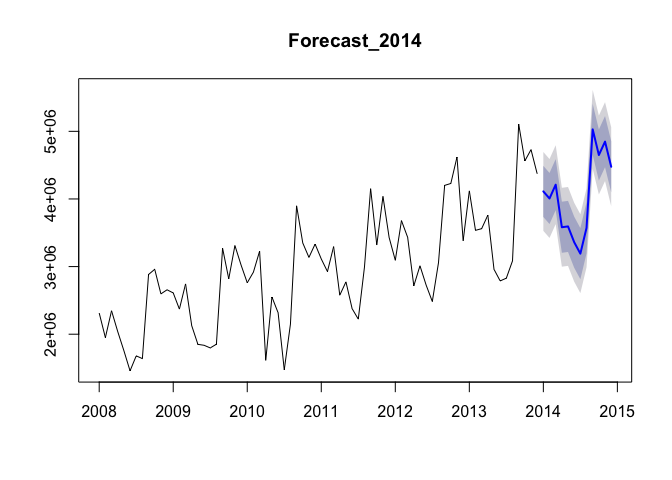<!-- -->

```r
mywait()
```

```
## <Tcl>
```

```r
Forecast_2014_df <-as.data.frame(Forecast_2014) 
PointForecast_TrendAndSeasonality_2014 <- ts(Forecast_2014_df$"Point Forecast", start=c(2014,1), end=c(2014,12), frequency=12)
PointForecast_TrendAndSeasonality_2014
```

```
##          Jan     Feb     Mar     Apr     May     Jun     Jul     Aug
## 2014 4111576 4006834 4211014 3581754 3593744 3360637 3191012 3571869
##          Sep     Oct     Nov     Dec
## 2014 5028705 4649435 4847941 4476194
```

```r
cor(TotalAsIs_2014,TotalPlan_2014)
```

```
## [1] 0.9448221
```

```r
cor(TotalAsIs_2014,PointForecast_TrendAndSeasonality_2014)
```

```
## [1] 0.9349765
```

###ALTERNATIVE
#####As the indiators NationalHolidays delievered a good result, but could not convince in the 2013 forecast, it could be possible that the data for 2013 was to blame. Therefore there is another Forecast using the Model With National Holidays

```r
summary(ModelWithNationalHolidays)
```

```
## 
## Call:
## tslm(formula = TotalAsIs ~ trend + season + NationalHolidays)
## 
## Residuals:
##     Min      1Q  Median      3Q     Max 
## -555545 -153976       4  150487  404837 
## 
## Coefficients:
##                  Estimate Std. Error t value Pr(>|t|)    
## (Intercept)       2182435     110867  19.685  < 2e-16 ***
## trend               26427       1431  18.465  < 2e-16 ***
## season2           -131168     143696  -0.913  0.36512    
## season3            190430     152432   1.249  0.21658    
## season4           -321411     176034  -1.826  0.07302 .  
## season5           -623539     143803  -4.336 5.86e-05 ***
## season6           -883072     143867  -6.138 8.06e-08 ***
## season7          -1079124     143945  -7.497 4.29e-10 ***
## season8           -724693     144037  -5.031 5.02e-06 ***
## season9            705716     144144   4.896 8.18e-06 ***
## season10           300019     144265   2.080  0.04199 *  
## season11           472099     144400   3.269  0.00182 ** 
## season12           505461     210051   2.406  0.01932 *  
## NationalHolidays  -431536     152405  -2.832  0.00636 ** 
## ---
## Signif. codes:  0 '***' 0.001 '**' 0.01 '*' 0.05 '.' 0.1 ' ' 1
## 
## Residual standard error: 248900 on 58 degrees of freedom
## Multiple R-squared:  0.9273,	Adjusted R-squared:  0.911 
## F-statistic: 56.92 on 13 and 58 DF,  p-value: < 2.2e-16
```

```r
Forecast_2014_alternative <- forecast(ModelWithNationalHolidays, newdata=data.frame(NationalHolidays=NationalHolidays_2014),h=12)
plot(Forecast_2014_alternative,main="Forecast_2014_alternative")
```

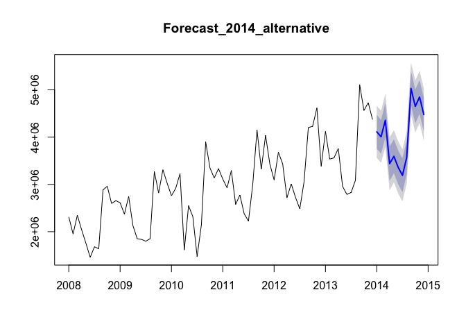<!-- -->

```r
mywait()
```

```
## <Tcl>
```

```r
Forecast_2014_alternative_df <-as.data.frame(Forecast_2014_alternative) 
PointForecast_2014_alternative <- ts(Forecast_2014_alternative_df$"Point Forecast", start=c(2014,1), end=c(2014,12), frequency=12)
PointForecast_2014_alternative
```

```
##          Jan     Feb     Mar     Apr     May     Jun     Jul     Aug
## 2014 4111576 4006834 4354859 3437909 3593744 3360637 3191012 3571869
##          Sep     Oct     Nov     Dec
## 2014 5028705 4649435 4847941 4476194
```

****************************
<div id='id-section7.0'/>
###7.0 Forecasting models with smoothing and related approaches
#####Exponential Smoothing uses past values to calculate a forecast. The strength with which each value influences the forecast is weakened with help of a smoothing parameter. Thus we are dealing with a weighted average, whose values fade out the longer ago they were in the past.
####The Akaike's Information Criterion(AIC/AICc) or the Bayesian Information Criterion (BIC) should be at minimum.
****************************
<div id='id-section7.1'/>
###7.1 Forecasting Models with Smoothing and related approaches (TotalAsIs)
#####Simple expontential smoothing    

```r
Model_ses <- ses(TotalAsIs, h=12)
summary(Model_ses)
```

```
## 
## Forecast method: Simple exponential smoothing
## 
## Model Information:
## Simple exponential smoothing 
## 
## Call:
##  ses(x = TotalAsIs, h = 12) 
## 
##   Smoothing parameters:
##     alpha = 0.671 
## 
##   Initial states:
##     l = 2173226.7433 
## 
##   sigma:  609507
## 
##      AIC     AICc      BIC 
## 2230.058 2230.232 2234.612 
## 
## Error measures:
##                    ME   RMSE      MAE       MPE     MAPE     MASE
## Training set 47469.84 609507 429997.1 -1.511008 15.02336 1.172074
##                    ACF1
## Training set 0.02384493
## 
## Forecasts:
##          Point Forecast   Lo 80   Hi 80   Lo 95   Hi 95
## Jan 2014        4466448 3685333 5247562 3271836 5661059
## Feb 2014        4466448 3525801 5407094 3027853 5905042
## Mar 2014        4466448 3389650 5543245 2819628 6113267
## Apr 2014        4466448 3268880 5664015 2634926 6297969
## May 2014        4466448 3159220 5773675 2467215 6465680
## Jun 2014        4466448 3058072 5874823 2312524 6620371
## Jul 2014        4466448 2963718 5969177 2168221 6764674
## Aug 2014        4466448 2874947 6057948 2032458 6900437
## Sep 2014        4466448 2790873 6142022 1903878 7029017
## Oct 2014        4466448 2710821 6222074 1781448 7151447
## Nov 2014        4466448 2634263 6298632 1664363 7268532
## Dec 2014        4466448 2560778 6372117 1551977 7380918
```

```r
plot(Model_ses, plot.conf=FALSE, ylab="Exports Chulwalar  )", xlab="Year", main="", fcol="white", type="o")
lines(fitted(Model_ses), col="green", type="o")
lines(Model_ses$mean, col="blue", type="o")
legend("topleft",lty=1, col=c(1,"green"), c("data", expression(alpha == 0.671)),pch=1)
```

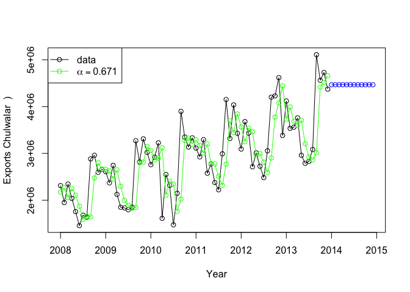<!-- -->

####Holt's linear trend method   
#####Holt added to the model in order to forecast using trends as well. For this it is necessary to add a beta, which determines the trend. If neither alpha nor beta is stated, both parameters will be optimised using ets(). The trend is exponential if the intercepts(level) and the gradient (slope) are multiplied with eachother. The values are worse. As the Beta was very low in the optimisation, the forecast is very similar to the ses() model. 

```r
Model_holt_1 <- holt(TotalAsIs,h=12)
summary(Model_holt_1)
```

```
## 
## Forecast method: Holt's method
## 
## Model Information:
## Holt's method 
## 
## Call:
##  holt(x = TotalAsIs, h = 12) 
## 
##   Smoothing parameters:
##     alpha = 0.6571 
##     beta  = 1e-04 
## 
##   Initial states:
##     l = 2040390.7764 
##     b = 45050.7514 
## 
##   sigma:  608119.1
## 
##      AIC     AICc      BIC 
## 2233.730 2234.327 2242.837 
## 
## Error measures:
##                    ME     RMSE      MAE      MPE     MAPE     MASE
## Training set -16586.9 608119.1 441110.7 -3.88925 15.75307 1.202367
##                    ACF1
## Training set 0.03462672
## 
## Forecasts:
##          Point Forecast   Lo 80   Hi 80   Lo 95   Hi 95
## Jan 2014        4536367 3757031 5315703 3344475 5728259
## Feb 2014        4581298 3648703 5513894 3155016 6007580
## Mar 2014        4626230 3562188 5690271 2998918 6253541
## Apr 2014        4671161 3490181 5852141 2865008 6477314
## May 2014        4716092 3428721 6003463 2747228 6684956
## Jun 2014        4761024 3375378 6146669 2641862 6880185
## Jul 2014        4805955 3328531 6283379 2546429 7065480
## Aug 2014        4850886 3287035 6414738 2459182 7242591
## Sep 2014        4895818 3250047 6541588 2378829 7412807
## Oct 2014        4940749 3216925 6664573 2304387 7577111
## Nov 2014        4985680 3187164 6784196 2235088 7736273
## Dec 2014        5030612 3160363 6900860 2170314 7890909
```

```r
plot(Model_holt_1)
```

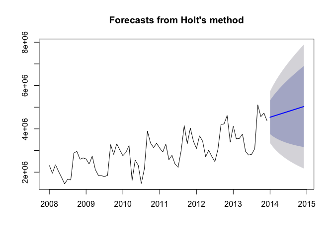<!-- -->
#####expoential trend

```r
Model_holt_2<- holt(TotalAsIs, exponential=TRUE,h=12)
summary(Model_holt_2)
```

```
## 
## Forecast method: Holt's method with exponential trend
## 
## Model Information:
## Holt's method with exponential trend 
## 
## Call:
##  holt(x = TotalAsIs, h = 12, exponential = TRUE) 
## 
##   Smoothing parameters:
##     alpha = 0.6637 
##     beta  = 1e-04 
## 
##   Initial states:
##     l = 2041538.9468 
##     b = 1.0029 
## 
##   sigma:  0.2438
## 
##      AIC     AICc      BIC 
## 2251.010 2251.607 2260.116 
## 
## Error measures:
##                    ME     RMSE      MAE       MPE     MAPE     MASE
## Training set 37825.61 609787.5 433018.9 -1.838214 15.18487 1.180311
##                    ACF1
## Training set 0.02918287
## 
## Forecasts:
##          Point Forecast   Lo 80   Hi 80   Lo 95    Hi 95
## Jan 2014        4488281 3075054 5917174 2300732  6650128
## Feb 2014        4502175 2843063 6272756 2134231  7293521
## Mar 2014        4516113 2668763 6441983 1977788  7862260
## Apr 2014        4530094 2528312 6814940 1823798  8553689
## May 2014        4544118 2408838 7116178 1751712  9173504
## Jun 2014        4558186 2227044 7310356 1538266  9424770
## Jul 2014        4572297 2144501 7522494 1482858  9980872
## Aug 2014        4586452 2045707 7658686 1378757 10510558
## Sep 2014        4600650 1940163 7827296 1278724 10855226
## Oct 2014        4614893 1865263 8036620 1269723 11350069
## Nov 2014        4629180 1794623 8271215 1173475 11941510
## Dec 2014        4643510 1716242 8345524 1123073 12454467
```

```r
plot(Model_holt_2)
```

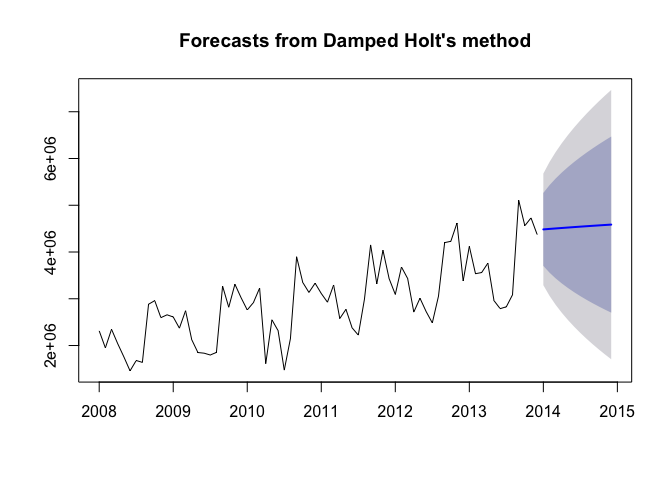<!-- -->

####Dampened trends
#####As such simple trends tend to forecast the future to positively, we have added a dampener. This also works for exponential trends. We also plot the level and slope individually for each model.

```r
Model_holt_3 <- holt(TotalAsIs, damped=TRUE,h=12)
summary(Model_holt_3)
```

```
## 
## Forecast method: Damped Holt's method
## 
## Model Information:
## Damped Holt's method 
## 
## Call:
##  holt(x = TotalAsIs, h = 12, damped = TRUE) 
## 
##   Smoothing parameters:
##     alpha = 0.6613 
##     beta  = 2e-04 
##     phi   = 0.98 
## 
##   Initial states:
##     l = 2040392.5761 
##     b = 45053.25 
## 
##   sigma:  608787.2
## 
##      AIC     AICc      BIC 
## 2235.888 2236.797 2247.272 
## 
## Error measures:
##                    ME     RMSE      MAE       MPE     MAPE     MASE
## Training set 15578.94 608787.2 436909.7 -2.797612 15.46526 1.190916
##                    ACF1
## Training set 0.03351419
## 
## Forecasts:
##          Point Forecast   Lo 80   Hi 80   Lo 95   Hi 95
## Jan 2014        4483618 3703426 5263811 3290417 5676819
## Feb 2014        4493914 3558436 5429391 3063224 5924603
## Mar 2014        4504003 3435520 5572486 2869899 6138107
## Apr 2014        4513891 3327168 5700614 2698955 6328827
## May 2014        4523581 3229332 5817829 2544198 6502963
## Jun 2014        4533077 3139534 5926619 2401837 6664316
## Jul 2014        4542383 3056128 6028638 2269352 6815413
## Aug 2014        4551503 2977955 6125051 2144969 6958036
## Sep 2014        4560440 2904162 6216719 2027381 7093499
## Oct 2014        4569199 2834101 6304298 1915595 7222803
## Nov 2014        4577783 2767264 6388301 1808834 7346732
## Dec 2014        4586195 2703249 6469141 1706477 7465913
```

```r
plot(Model_holt_3)
```

<!-- -->

```r
Model_holt_4 <- holt(TotalAsIs, exponential=TRUE, damped=TRUE,h=12)
summary(Model_holt_4)
```

```
## 
## Forecast method: Damped Holt's method with exponential trend
## 
## Model Information:
## Damped Holt's method with exponential trend 
## 
## Call:
##  holt(x = TotalAsIs, h = 12, damped = TRUE, exponential = TRUE) 
## 
##   Smoothing parameters:
##     alpha = 0.6679 
##     beta  = 1e-04 
##     phi   = 0.9799 
## 
##   Initial states:
##     l = 2041541.9705 
##     b = 1.0019 
## 
##   sigma:  0.2449
## 
##      AIC     AICc      BIC 
## 2253.216 2254.125 2264.600 
## 
## Error measures:
##                    ME     RMSE      MAE       MPE     MAPE     MASE
## Training set 46119.56 609906.7 432069.1 -1.549114 15.11987 1.177722
##                   ACF1
## Training set 0.0254941
## 
## Forecasts:
##          Point Forecast   Lo 80   Hi 80   Lo 95    Hi 95
## Jan 2014        4470648 3035902 5859669 2324210  6632698
## Feb 2014        4473164 2798422 6196358 2112300  7306782
## Mar 2014        4475630 2607508 6505256 1869631  7982478
## Apr 2014        4478047 2466162 6710381 1751693  8255394
## May 2014        4480418 2351811 7014521 1640170  8955653
## Jun 2014        4482742 2226601 7105481 1532910  9505872
## Jul 2014        4485020 2054870 7294864 1406658 10058841
## Aug 2014        4487253 2014225 7501892 1351746 10322885
## Sep 2014        4489443 1883472 7658841 1250331 10512100
## Oct 2014        4491589 1826328 7778770 1217028 10896644
## Nov 2014        4493694 1758205 7983625 1117273 11329021
## Dec 2014        4495757 1646072 8165142 1062536 12047843
```

```r
plot(Model_holt_4)
```

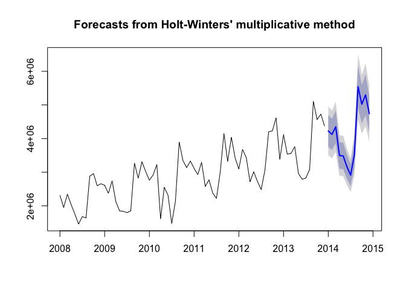<!-- -->
#####level and slope can be plotted individually for each model. 

```r
plot(Model_holt_1$model$state)
```

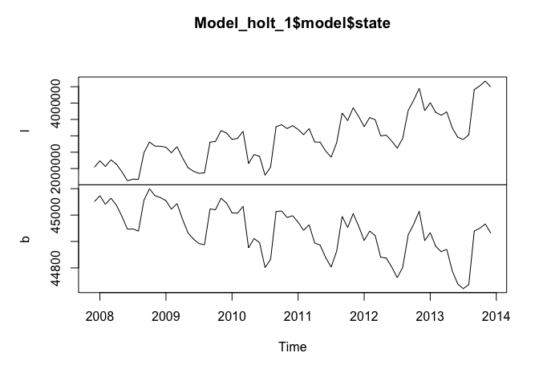<!-- -->

```r
plot(Model_holt_2$model$state)
```

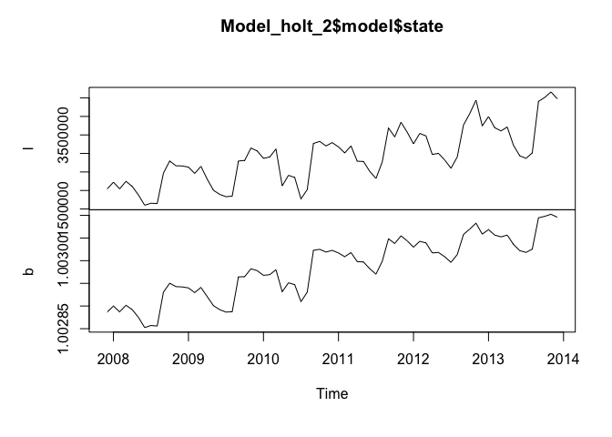<!-- -->

```r
plot(Model_holt_3$model$state)
```

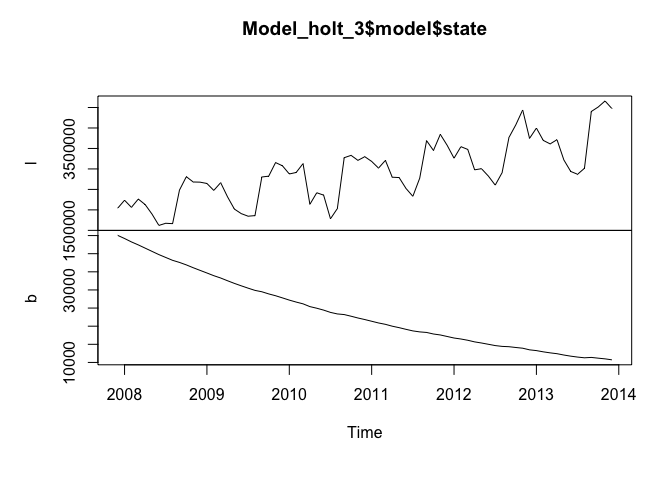<!-- -->

```r
plot(Model_holt_4$model$state)
```

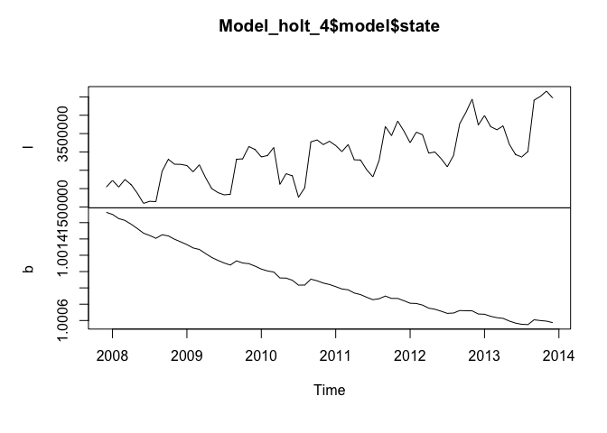<!-- -->

```r
plot(Model_holt_1, plot.conf=FALSE, ylab="Exports Chulwalar  )", xlab="Year", main="", fcol="white", type="o")
lines(fitted(Model_ses), col="purple", type="o")
lines(fitted(Model_holt_1), col="blue", type="o")
lines(fitted(Model_holt_2), col="red", type="o")
lines(fitted(Model_holt_3), col="green", type="o")
lines(fitted(Model_holt_4), col="orange", type="o")
lines(Model_ses$mean, col="purple", type="o")
lines(Model_holt_1$mean, col="blue", type="o")
lines(Model_holt_2$mean, col="red", type="o")
lines(Model_holt_3$mean, col="green", type="o")
lines(Model_holt_4$mean, col="orange", type="o")
legend("topleft",lty=1, col=c(1,"purple","blue","red","green","orange"), c("data", "SES","Holts auto", "Exponential", "Additive Damped", "Multiplicative Damped"),pch=1)
```

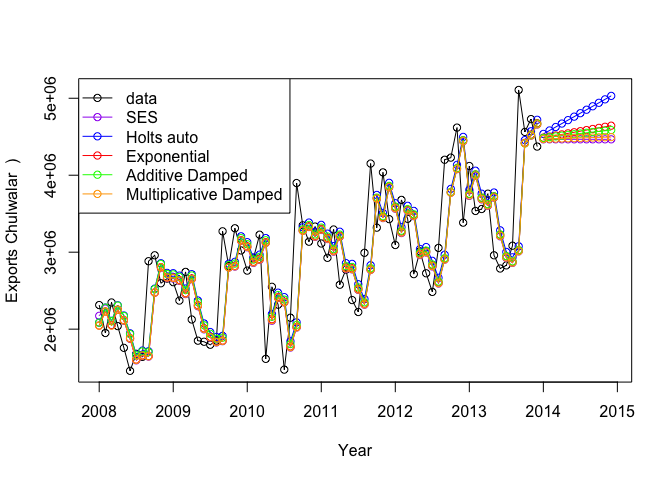<!-- -->

####Holt-Winter's seasonal method   
#####Holt and Winters have expanded Holt's model further to include the seasonality aspect. The parameter gamma, which is for smoothing the seasonality, was added to achieve this. The values are better than the models without seasonality. This is logical, since the data is strongly influenced by seasonality.  In the following model, none of the parameters are given so that they will be optimised automatically. There are two models: one using an additive error model method and one using a multiplicative error model. The additive model gives slightly better results than the multiplicative model.


```r
Model_hw_1 <- hw(TotalAsIs ,seasonal="additive",h=12)
summary(Model_hw_1)
```

```
## 
## Forecast method: Holt-Winters' additive method
## 
## Model Information:
## Holt-Winters' additive method 
## 
## Call:
##  hw(x = TotalAsIs, h = 12, seasonal = "additive") 
## 
##   Smoothing parameters:
##     alpha = 0.0087 
##     beta  = 0.0087 
##     gamma = 1e-04 
## 
##   Initial states:
##     l = 2047375.0884 
##     b = 22509.7631 
##     s=259168.3 654942.6 474529.8 876025.2 -475155 -852844
##            -664662.5 -412596.7 -438677.3 273215 138077.9 167976.7
## 
##   sigma:  241685
## 
##      AIC     AICc      BIC 
## 2124.856 2134.747 2161.283 
## 
## Error measures:
##                    ME   RMSE      MAE         MPE     MAPE      MASE
## Training set 21615.43 241685 202218.5 -0.08252109 7.329458 0.5512016
##                    ACF1
## Training set -0.2819072
## 
## Forecasts:
##          Point Forecast   Lo 80   Hi 80   Lo 95   Hi 95
## Jan 2014        4141204 3831472 4450936 3667510 4614898
## Feb 2014        4147309 3837472 4457147 3673453 4621165
## Mar 2014        4318537 4008512 4628563 3844394 4792680
## Apr 2014        3642744 3332425 3953063 3168153 4117335
## May 2014        3704865 3394124 4015605 3229628 4180102
## Jun 2014        3488859 3177546 3800173 3012746 3964973
## Jul 2014        3336738 3024677 3648799 2859482 3813994
## Aug 2014        3750478 3437474 4063482 3271780 4229176
## Sep 2014        5137771 4823607 5451935 4657298 5618244
## Oct 2014        4772337 4456775 5087900 4289726 5254949
## Nov 2014        4988809 4671591 5306028 4503665 5473953
## Dec 2014        4629097 4309943 4948252 4140992 5117202
```

```r
plot(Model_hw_1)
```

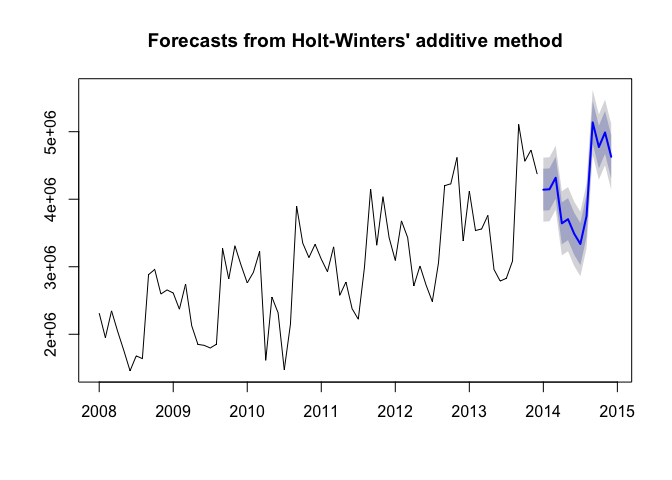<!-- -->

```r
Model_hw_2 <- hw(TotalAsIs ,seasonal="multiplicative",h=12)
summary(Model_hw_2)
```

```
## 
## Forecast method: Holt-Winters' multiplicative method
## 
## Model Information:
## Holt-Winters' multiplicative method 
## 
## Call:
##  hw(x = TotalAsIs, h = 12, seasonal = "multiplicative") 
## 
##   Smoothing parameters:
##     alpha = 0.025 
##     beta  = 0.0062 
##     gamma = 1e-04 
## 
##   Initial states:
##     l = 2026247.531 
##     b = 25395.1259 
##     s=1.0933 1.232 1.1763 1.3086 0.8384 0.699
##            0.7653 0.8502 0.8596 1.0793 1.0316 1.0665
## 
##   sigma:  0.0877
## 
##      AIC     AICc      BIC 
## 2128.303 2138.194 2164.729 
## 
## Error measures:
##                    ME     RMSE      MAE        MPE     MAPE      MASE
## Training set 17434.11 235296.6 191805.3 -0.3292809 7.213472 0.5228175
##                    ACF1
## Training set -0.3514421
## 
## Forecasts:
##          Point Forecast   Lo 80   Hi 80   Lo 95   Hi 95
## Jan 2014        4226941 3751624 4702258 3500006 4953876
## Feb 2014        4123665 3659738 4587591 3414151 4833179
## Mar 2014        4350808 3860995 4840620 3601704 5099911
## Apr 2014        3494208 3100476 3887940 2892046 4096370
## May 2014        3484738 3091618 3877858 2883513 4085963
## Jun 2014        3162774 2805463 3520085 2616314 3709234
## Jul 2014        2912399 2582802 3241996 2408324 3416474
## Aug 2014        3521645 3122278 3921013 2910865 4132425
## Sep 2014        5540988 4911109 6170867 4577671 6504304
## Oct 2014        5020487 4448200 5592775 4145249 5895725
## Nov 2014        5299729 4693715 5905743 4372911 6226547
## Dec 2014        4740169 4196230 5284108 3908286 5572052
```

```r
plot(Model_hw_2)
```

<!-- -->

```r
plot(Model_hw_1, ylab="Exports Chulwalar  ", plot.conf=FALSE, type="o", fcol="white", xlab="Year")
lines(fitted(Model_hw_1), col="red", lty=2)
lines(fitted(Model_hw_2), col="green", lty=2)
lines(Model_hw_1$mean, type="o", col="red")
lines(Model_hw_2$mean, type="o", col="green")
legend("topleft",lty=1, pch=1, col=1:3, c("data","Holt Winters' Additive","Holt Winters' Multiplicative"))
```

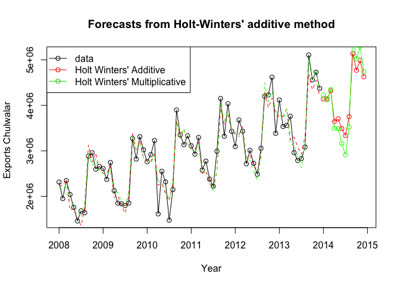<!-- -->
#####In order to use the results later, they need to be converted into point forcasts.

```r
Model_hw_1_df <-as.data.frame(Model_hw_1) 
Model_hw_1_PointForecast <- ts(Model_hw_1_df$"Point Forecast", start=c(2014,1), end=c(2014,12), frequency=12)
Model_hw_1_PointForecast
```

```
##          Jan     Feb     Mar     Apr     May     Jun     Jul     Aug
## 2014 4141204 4147309 4318537 3642744 3704865 3488859 3336738 3750478
##          Sep     Oct     Nov     Dec
## 2014 5137771 4772337 4988809 4629097
```

```r
Model_hw_2_df <-as.data.frame(Model_hw_2) 
Model_hw_2_PointForecast <- ts(Model_hw_2_df$"Point Forecast", start=c(2014,1), end=c(2014,12), frequency=12)
Model_hw_2_PointForecast
```

```
##          Jan     Feb     Mar     Apr     May     Jun     Jul     Aug
## 2014 4226941 4123665 4350808 3494208 3484738 3162774 2912399 3521645
##          Sep     Oct     Nov     Dec
## 2014 5540988 5020487 5299729 4740169
```
#####Output instruction for the data export of the results for further use in Excel.
######write.csv(Model_hw_1_PointForecast,file='Model_hw_1_PointForecast.csv')
######write.csv(Model_hw_2_PointForecast,file='Model_hw_2_PointForecast.csv')

****************************
<div id='id-section7.2'/>
###7.2 Forecasting Models with Smoothing and related approaches (TotalEtelAsIs)
####Simple expontential smoothing    

```r
Model_sesEtel <- ses(TotalEtelAsIs, h=12)
summary(Model_sesEtel)
```

```
## 
## Forecast method: Simple exponential smoothing
## 
## Model Information:
## Simple exponential smoothing 
## 
## Call:
##  ses(x = TotalEtelAsIs, h = 12) 
## 
##   Smoothing parameters:
##     alpha = 0.7395 
## 
##   Initial states:
##     l = 1195425.4826 
## 
##   sigma:  457693.8
## 
##      AIC     AICc      BIC 
## 2188.810 2188.984 2193.363 
## 
## Error measures:
##                    ME     RMSE      MAE       MPE     MAPE     MASE
## Training set 17461.77 457693.8 297227.3 -4.846428 21.14544 1.453283
##                    ACF1
## Training set 0.02266816
## 
## Forecasts:
##          Point Forecast     Lo 80   Hi 80      Lo 95   Hi 95
## Jan 2014        2125179 1538620.3 2711737 1228115.06 3022242
## Feb 2014        2125179 1395654.1 2854703 1009467.27 3240890
## Mar 2014        2125179 1276437.7 2973919  827141.42 3423216
## Apr 2014        2125179 1172017.3 3078340  667444.30 3582913
## May 2014        2125179 1077957.7 3172399  523592.49 3726765
## Jun 2014        2125179  991676.6 3258680  391636.90 3858720
## Jul 2014        2125179  911513.9 3338843  269038.63 3981318
## Aug 2014        2125179  836327.5 3414030  154050.92 4096306
## Sep 2014        2125179  765291.7 3485065   45411.04 4204946
## Oct 2014        2125179  697786.7 3552570  -57828.92 4308186
## Nov 2014        2125179  633333.1 3617024 -156402.12 4406759
## Dec 2014        2125179  571551.2 3678806 -250889.44 4501246
```

```r
plot(Model_sesEtel, plot.conf=FALSE, ylab="Exports Chulwalar  )", xlab="Year", main="", fcol="white", type="o")
lines(fitted(Model_ses), col="green", type="o")
lines(Model_ses$mean, col="blue", type="o")
legend("topleft",lty=1, col=c(1,"green"), c("data", expression(alpha == 0.671)),pch=1)
```

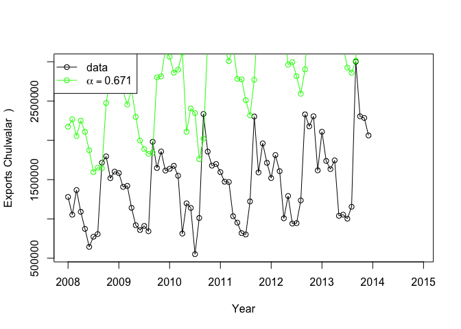<!-- -->
####Holt's linear trend method   

```r
Model_holt_1Etel <- holt(TotalEtelAsIs,h=12)
summary(Model_holt_1Etel)
```

```
## 
## Forecast method: Holt's method
## 
## Model Information:
## Holt's method 
## 
## Call:
##  holt(x = TotalEtelAsIs, h = 12) 
## 
##   Smoothing parameters:
##     alpha = 0.7392 
##     beta  = 1e-04 
## 
##   Initial states:
##     l = 1059957.9064 
##     b = 32067.7173 
## 
##   sigma:  458401.4
## 
##      AIC     AICc      BIC 
## 2193.032 2193.629 2202.139 
## 
## Error measures:
##                     ME     RMSE      MAE       MPE     MAPE     MASE
## Training set -23016.69 458401.4 311051.9 -7.993243 22.56079 1.520877
##                    ACF1
## Training set 0.02160216
## 
## Forecasts:
##          Point Forecast     Lo 80   Hi 80     Lo 95   Hi 95
## Jan 2014        2168423 1580958.2 2755888 1269973.0 3066873
## Feb 2014        2200325 1469713.8 2930937 1082951.5 3317699
## Mar 2014        2232227 1382214.3 3082240  932244.7 3532210
## Apr 2014        2264129 1309507.9 3218750  804161.9 3724096
## May 2014        2296031 1247159.0 3344903  691919.6 3900143
## Jun 2014        2327933 1192585.2 3463281  591568.4 4064298
## Jul 2014        2359835 1144126.3 3575544  500568.9 4219101
## Aug 2014        2391737 1100639.9 3682834  417174.2 4366300
## Sep 2014        2423639 1061300.2 3785978  340121.5 4507157
## Oct 2014        2455541 1025487.3 3885595  268462.6 4642620
## Nov 2014        2487443  992722.0 3982164  201464.4 4773422
## Dec 2014        2519345  962624.2 4076066  138546.0 4900144
```

```r
plot(Model_holt_1Etel)
```

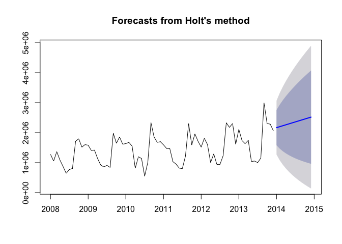<!-- -->
#####expoential trend

```r
Model_holt_2Etel<- holt(TotalEtelAsIs, exponential=TRUE,h=12)
summary(Model_holt_2Etel)
```

```
## 
## Forecast method: Holt's method with exponential trend
## 
## Model Information:
## Holt's method with exponential trend 
## 
## Call:
##  holt(x = TotalEtelAsIs, h = 12, exponential = TRUE) 
## 
##   Smoothing parameters:
##     alpha = 0.7557 
##     beta  = 1e-04 
## 
##   Initial states:
##     l = 1061058.064 
##     b = 0.9828 
## 
##   sigma:  0.4334
## 
##      AIC     AICc      BIC 
## 2226.746 2227.343 2235.853 
## 
## Error measures:
##                    ME   RMSE      MAE       MPE    MAPE     MASE
## Training set 51092.46 457072 290407.9 -2.258191 20.3863 1.419939
##                     ACF1
## Training set 0.004350746
## 
## Forecasts:
##          Point Forecast    Lo 80   Hi 80     Lo 95   Hi 95
## Jan 2014        2073994 956292.3 3202674 339714.33 3825645
## Feb 2014        2039645 697350.3 3573386 249414.54 4685613
## Mar 2014        2005865 573762.6 3829416 190777.80 5452954
## Apr 2014        1972644 481096.9 4081309 156830.63 5897348
## May 2014        1939973 403984.7 4090743 137220.66 6572535
## Jun 2014        1907843 326975.4 4184715  93367.13 7194029
## Jul 2014        1876246 284225.6 4206572  77019.58 7230936
## Aug 2014        1845171 232991.8 4250078  70675.06 7878851
## Sep 2014        1814612 192242.9 4306826  52356.89 8134810
## Oct 2014        1784558 159859.5 4306216  39056.39 9225484
## Nov 2014        1755003 144820.6 4243016  36023.55 8999353
## Dec 2014        1725936 115614.4 4170061  27629.41 8797322
```

```r
plot(Model_holt_2Etel)
```

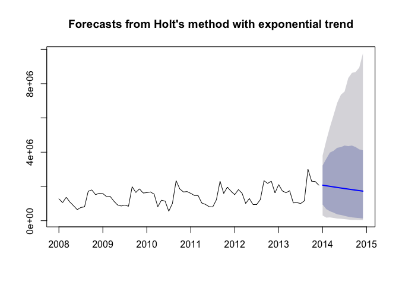<!-- -->
#####Dampened trends

```r
Model_holt_3Etel <- holt(TotalEtelAsIs, damped=TRUE,h=12)
summary(Model_holt_3Etel)
```

```
## 
## Forecast method: Damped Holt's method
## 
## Model Information:
## Damped Holt's method 
## 
## Call:
##  holt(x = TotalEtelAsIs, h = 12, damped = TRUE) 
## 
##   Smoothing parameters:
##     alpha = 0.7381 
##     beta  = 1e-04 
##     phi   = 0.9083 
## 
##   Initial states:
##     l = 1059958.1516 
##     b = 32067.6737 
## 
##   sigma:  458121.2
## 
##      AIC     AICc      BIC 
## 2194.944 2195.853 2206.327 
## 
## Error measures:
##                    ME     RMSE      MAE       MPE     MAPE     MASE
## Training set 14074.53 458121.2 299379.3 -5.181928 21.35676 1.463805
##                    ACF1
## Training set 0.02356552
## 
## Forecasts:
##          Point Forecast     Lo 80   Hi 80      Lo 95   Hi 95
## Jan 2014        2125648 1538541.7 2712754 1227746.57 3023549
## Feb 2014        2125720 1395956.7 2855484 1009643.17 3241798
## Mar 2014        2125787 1276990.4 2974583  827664.91 3423908
## Apr 2014        2125847 1172752.0 3078941  668214.23 3583479
## May 2014        2125901 1078831.3 3172971  524546.06 3727256
## Jun 2014        2125951  992659.2 3259242  392730.88 3859170
## Jul 2014        2125996  912583.1 3339408  270241.26 3981750
## Aug 2014        2126037  837466.0 3414607  155337.90 4096735
## Sep 2014        2126074  766485.6 3485662   46763.21 4205384
## Oct 2014        2126107  699024.9 3553190  -56426.99 4308642
## Nov 2014        2126138  634606.2 3617670 -154963.04 4407239
## Dec 2014        2126166  572851.4 3679480 -249423.62 4501755
```

```r
plot(Model_holt_3Etel)
```

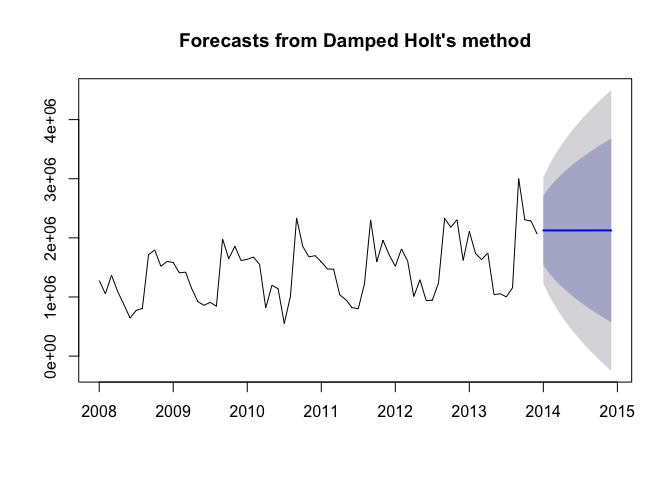<!-- -->

```r
Model_holt_4Etel <- holt(TotalEtelAsIs, exponential=TRUE, damped=TRUE,h=12)
summary(Model_holt_4Etel)
```

```
## 
## Forecast method: Damped Holt's method with exponential trend
## 
## Model Information:
## Damped Holt's method with exponential trend 
## 
## Call:
##  holt(x = TotalEtelAsIs, h = 12, damped = TRUE, exponential = TRUE) 
## 
##   Smoothing parameters:
##     alpha = 0.7512 
##     beta  = 1e-04 
##     phi   = 0.98 
## 
##   Initial states:
##     l = 1061058.7429 
##     b = 0.9709 
## 
##   sigma:  0.4316
## 
##      AIC     AICc      BIC 
## 2228.461 2229.371 2239.845 
## 
## Error measures:
##                    ME     RMSE      MAE       MPE     MAPE     MASE
## Training set 46720.45 457308.5 292360.8 -2.502549 20.54122 1.429488
##                     ACF1
## Training set 0.007568185
## 
## Forecasts:
##          Point Forecast    Lo 80   Hi 80     Lo 95    Hi 95
## Jan 2014        2103710 957143.4 3305317 337223.11  3904479
## Feb 2014        2090196 732698.1 3625978 237354.53  4729331
## Mar 2014        2077035 586031.1 4021909 180375.58  5425252
## Apr 2014        2064219 475507.7 4131834 132884.31  6208573
## May 2014        2051735 413475.8 4243012 126052.07  6578540
## Jun 2014        2039574 335212.0 4377963 111485.46  7160079
## Jul 2014        2027727 303053.8 4586479  97417.01  7740617
## Aug 2014        2016183 262089.5 4712820  78615.81  7946934
## Sep 2014        2004934 224524.7 4601786  68787.61  8644573
## Oct 2014        1993970 194606.2 4748310  56508.21  9042103
## Nov 2014        1983284 174766.5 4685755  45579.28 10010006
## Dec 2014        1972868 150840.5 4874846  35460.75  9963410
```

```r
plot(Model_holt_4Etel)
```

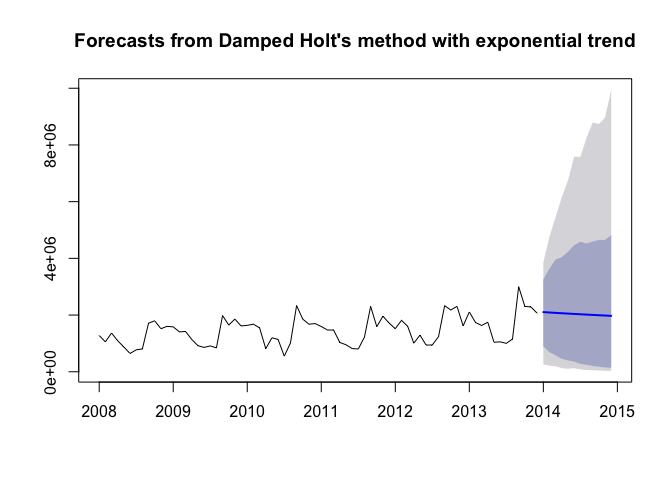<!-- -->
#####level and slope can be plotted individually for each model. 

```r
plot(Model_holt_1Etel$model$state)
```

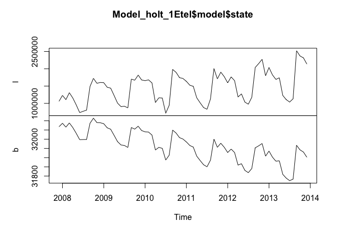<!-- -->

```r
plot(Model_holt_2Etel$model$state)
```

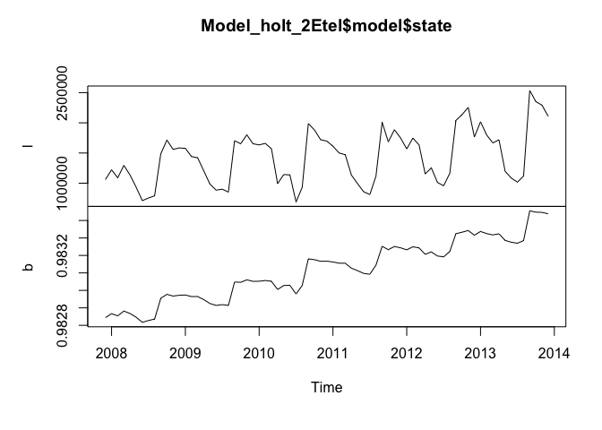<!-- -->

```r
plot(Model_holt_3Etel$model$state)
```

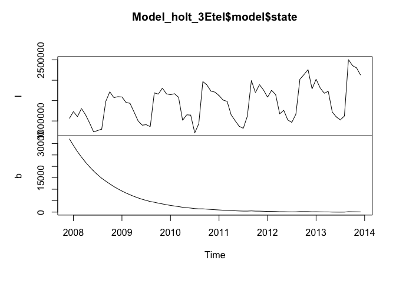<!-- -->

```r
plot(Model_holt_4Etel$model$state)
```

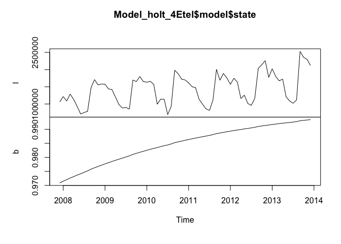<!-- -->

```r
plot(Model_holt_1Etel, plot.conf=FALSE, ylab="Exports Chulwalar  )", xlab="Year", main="", fcol="white", type="o")
lines(fitted(Model_sesEtel), col="purple", type="o")
lines(fitted(Model_holt_1Etel), col="blue", type="o")
lines(fitted(Model_holt_2Etel), col="red", type="o")
lines(fitted(Model_holt_3Etel), col="green", type="o")
lines(fitted(Model_holt_4Etel), col="orange", type="o")
lines(Model_sesEtel$mean, col="purple", type="o")
lines(Model_holt_1Etel$mean, col="blue", type="o")
lines(Model_holt_2Etel$mean, col="red", type="o")
lines(Model_holt_3Etel$mean, col="green", type="o")
lines(Model_holt_4Etel$mean, col="orange", type="o")
legend("topleft",lty=1, col=c(1,"purple","blue","red","green","orange"), c("data", "SES","Holts auto", "Exponential", "Additive Damped", "Multiplicative Damped"),pch=1)
```

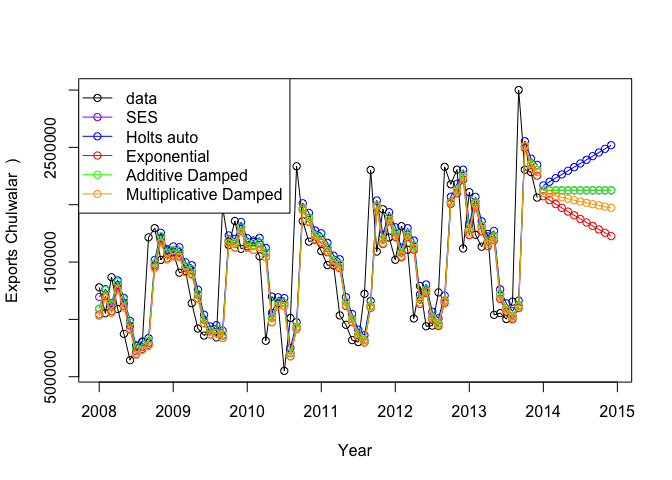<!-- -->

####Holt-Winter's seasonal method   

```r
Model_hw_1Etel <- hw(TotalEtelAsIs ,seasonal="additive",h=12)
summary(Model_hw_1Etel)
```

```
## 
## Forecast method: Holt-Winters' additive method
## 
## Model Information:
## Holt-Winters' additive method 
## 
## Call:
##  hw(x = TotalEtelAsIs, h = 12, seasonal = "additive") 
## 
##   Smoothing parameters:
##     alpha = 0.1006 
##     beta  = 4e-04 
##     gamma = 1e-04 
## 
##   Initial states:
##     l = 1197857.198 
##     b = 10920.4281 
##     s=213227.6 432750.3 389222.1 773339.9 -385004.6 -600027.3
##            -533376.9 -405213.3 -324353.9 76198.07 175183 188055
## 
##   sigma:  172689.4
## 
##      AIC     AICc      BIC 
## 2076.452 2086.343 2112.879 
## 
## Error measures:
##                  ME     RMSE    MAE       MPE     MAPE      MASE
## Training set -19817 172689.4 137259 -3.310116 10.74612 0.6711232
##                    ACF1
## Training set -0.1543248
## 
## Forecasts:
##          Point Forecast   Lo 80   Hi 80     Lo 95   Hi 95
## Jan 2014        2008304 1786994 2229615 1669839.3 2346769
## Feb 2014        2005752 1783307 2228197 1665551.5 2345952
## Mar 2014        1917189 1693606 2140771 1575248.8 2259128
## Apr 2014        1527024 1302302 1751747 1183340.8 1870708
## May 2014        1456525 1230660 1682391 1111093.8 1801957
## Jun 2014        1338726 1111715 1565737  991542.2 1685909
## Jul 2014        1282438 1054279 1510598  933498.5 1631378
## Aug 2014        1507832 1278522 1737143 1157132.1 1858532
## Sep 2014        2676592 2446128 2907057 2324127.9 3029057
## Oct 2014        2302843 2071223 2534464 1948610.2 2657076
## Nov 2014        2356737 2123957 2589516 2000730.8 2712742
## Dec 2014        2147585 1913641 2381529 1789799.1 2505371
```

```r
plot(Model_hw_1Etel)
```

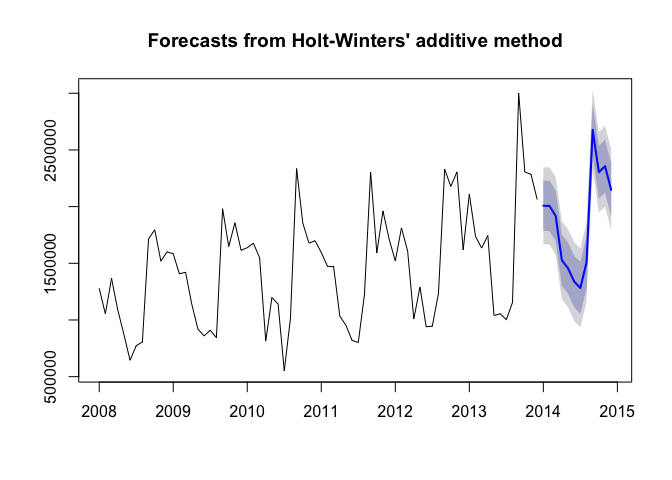<!-- -->

```r
Model_hw_2Etel <- hw(TotalEtelAsIs ,seasonal="multiplicative",h=12)
summary(Model_hw_2Etel)
```

```
## 
## Forecast method: Holt-Winters' multiplicative method
## 
## Model Information:
## Holt-Winters' multiplicative method 
## 
## Call:
##  hw(x = TotalEtelAsIs, h = 12, seasonal = "multiplicative") 
## 
##   Smoothing parameters:
##     alpha = 0.1007 
##     beta  = 0.0202 
##     gamma = 1e-04 
## 
##   Initial states:
##     l = 1185233.6784 
##     b = 11436.6691 
##     s=1.1484 1.3007 1.2775 1.5501 0.7138 0.5675
##            0.6356 0.7225 0.7983 1.0554 1.0793 1.1511
## 
##   sigma:  0.1215
## 
##      AIC     AICc      BIC 
## 2071.694 2081.585 2108.121 
## 
## Error measures:
##                    ME     RMSE      MAE       MPE     MAPE      MASE
## Training set 2570.544 154506.4 126050.4 -1.274176 9.741218 0.6163191
##                    ACF1
## Training set -0.2582845
## 
## Forecasts:
##          Point Forecast     Lo 80   Hi 80     Lo 95   Hi 95
## Jan 2014        2134821 1802370.6 2467272 1626381.7 2643261
## Feb 2014        2018272 1701688.7 2334855 1534099.6 2502444
## Mar 2014        1990076 1674924.2 2305227 1508093.0 2472059
## Apr 2014        1517542 1274319.5 1760765 1145565.3 1889519
## May 2014        1384653 1159472.1 1609834 1040268.6 1729037
## Jun 2014        1228015 1024850.6 1431179  917301.9 1538728
## Jul 2014        1105178  918695.4 1291660  819977.4 1390378
## Aug 2014        1401176 1159448.3 1642903 1031485.6 1770866
## Sep 2014        3067063 2524835.0 3609292 2237796.7 3896330
## Oct 2014        2547465 2084968.1 3009962 1840136.8 3254794
## Nov 2014        2613831 2125584.2 3102077 1867122.3 3360539
## Dec 2014        2325692 1877988.5 2773396 1640988.6 3010396
```

```r
plot(Model_hw_2Etel)
```

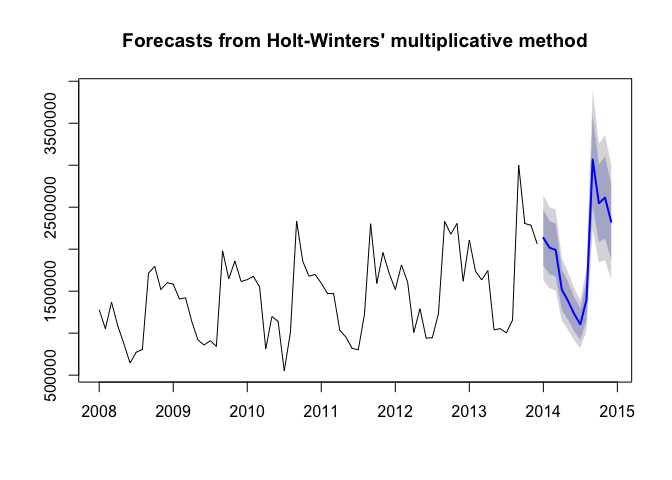<!-- -->

```r
plot(Model_hw_1Etel, ylab="Exports Chulwalar  ", plot.conf=FALSE, type="o", fcol="white", xlab="Year")
lines(fitted(Model_hw_1Etel), col="red", lty=2)
lines(fitted(Model_hw_2Etel), col="green", lty=2)
lines(Model_hw_1Etel$mean, type="o", col="red")
lines(Model_hw_2Etel$mean, type="o", col="green")
legend("topleft",lty=1, pch=1, col=1:3, c("data","Holt Winters' Additive","Holt Winters' Multiplicative"))
```

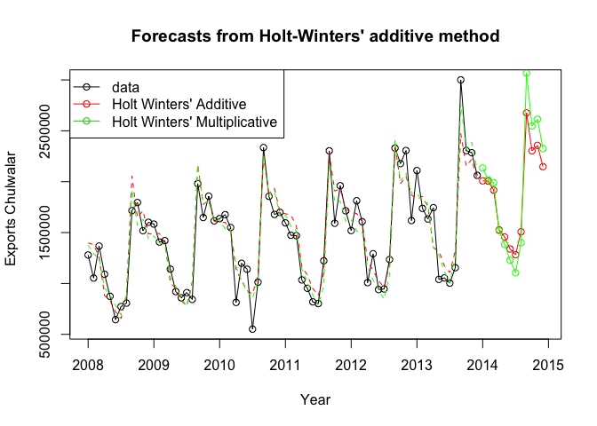<!-- -->
#####In order to use the results later, they need to be converted into point forcasts.

```r
Model_hw_1_dfEtel <-as.data.frame(Model_hw_1Etel) 
Model_hw_1_PointForecastEtel<- ts(Model_hw_1_dfEtel$"Point Forecast", start=c(2014,1), end=c(2014,12), frequency=12)
Model_hw_1_PointForecastEtel
```

```
##          Jan     Feb     Mar     Apr     May     Jun     Jul     Aug
## 2014 2008304 2005752 1917189 1527024 1456525 1338726 1282438 1507832
##          Sep     Oct     Nov     Dec
## 2014 2676592 2302843 2356737 2147585
```

```r
Model_hw_2_dfEtel <-as.data.frame(Model_hw_2Etel) 
Model_hw_2_PointForecastEtel <- ts(Model_hw_2_dfEtel$"Point Forecast", start=c(2014,1), end=c(2014,12), frequency=12)
Model_hw_2_PointForecastEtel
```

```
##          Jan     Feb     Mar     Apr     May     Jun     Jul     Aug
## 2014 2134821 2018272 1990076 1517542 1384653 1228015 1105178 1401176
##          Sep     Oct     Nov     Dec
## 2014 3067063 2547465 2613831 2325692
```
#####Output instruction for the data export of the results for further use in Excel.
######write.csv(Model_hw_1_PointForecast,file='Model_hw_1_PointForecast.csv')
######write.csv(Model_hw_2_PointForecast,file='Model_hw_2_PointForecast.csv')

****************************
<div id='id-section9'/>
##9.0 Conclusion
#####SES model

```r
AIC(Model_sesEtel$model)
```

```
## [1] 2188.81
```

```r
accuracy(Model_sesEtel)
```

```
##                    ME     RMSE      MAE       MPE     MAPE     MASE
## Training set 17461.77 457693.8 297227.3 -4.846428 21.14544 1.453283
##                    ACF1
## Training set 0.02266816
```
####Holt model

```r
AIC(Model_holt_1Etel$model)
```

```
## [1] 2193.032
```

```r
accuracy(Model_holt_1Etel)
```

```
##                     ME     RMSE      MAE       MPE     MAPE     MASE
## Training set -23016.69 458401.4 311051.9 -7.993243 22.56079 1.520877
##                    ACF1
## Training set 0.02160216
```
#####Holt Model with Exponential Trend

```r
AIC(Model_holt_2Etel$model)
```

```
## [1] 2226.746
```

```r
accuracy(Model_holt_2Etel)
```

```
##                    ME   RMSE      MAE       MPE    MAPE     MASE
## Training set 51092.46 457072 290407.9 -2.258191 20.3863 1.419939
##                     ACF1
## Training set 0.004350746
```
#####Dampened Holt Model

```r
AIC(Model_holt_3Etel$model)
```

```
## [1] 2194.944
```

```r
accuracy(Model_holt_3Etel)
```

```
##                    ME     RMSE      MAE       MPE     MAPE     MASE
## Training set 14074.53 458121.2 299379.3 -5.181928 21.35676 1.463805
##                    ACF1
## Training set 0.02356552
```
#####Dampened Holt Model with Exponential Trend

```r
AIC(Model_holt_4Etel$model)
```

```
## [1] 2228.461
```

```r
accuracy(Model_holt_4Etel)
```

```
##                    ME     RMSE      MAE       MPE     MAPE     MASE
## Training set 46720.45 457308.5 292360.8 -2.502549 20.54122 1.429488
##                     ACF1
## Training set 0.007568185
```
#####Holt Winters Additive Model

```r
AIC(Model_hw_1Etel$model)
```

```
## [1] 2076.452
```

```r
accuracy(Model_hw_1Etel)
```

```
##                  ME     RMSE    MAE       MPE     MAPE      MASE
## Training set -19817 172689.4 137259 -3.310116 10.74612 0.6711232
##                    ACF1
## Training set -0.1543248
```
#####Holt Winters Multiplicative Model

```r
AIC(Model_hw_2Etel$model)
```

```
## [1] 2071.694
```

```r
accuracy(Model_hw_2Etel)
```

```
##                    ME     RMSE      MAE       MPE     MAPE      MASE
## Training set 2570.544 154506.4 126050.4 -1.274176 9.741218 0.6163191
##                    ACF1
## Training set -0.2582845
```

#####Minimizing the AIC and RMSE from the models, it is clear that the best model for the "TotalEtel" forecast is the Holt-Winters model. We can see that the Holt-Winters Multiplicative Model is marginally better than the Additive model. We assume this is the case since this is the only model that takes into account the seasonality changing proportionally to the level of the data. Whereas the Additive model would have been better if the "TotalEtel" seasonality would have been roughly constant throughout the data. The Total Etel exports were found to be highly seasonal so this makes sense. This may be attributed to the Winter blooming flower and the demonstrated correlation between the Total Etel Exports and the Influential National Holidays. Our complete predicted forecast for 2014 Total Etel Exports, based on the Holt-Winters Multiplicative Model, is as follows:


```r
Model_hw_2_PointForecastEtel
```

```
##          Jan     Feb     Mar     Apr     May     Jun     Jul     Aug
## 2014 2134821 2018272 1990076 1517542 1384653 1228015 1105178 1401176
##          Sep     Oct     Nov     Dec
## 2014 3067063 2547465 2613831 2325692
```

****************************
<div id='id-section9.0'/>
##10.0 Acknowledgements

#####While this document details the specific models and data for the "TotalEtel" flowers all data and code are based off of information provided in the document entitled "Forecasting Exports Chulwalar_0.8a.R". This document can be found in this repository in the data folder.
[/Analysis/Data](https://github.com/clairecDS/DoingDataScience_CaseStudy2/blob/master/Data/Forecasting%20Exports%20Chulwalar_0.8a.R)<br>
#####We would like to credit the following for their contributions to this document.<br>
#####Amy Wheeler<br>
#####Nina Weitkamp<br>
#####Patrick Berlekamp<br>
#####Johannes Brauer<br>
#####Andreas Faatz<br>
#####Hans-Ulrich Holst<br>
#####Designed and coded at Hochschule Osnabrück, Germany<br>
#####Contact: faatz@wi.hs-osnabrueck.de<br>
#####Additionally, we would like to thank: Rob Hyndman for the forecasting libraries in R<br>
